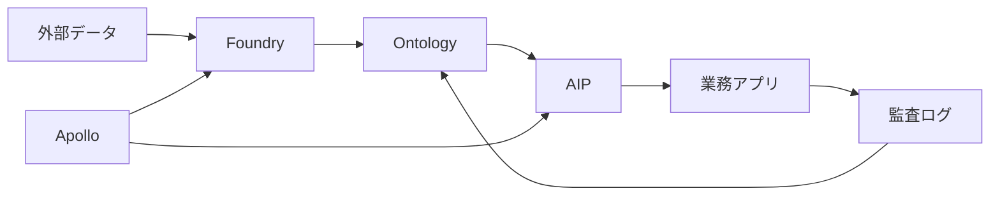
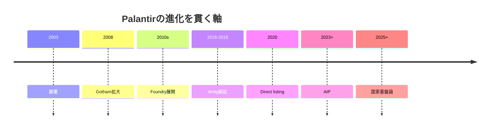
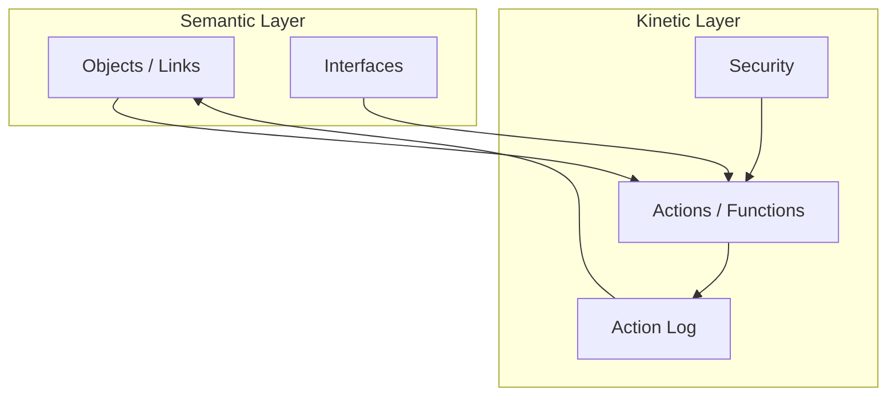
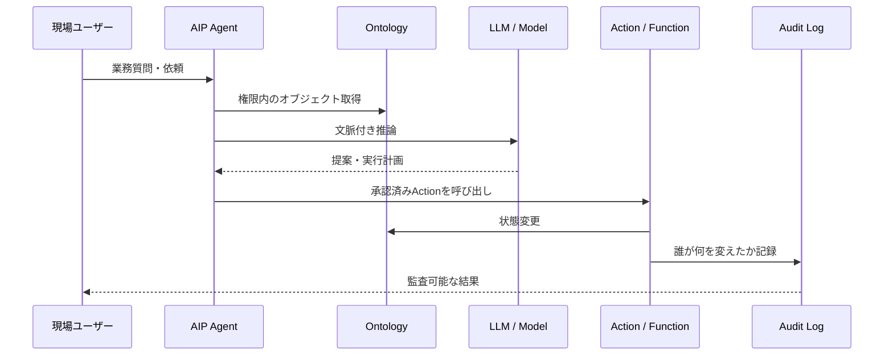
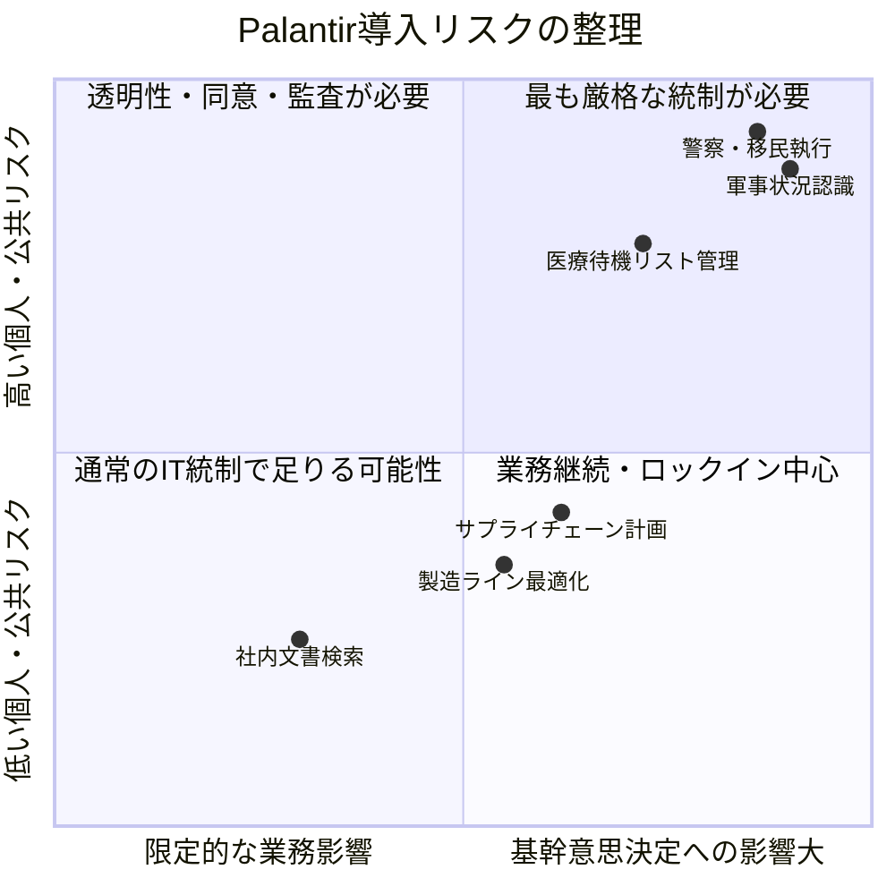

## 1. Executive Summary

Palantir is not just an analytics tools company or an LLM app company. The core is an "operational AI platform" that bundles corporate and government data, business objects, decisions, permissions, audits, applications, and AI agents into a single operational layer. In terms of product names, Foundry is the data operation platform, Ontology is the organizational object/relationship/action layer, AIP is the generation AI and agent execution layer, and Apollo is the continuous deployment platform to multiple environments.
Source note: Palantir official documentation describes AIP as connecting AI to "data and operations" and organizes Foundry, AIP, and Apollo as an integrated platform. See [AIP overview](https://www.palantir.com/docs/foundry/aip/overview), [Integrated platforms: AIP, Foundry, and Apollo](https://www.palantir.com/docs/foundry/architecture-center/platforms).
The conclusions of this report are as follows.

1. Palantir's differentiation lies not in its model performance, but in its design that uses Ontology to make "real business conditions into a form that AI can read, change, and audit."
2. Growth as of May 2026 is very strong. Palantir announced Q1 2026 sales of $1.633 billion, 85% year-over-year growth, and 104% U.S. sales growth, and raised its full-year 2026 sales guidance to $7.650 billion-$7.662 billion.
3. AIP's commercial growth is accelerating not only due to the AI ​​boom, but also due to Bootcamp-style short-term introductions, business application development on Ontology, and implementation support including governance.
4. On the other hand, Palantir's strengths also pose risks. Cross-organizational data integration, activity logging, privilege management, and deep embedding in field operations provide organizations with strong execution power, but also increase issues of surveillance, military/security use, medical data, vendor lock-in, and accountability.
5. The question that should be asked when introducing it into practice is not "Is Palantir useful?" but "Can I put my own organization's decision-making, authority, accountability, and exit strategy on Palantir?"
   Source Note: Q1 2026 numbers based on Palantir's SEC-filed press releases [a2026q1ex991pressrelease.htm](https://www.sec.gov/Archives/edgar/data/1321655/000132165526000026/a2026q1ex991pressrelease.htm) and [Q1 2026 Business Update PDF](https://investors.palantir.com/files/Palantir%20-%20Q1%202026%20Business%20Update.pdf).

## 2. What is Palantir?

Palantir is an American software company founded in 2003 that develops Gotham for government, defense, and intelligence agencies, Foundry for commercial and public institutions, AIP for generative AI/agent-based, and Apollo for deployment platform. The company's self-definition is "software that integrates data, decision-making, and operations on a large scale," and rather than replacing a single task like typical SaaS, it has evolved in the direction of creating a cross-sectional operational layer on top of existing systems.
Source Note: The 2025 Form 10-K Overview describes Palantir as a software company that integrates "data, decisions, and operations." See [2025 FY PLTR 10-K](https://investors.palantir.com/files/2025%20FY%20PLTR%2010-K.pdf).
Palantir's product structure is different from the traditional "data lake + BI + individual apps". It not only collects data, but also defines business objects as objects, and integrates actions, approvals, history, and authority for those objects. For this reason, it functions not only as an analytical platform for viewing reports, but also as an operational layer for changing behavior on the ground.
Source note: Palantir's official description of Ontology describes Ontology as an "operational layer" that sits on top of datasets, virtual tables, and models, and connects to real-world objects such as physical assets, products, orders, and financial transactions. See [Ontology overview](https://www.palantir.com/docs/foundry/ontology/overview).

### 2.1 Palantir's deep structure read from history

Palantir's history should not be read as the growth history of a typical SaaS company, but as a continuous story of national security in the post-9/11 era, fraud detection philosophy derived from PayPal, rebellion against government procurement, commercial data OS, and dual-use platform in the era of generative AI.
In S-1, Palantir explains that it was founded in 2003 to create software for counterterrorism operations, and in 2008 released Gotham as its first platform for intelligence agencies. Gotham was positioned to find patterns deep within massive data sets and help them hand it off from analysts to field operators to plan and execute real-world responses to threats. Here is the prototype of Palantir. In other words, it started out as a company that connects analysis to action, rather than a company that analyzes data.
Source Note: Founding purpose and description of Gotham are based on Palantir's [2020 Form S-1](https://www.sec.gov/Archives/edgar/data/1321655/000119312520230013/d904406ds1.htm). S-1 explains that it was founded in 2003, Gotham was released in 2008, and that Gotham supports the handover of analysts and operational users.
This origin remains consistent up to the present AIP. Gotham's theme was "finding threats and taking them to action." At Foundry, it has been generalized to commercial and public institutions to "integrate business data and change organizational behavior." In AIP, LLM and agents are connected to this, moving from a "human-readable dashboard" to "AI reading the business status and proposing and executing constrained actions."

Palantir is unique in that it views governments and large corporations as "institutional behemoths" rather than "customers." In his 2022 CEO annual letter, Karp wrote that when the company started, it made software for defense and intelligence agencies, and while they had the budget and staff, they didn't have the software they needed. He also argued that while the moat of the 20th century was industrial structure, the only moat of this century is software. In this view, Palantir's competitors are not just BI vendors. Bureaucracy, traditional SI, departmental SaaS, Excel, procurement systems, and organizational data insufficiency themselves become competitors.
Source note: Karp's 2022 letter highlights startups for defense and intelligence agencies, software needed by large organizations, and the assertion that "only moat is software." See [Palantir 2022 Annual Letter](https://www.palantir.com/2022-annual-letter/letter-en.pdf).
The first insight that can be gleaned from this history is that Palantir's products are premised on "reshaping an organization" rather than "implementing" it. Calling Foundry a "central operating system for data" and describing Foundry's Workshop as an app builder that reads and writes ontological data indicates a design that intentionally breaks the boundaries between data infrastructure and business apps. Companies that adopt it may think they are purchasing a data infrastructure, but in reality they will be redesigning decision-making practices, authority, auditing, and even the flow of on-site actions.
Source note: Foundry's "central operating system for data" and Workshop's read/write business application construction are based on [2020 Form S-1](https://www.sec.gov/Archives/edgar/data/1321655/000119312520230013/d904406ds1.htm)'s product description.
The second insight is that Palantir's "Choose the West" attitude is not marketing, but a business principle that influences customer selection, sourcing strategy, product design, and adopted brands. S-1 wrote that Palantir generally does not do business with customers or governments that are inconsistent with its mission of supporting "Western liberal democracy and its strategic allies," and specified that it does not work with the Chinese Communist Party or host its platform in China. This attitude defines itself as a geopolitical software company rather than an ethically neutral cloud company.
Source note: Statements regarding customer selection and China are based on [2020 Form S-1](https://www.sec.gov/Archives/edgar/data/1321655/000119312520230013/d904406ds1.htm) risk factors.
The third insight is that Palantir's politics and commerce are not contradictory. Rather, by layering software for national security and large organizations, it has created high unit prices, long-term contracts, deep organizational penetration, and barriers to entry into regulated industries. S-1 states that the average length of service for the top 20 customers in 2019 was 6.6 years, that the 2016 lawsuit against the U.S. Army affected the adoption of commercial software for government procurement, and that the company's growth strategy is to expand beyond government into the commercial field. It would be more accurate to view Palantir as a company that exported operational software developed in the government to large commercial organizations, rather than a company that expanded horizontally from government to commercial operations.
Source note: See [2020 Form S-1](https://www.sec.gov/Archives/edgar/data/1321655/000119312520230013/d904406ds1.htm) for top customer retention, U.S. Army lawsuits, and commercial expansion strategy.
The fourth insight is that `The Technological Republic` is not a thought book that suddenly appeared, but an externalization of Palantir's self-understanding from the S-1 and the CEO letter as a political philosophy for the age of AI. The book criticizes Silicon Valley for moving away from national security and industrial issues toward narrower consumer issues. The fact that Palantir posted a 22-point manifesto-like summary of the book in April 2026, drawing criticism over AI weapons, national service, and Western supremacy, means that Palantir is no longer a "politically misunderstood company" but a political company in its own right.
Source note: See [Penguin Random House press release](https://sites.prh.com/technologicalrepublicpressrelease) for the publication intent of the book. See [Fortune](https://fortune.com/2026/04/22/palantir-alex-karp-mini-manifesto-national-security-defense-tech-ai/) and [Euronews](https://www.euronews.com/next/2026/04/22/ramblings-of-a-supervillain-palantir-manifesto-claims-ai-weapons-and-cultural-inferiority) for reactions to the 22-item post in April 2026.
The fifth insight is that Palantir's greatest value and greatest danger lie in the same place. Ontology, Action, AIP, and Apollo transform disparate organizations into a single actionable system. This is powerful for hospital waiting lists, factory constraints, military situational awareness, and financial crime fighting. But the same mechanisms can be used for surveillance, immigration enforcement, targeting, and the use of public data for other purposes. Technology is not neutral, but rather it amplifies the "will of nations and large organizations." Therefore, when evaluating Palantir, it is necessary to ask which system it will be connected to before considering the product's features.
Source Note: Palantir itself describes a strategic partnership with the Israeli Ministry of Defense and technology contributions to the war effort in its Q4 2024 materials. See [Q4 2023 Business Update](https://investors.palantir.com/files/Palantir%20Q4%202023%20Business%20Update.pdf). Although the UN Special Rapporteur has expressed concerns about Israel's military use of Palantir, this is the special rapporteur's assessment and is not a final judgment by the court. See [UN A/HRC/59/23](https://www.un.org/unispal/document/a-hrc-59-23-from-economy-of-occupation-to-economy-of-genocide-report-special-rapporteur-francesca-albanese-palestine-2025/).
In short, the most profound lesson from Palantir's history is that competitive advantage in the age of AI lies not in having a model, but in translating an organization's reality into a structure that software can read, change, and audit. Palantir is leading the way in this regard. However, that ability has a public nature. So when implementing, investing in, and evaluating Palantir, the central question is not "What can this company do with AI?" but rather, "What systems is this company amplifying?"

## 3. Technological Principle: Why Ontology is Core

The key to understanding Palantir is Ontology. A typical RDF/OWL type ontology is a knowledge representation framework that represents concepts, relationships, and constraints in a machine-readable manner. Palantir's Ontology is not just a similar "semantics," but also includes a "kinetic theory" for implementing business changes. In addition to objects, attributes, links, and interfaces, there are action types, functions, dynamic security, and action logs.
Source Note: The W3C describes OWL as a Semantic Web language that stands for "things, groups of things, and relations between things." See [W3C OWL](https://www.w3.org/OWL/). Palantir explains that the ontology includes "semantic elements" and "kinetic elements." See [Ontology overview](https://www.palantir.com/docs/foundry/ontology/overview).
This difference is significant in practice. While traditional BI can display the status of opportunities, inventory, patients, parts, alarms, units, and transportation plans, field changes often remain in a separate system. Palantir treats the change itself as an action, and returns information about who made the change, when, what target, and why as Ontology data. This puts business decisions, audits, and improvement cycles on the same foundation.
Source note: Palantir's Action log is a mechanism that models action submissions as objects, allowing decision-making and data editing to be analyzed within Ontology. See [Action log](https://www.palantir.com/docs/foundry/action-types/action-log).

## 4. AIP: The layer that connects LLM to business operations

AIP is not just a product that connects chatbots to internal data. Palantir explains that AIP brings together Ontology, development tools, assessments, agents, automation, and LLM connectivity, allowing LLMs to access business data, business logic, and business actions. What is important is that LLM does not access all data on its own, but operates based on existing Foundry/Ontology authority, auditing, and lineage.
Source note: AIP Features describes building AI apps that connect to Ontology data, logic, and actions, including AIP Agent Studio, AIP Logic, AIP Evals, Ontology SDK, and Palantir MCP. See [AIP features](https://www.palantir.com/docs/foundry/aip/aip-features).
Palantir's AIP aims to transform LLMs from "answer generation engines" to "agents that read business conditions, make recommendations, and initiate controlled actions." This design directly addresses three issues that companies face when implementing LLM: data connectivity, permissions, and business execution.

## 5. Apollo: Palantir's hidden strengths

Another key element of Palantir is Apollo. Apollo is a deployment platform that manages and updates software across cloud, on-premises, closed, air-gapped, and edge environments. For government, defense, and critical infrastructure, it is not enough to simply update to a single cloud like regular SaaS. The ability to continually update across certifications, regulations, connectivity, and environmental differences gives Palantir a competitive edge in government and defense projects.
Source note: Official Apollo documentation describes the controls required for "autonomous deployment" across connected and disconnected/air-gapped environments, and rigorous certification frameworks such as FedRAMP, IL5, and IL6. See [Apollo introduction](https://www.palantir.com/docs/apollo/core/introduction/).

## 6. Business situation: Accelerated growth after AIP

Palantir's financials are accelerating significantly from 2024 to 2026. Full-year 2025 sales were $4.475 billion, gross margin was 82%, operating cash flow was $2.134 billion, and cash, cash equivalents, and short-term U.S. debt at the end of 2025 were $7.2 billion. In Q1 2026, the company announced sales of $1.633 billion, an 85% growth from the previous year, and US commercial sales of $595 million, a growth of 133% from the previous year.
Source note: Sales, gross profit, cash flow, and liquidity for the full year 2025 are based on MD&A of [2025 FY PLTR 10-K](https://investors.palantir.com/files/2025%20FY%20PLTR%2010-K.pdf). Q1 2026 is based on [SEC Exhibit 99.1](https://www.sec.gov/Archives/edgar/data/1321655/000132165526000026/a2026q1ex991pressrelease.htm).
Care must be taken when reading growth. Palantir himself emphasizes the acceleration of AIP and the US market, but government deals, defense demand, the AI ​​investment cycle, sales methods, and expansion of existing customers are all at play. It would be excessive to conclude that AIP is the only cause. However, looking at the growth in U.S. commercial sales, the number of customers, and the number of deals over $1 million, AIP is at least strengthening its sales mechanism for commercial expansion.
| Indicators | 2026 Q1 | How to read |
| ------------------ | ------------------: | ---------------------------------- |
| Sales | $1.633 billion | 85% growth compared to previous year |
| US sales | $1.282 billion | 104% growth compared to previous year |
| US Commercial Sales | $595 million | 133% YoY growth |
| US Government Revenue | $687 million | 84% growth year over year |
| Projects worth $1 million or more | 206 projects | Large projects are becoming more common |
| Full-year sales guidance | $7.650 billion - $7.662 billion | Expected to grow 71% year-on-year in 2026 |
Source note: The above table is based on [Palantir Q1 2026 press release](https://www.sec.gov/Archives/edgar/data/1321655/000132165526000026/a2026q1ex991pressrelease.htm) Highlights and Guidance.

## 7. Case studies and issues in the public sector

Palantir's commercial footprint spans manufacturing, supply chain, energy, finance, medical operations, and defense industries. In the public sector, issues include the US government, defence, homeland security, the UK NHS, and police and regulators. The important point here is that because Palantir's value lies in "unifying siled data and speeding up decision-making," the benefits and risks are both greater in the public sector.
NHS England's Federated Data Platform was awarded to a consortium including Palantir in November 2023 and officially launched in March 2024. The contract is for a maximum of seven years, but NHS England says it will commit to an initial three years, with the initial term coming in March 2027. While NHS England says the FDP will help improve patient care and efficiency, there are continuing concerns from political, civil society and healthcare professionals about patient data, transparency, public procurement and Palantir's links to defense and security.
Source note: NHS contract start date, consortium and duration based on [NHS England contract explainer](https://www.england.nhs.uk/digitaltechnology/nhs-federated-data-platform/security-privacy/contract-explainer/). For counter arguments in 2026, see Medact's [Briefing: Concerns Regarding Palantir Technologies and NHS Data Systems](https://www.medact.org/2026/resources/briefings/briefing-palantir-fdp/). Medact is critical material from rights groups and includes evaluations and arguments.
In the defense domain, the Maven Smart System is emblematic. Palantir will receive a contract from the U.S. Army for the Maven Smart System in 2024, and it was reported that the contract ceiling will be significantly expanded in 2025. Maven is talked about in the context of connecting AI/ML to military situational awareness, analysis, and decision-making. While this demonstrates Palantir's technological capabilities, it also raises the ethical risks of AI involvement in target selection, surveillance, and the war effort.
Source note: Regarding the Maven contract, refer to Palantir's [BusinessWire発表](https://www.businesswire.com/news/home/20240920746094/en/Palantir-Expands-Maven-Smart-System-AIML-Capabilities-to-Military-Services) and defense media coverage of contract cap expansion. Since the latter is not primary information, the amount and contract details require additional confirmation with public contract data.

## 8. Strengths of Palantir

Palantir's strength lies not in its AI model, but in its "foundation for turning business into AI."
First, Ontology allows you to handle organizational data as business objects. Rather than just a table, it can represent objects, relationships, states, operations, authorities, and history all at once, allowing AI agents to reason and execute in meaningful units for business purposes.
Second, implementation support is now part of the product. A short-term intensive implementation like AIP Bootcamp prototypes the customer's business issues in a short time and integrates sales, implementation, and value verification. This is difficult to reproduce using a general-purpose LLM API or BI tool alone.
Source note: Palantir's official Getting started describes AIP Bootcamp as a place to progress to use cases in "hours or days." See [Getting started with Palantir](https://www.palantir.com/docs/foundry/getting-started/overview/).
Third, it has the deployment capabilities needed in government, defense, and regulated industries. Apollo allows you to handle continuous updates across closed, air-gapped, multiple cloud, and regulated environments. This becomes a barrier to entry for general cloud SaaS and LLM app companies.
Fourth, governance functions are brought to the fore as a product value. Palantir explains in its Privacy and Governance Whitepaper that its product features include transparency, purpose restriction, data minimization, retention/deletion, and accountability. However, this claim is Palantir's own explanation, and the actual quality of the controls depends on the installation site's settings, contracts, audits, and operations.
Source note: The Privacy and Governance Whitepaper explains that Foundry is the foundation of AIP and will also be used as a base layer for Gotham, and that it will address features such as transparency and purpose restriction as product features. See [Palantir Privacy and Governance Whitepaper](https://www.palantir.com/assets/xrfr7uokpv1b/4lXOhv4ycKr5IEMMFybaBj/2d7011ad45d11d189970d13e474f62bd/Palantir_Privacy_and_Governance_Whitepaper__1_.pdf).

## 9. Risks/Limitations

Palantir's risk lies in "too much integration" rather than a lack of functionality. Integrating siled data, decisions, authority, and field actions into a single operational layer increases operational efficiency. However, accountability and democratic control become difficult when the integration layer is opaque, dependent on external vendors, and in politically contested areas.

### 9.1 Surveillance/Military/Security Use

Palantir has been deeply tied to defense, intelligence, border control, police and immigration enforcement. In 2020, Amnesty International pointed out the risk of involvement in human rights violations and lack of human rights due diligence regarding Palantir's ICE-related contracts. This rating does not prove that all Palantir products are inappropriate, but it does indicate that the vendor's use in other areas will be a trust, procurement, and ethical issue when adopting Palantir in the public sector or healthcare organization.
Source Note: Amnesty International's 2020 Report [Failing to do right](https://www.amnesty.org/en/documents/amr51/3124/2020/en/) covers Palantir's government contracts and human rights responsibilities. Palantir's counterarguments and explanations should also be read.

### 9.2 Health data and public trust

The NHS FDP is the most obvious example of Palantir risk. NHS England says the purpose of FDP is to bring together disparate health data and use it to improve care, efficiency and waiting lists. Opponents are concerned about the reuse of patient data, the limits of pseudonymization, future cross-government use, vendor lock-in, and Palantir's ties to military and security domains. Both arguments cannot be summed up in the abstract "pro-or-opposite" of data utilization. Medical data infrastructure requires documentation to confirm the actual data items, who accesses them, purpose restrictions, deletion, independent audits, and portability upon contract termination.
Source note: NHS England explains the contract structure on its contract description page, with a Palantir-led consortium, up to seven years, and an initial three-year commitment. See [NHS England contract explainer](https://www.england.nhs.uk/digitaltechnology/nhs-federated-data-platform/security-privacy/contract-explainer/). See [Medact briefing](https://www.medact.org/2026/resources/briefings/briefing-palantir-fdp/) for counter arguments.

### 9.3 Vendor Lock-in

Palantir deeply integrates your business model, data transformation, apps, actions, permissions, and auditing. This is a source of value, but it also creates transition difficulties. In particular, if Ontology design, Functions, Workshop apps, Action Logs, access control, and field operation procedures depend on Palantir-specific implementation, it is easy to end up in a situation where "data can be provided, but business capabilities cannot be provided" at the end of the contract.
In practice, the following should be fixed in the contract and design before implementation.

- Data and metadata export formats
- Portability of Ontology definitions, Action definitions, and authority definitions
- Right to save and migrate audit logs and action logs
- Scope that customer engineers can independently operate and modify
- Costs, period, and cooperation obligations when moving to an alternative platform

### 9.4 AI Governance

AIP connects LLM to business actions, so it requires more control than regular chatbots. The NIST AI RMF treats AI risk management as a continuous process of Govern, Map, Measure, and Manage. The EU AI Act adopts a framework that treats AI systems that affect health, safety and fundamental rights as high risk. When Palantir implementation involves healthcare, employment, law enforcement, border control, or defense, a technical evaluation alone is not enough; an operational design that includes legal, ethical, audit, and field personnel is required.
Source Note: The NIST AI RMF organizes AI risk management as an organizational, continuous process. See [NIST AI Risk Management Framework](https://www.nist.gov/itl/ai-risk-management-framework). The EU AI Act adopts a risk-based AI regulatory framework. See [European Commission AI Act](https://digital-strategy.ec.europa.eu/en/policies/regulatory-framework-ai).

## 10. Comparison of major approaches

| Perspective                | Palantir                                                            | Snowflake/Databricks + BI/ML               | In-house data infrastructure + OSS Agent           | Regular LLM SaaS           |
| -------------------------- | ------------------------------------------------------------------- | ------------------------------------------ | -------------------------------------------------- | -------------------------- | --- | -------------------------- | ---- | ---------------------- | ------------------------------------ | ---------- |
| Core Value                 | Integration of Business Ontology and Action                         | Data Processing, Analysis, and ML Platform | Freedom and Portability                            | Speed of Introduction      |
| Business execution         | Strong. Including Action/Workflow                                   | Individual implementation required         | In-house development required                      | Weak                       |
| Governance                 | Product features are rich but configuration dependent               | Data governance centered                   | Design dependent                                   | Service dependent          |
| Deployment speed           | Fast with Palantir support                                          | Depends on existing infrastructure         | Slow                                               | Fast                       |
| Lock-in                    | High                                                                | Medium                                     | Low-Medium                                         | Medium                     |     | Public/defense suitability | High | Depends on the project | High, but construction load is large | Low-medium |
| AI agent execution         | Strong with Ontology connection                                     | Separately built                           | Free but heavy                                     | Limited                    |
| Organizations suitable for | Large organizations with complex, high-value operational challenges | Organizations with strong data teams       | Organizations that value technological sovereignty | Lightweight knowledge work |

## 11. Practical implementation decision

Palantir is suitable for large organizations that want to change not only data integration but also decision-making and on-site actions. It is worth considering in areas where data fragmentation is large, delays in decision-making are costly, and on-site action is important, such as manufacturing constraint optimization, supply chains, aviation and defense, resources and energy, financial crime prevention, and hospital management.
On the other hand, it can easily become excessive for simple internal searches, document summaries, BI dashboards, and light LLM use within departments. When Palantir is installed, a change similar to installing a business OS occurs rather than installing a tool. If an organization is not prepared to take on Ontology design, permissions, auditing, field processes, and contract controls, a strong foundation becomes a black box.
The checklist for making an introduction decision is as follows.

- **Business value**: Is there room for improvement of hundreds of millions of yen or more per year, or is it related to human life, security, or critical infrastructure?
- **Data maturity**: Have primary data sources, quality officers, master controls, and access rights been identified?
- **Action Responsibility**: Is it clear who is responsible for changes proposed and executed by AI or apps, who approves them, and the conditions for suspension?
- **Auditability**: Can an external audit explain who saw what and what changed?
- **Exit Strategy**: Can data, ontology, logs, apps, and operational knowledge be migrated at the end of the contract?
- **Public trust**: In healthcare, security, borders, and defense, do they hold up to explanations to residents, patients, staff, parliament, and regulatory agencies?

## 12. Extrapolation from public information: Palantir's future

Future features are not systematically released as part of the official roadmap. Judging from publicly available information, Palantir is likely to move in the following direction:

1. Expand AIP as a business agent OS rather than an LLM app.
2. Sell Ontology as a standard connection layer for enterprise AI context, authority, and action.
3. Strengthen Apollo as a deployment platform for sovereign AI, closed AI, edge AI, and defense AI.
4. Expand to allied governments, defense, medical care, and regulatory areas while keeping the U.S. commercial and U.S. government in tandem.
5. In the highly contested public sphere, political and legal pressures around transparency, data sovereignty, auditing and contract end-of-life transition will increase.
   Source note: This section is not an official roadmap, but extrapolations from published AIP/Foundry/Apollo documents, Q1 2026 announcements, and discussions surrounding the NHS.

## 13. Recommended policy

From a technology and business perspective, Palantir is one of the most powerful enterprise AI operating platforms as of 2026. In particular, a design that links data, business logic, action, AI, and auditing, centered on Ontology, will be a realistic breakthrough for organizations that tend to stop at PoC when utilizing LLM.
However, the hiring decision should be treated as "outsourcing the organizational operational infrastructure" rather than "introducing AI." For private companies, value assumptions, lock-in, data sovereignty, and in-house operational capabilities are worked out before the contract is signed. For public institutions, additional conditions include democratic control, explanations to residents, patients, and staff, third-party audits, procurement transparency, and prevention of unintended use.
The practical recommendations are as follows.

- **When you should consider hiring**: High-value, high-complexity, highly regulated business that needs to change from data integration to action in a short period of time.
- **Case where you should be careful**: Cases that have a large impact on individual rights and public trust, such as medical care, security, immigration, military, education, and welfare.
- **When to avoid**: If your issue is just a search, summary, or dashboard and you don't need Palantir-specific Ontology/Action/Apollo.
- **Minimum Requirements**: Document purpose, data scope, permissions, auditing, model evaluation, action approval, logging, and exit strategies before deployment.

## Reference information

- Palantir, [AIP overview](https://www.palantir.com/docs/foundry/aip/overview)
- Palantir, [AIP features](https://www.palantir.com/docs/foundry/aip/aip-features)
- Palantir, [Ontology overview](https://www.palantir.com/docs/foundry/ontology/overview)
- Palantir, [Action log](https://www.palantir.com/docs/foundry/action-types/action-log)
- Palantir, [Apollo introduction](https://www.palantir.com/docs/apollo/core/introduction/)
- Palantir, [Integrated platforms: AIP, Foundry, and Apollo](https://www.palantir.com/docs/foundry/architecture-center/platforms)
- Palantir, [Privacy and Governance Whitepaper](https://www.palantir.com/assets/xrfr7uokpv1b/4lXOhv4ycKr5IEMMFybaBj/2d7011ad45d11d189970d13e474f62bd/Palantir_Privacy_and_Governance_Whitepaper__1_.pdf)
- Palantir, [2025 FY PLTR 10-K](https://investors.palantir.com/files/2025%20FY%20PLTR%2010-K.pdf)
- SEC, [Palantir Q1 2026 press release Exhibit 99.1](https://www.sec.gov/Archives/edgar/data/1321655/000132165526000026/a2026q1ex991pressrelease.htm)
- NHS England, [FDP contract explainer](https://www.england.nhs.uk/digitaltechnology/nhs-federated-data-platform/security-privacy/contract-explainer/)
- Amnesty International, [Failing to do right](https://www.amnesty.org/en/documents/amr51/3124/2020/en/)
- Medact, [Concerns Regarding Palantir Technologies and NHS Data Systems](https://www.medact.org/2026/resources/briefings/briefing-palantir-fdp/)
- NIST, [AI Risk Management Framework](https://www.nist.gov/itl/ai-risk-management-framework)
- European Commission, [AI Act](https://digital-strategy.ec.europa.eu/en/policies/regulatory-framework-ai)
- W3C, [OWL - Semantic Web Standards](https://www.w3.org/OWL/)
