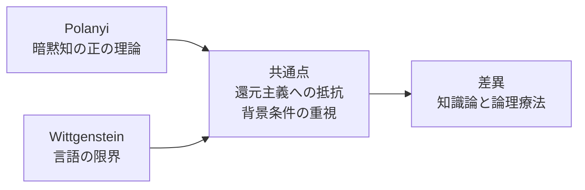
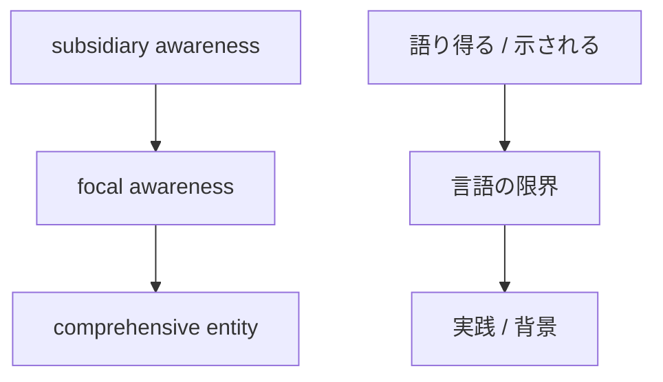

# Point of contact between Polanyi's tacit knowledge and Tractatus Logico-Philosophique

## 1. Executive Summary

Both Polanyi and the early Wittgenstein showed that knowledge cannot be exhausted by explicit propositions alone. However, even if the conclusions seem to be the same, the points reached are different. Polanyi actively depicts the implicit support within knowing. The Logical-Philosophical Tractatus logically sets the limits of what can be said and calls for silence about anything outside those limits.
The conclusions of this paper are as follows.

1. Polanyi's tacit knowledge is the function of subsidiary awareness that supports a focused object, and the act of knowing should be understood as "from-to" integration.
2. Focal awareness is not just the center of attention, but awareness of a comprehensive entity created by integrating multiple cues.
3. "What can be said" and "what can be shown" in "Tractises on Logical Philosophy" are devices that separate the relationship between the describability of facts and the limits of logical forms, values, and the world.
4. The commonalities between the two are resistance to reductionism, emphasis on background conditions, and awareness of the limits of language.
5. However, they cannot be equated. Polanyi is a theory of knowledge, Wittgenstein is a boundary setting of logic, and the meaning of silence is also different.
6. In practice, it is important not to over-summarize the narratives of experts, to preserve the original cases and original expressions, and to separate the parts that can be explained from the parts that should be preserved as practice.
   Source note: Polanyi's central propositions are summarized in [The Tacit Dimension](https://press.uchicago.edu/ucp/books/book/chicago/T/bo6035368.html) of the University of Chicago Press and [The Structure of Consciousness](https://polanyisociety.org/mp-structure.htm) of the Polanyi Society. 6.522, 6.53, 6.54, and 7 of "Tractises on Logical Philosophy" can be confirmed in [Wikisource の全文](https://en.wikisource.org/wiki/Tractatus_Logico-Philosophicus). A useful overview of the interpretation is [Wittgenstein](https://plato.stanford.edu/archives/fall2023/entries/wittgenstein/) in the Stanford Encyclopedia of Philosophy.

## 2. Research history and primary literature

When reading this topic, first understand the chronology of the literature to reduce confusion.
| Year | Literature | Position |
| --------- | ---------------------------------------------- | --------------------------------------------------------------------------- |
| 1921/1922 | Wittgenstein, _Tractatus Logico-Philosophicus_ | Separating what can be said from what can be shown, and viewing the work of philosophy as setting the limits of language |
| 1958 | Polanyi, _Personal Knowledge_ | Foregrounding the personal, responsible, and tacit aspects of the act of knowing |
| 1966 | Polanyi, _The Tacit Dimension_ | Formulating tacit knowing based on "we can know more than we can tell" |
Although Polanyi's argument is often reduced to "unspeakable skills," it is actually much broader. He believed that scientific cognition, skill, observation, judgment, and valuing had pre-propositional support. Wittgenstein's Tractatus Logico-Philosophique, on the contrary, clarifies the logical form of propositions that reflect the facts of the world, leaving what lies outside of it as the realm of being "shown."
Source note: Polanyi's [The Tacit Dimension](https://press.uchicago.edu/ucp/books/book/chicago/T/bo6035368.html) introduces the tacit dimension in connection with scientific practice, tradition, and valuing. The original text of Treatise on Logical Philosophy can be found in [Wikisource](https://en.wikisource.org/wiki/Tractatus_Logico-Philosophicus), and [Wittgenstein](https://plato.stanford.edu/archives/fall2023/entries/wittgenstein/) in SEP positions the Tractatus as setting the logical boundaries of the earlier period.

## 3. Polanyi's tacit knowledge

### 3.1 Tacit knowledge is not “missing knowledge”

Polanyi's tacit knowledge does not simply mean "knowledge that has not yet been documented." Rather, it is the claim that the very act of knowing requires support that is not explicitly grasped. We don't look at an object by arranging individual clues separately. While using clues as subsidiary awareness, grasp one target in focus.
For example, in facial recognition, the eyes, nose, mouth, and contours are not confirmed as separate propositions, but are used as support to understand that it is this person. The same goes for skilled observation, diagnosis, design, research, and craftsmanship. Tacit knowledge here is not a lack, but a structure that enables knowing.
Source note: Polanyi Society's [The Structure of Consciousness](https://polanyisociety.org/mp-structure.htm) explains the relationship between subsidiary awareness and focal awareness. [The Tacit Dimension](https://press.uchicago.edu/ucp/books/book/chicago/T/bo6035368.html) from the University of Chicago Press shows "we can know more than we can tell" as the central proposition.

### 3.2 subsidiary awareness / focal awareness / comprehensive entity

These three are central to understanding Polanyi.
| Terminology | Meaning | Role |
| -------------------- | --------------------------------- | --------------------------------- |
| Subsidiary awareness | Peripheral awareness that supports the focal object | Acts as a clue, background, and base |
| focal awareness | grasp at the center of attention | awareness of an integrated object |
| comprehensive entity | a whole that emerges from the integration of clues | a result that emerges as a meaningful object |
The important point is that subtracting subsidiary awareness alone does not lead to knowledge. In Polanyi's "from-to" structure, we move from the clue to the object; we do not continue to view the clue as an object. Therefore, mastery is not about "being able to say everything," but is closer to reaching the target using the support that cannot be said.
Source note: Polanyi Society's [The Structure of Consciousness](https://polanyisociety.org/mp-structure.htm) explains the relationship between from-to structure and focal/subsidiary. `comprehensive entity` here is understood as the result of an integrated grasp, not simply the sum of its parts.

### 3.3 What Polanyi emphasized

Polanyi was keenly aware that science and professional practice are not purely operations of explicit rules. What we consider to be a problem, what we perceive to be abnormal, which observations to consider important, and where to stop making decisions are often learned before we can write rules.
In this sense, Polanyi's theory is not a pessimistic theory that "tacit knowledge cannot be spoken of correctly." Rather, it is a theory that positively states that the act of knowing involves responsibility, trust, commitment, training, and the relationship between master and student.
Source note: [The Tacit Dimension](https://press.uchicago.edu/ucp/books/book/chicago/T/bo6035368.html)'s commentary relates tacit knowledge to tradition, inherited practices, implemented values, and prejudgments. This provides grounds for reading tacit knowledge not only as an individual's intuition but also as a background condition of a community of practice.

## 4. What can be said and what can be shown in the Tractatus Logico-Philosophique

### 4.1 Boundaries of what can be said

In the Treatise on Logical Philosophy, propositions are said to reflect the facts of the world. Therefore, a meaningful statement must have content that can be established as fact. Some aspects of ethics, beauty, metaphysics, and logical forms cannot be described as factual statements.
In this framework, the task of philosophy is not to add new theories but to clarify the boundaries of narrative. Be clear about what you can say and don't confuse what you can't say. That is the basic stance of Tractatus.
Source note: You can check the propositions after 4.x in [Wikisource 版](https://en.wikisource.org/wiki/Tractatus_Logico-Philosophicus) of "Tractises on Logical Philosophy". [Wittgenstein](https://plato.stanford.edu/archives/fall2023/entries/wittgenstein/) of SEP organizes Tractatus as a mapping theory of facts and boundary setting.

### 4.2 What is shown

Tractatus 6.522 states that the ineffable is "shown." 6.53 shows the philosophical method of saying only what can be said, and 6.54 says to discard the proposition as a ladder. The last number 7 concludes by telling us to be silent about what we cannot talk about.
"Silence" here is not just reticence. Rather, it is a methodological silence that separates what can be stated logically from what cannot be treated as a statement, but which appears in the dimensions of the world and values.
Source note: 6.522, 6.53, 6.54, and 7 of "Tractises on Logical Philosophy" can be found in [Wikisource](https://en.wikisource.org/wiki/Tractatus_Logico-Philosophicus). [Wittgenstein](https://plato.stanford.edu/archives/fall2023/entries/wittgenstein/) of SEP treats the "say/show" distinction in Tractatus as a core issue in the first half.

### 4.3 A request for silence is not a denial of knowledge

Tractatus' silence does not deny knowledge itself. Rather, it is an attitude that does not easily include what remains outside of language as the subject of theory, as a result of being strict about how language can represent facts. There is a different tension here than Polanyi's positive tacit knowledge theory.
Source note: 6.54 and 7 of the Treatise on Logical Philosophy have a structure in which the propositions self-resolve. SEP's [Wittgenstein](https://plato.stanford.edu/archives/fall2023/entries/wittgenstein/) distinguishes this self-resolution methodology from the later Wittgenstein's language game theory.

## 5. Point of contact between the two

On the surface, the point of contact between Polanyi and Tractatus appears to be that "there are things that cannot be said." However, in reality, we need to be a little more precise.

1. **Resists reduction to explicit knowledge**: Neither reduces knowing or meaning to the sum of explicit propositions.
2. **Emphasis on background conditions**: Polanyi emphasizes subsidiary awareness, and Wittgenstein emphasizes logical forms and limit conditions.
3. **The appearance of the object precedes**: Polanyi indicates integration into a focused object, and Tractatus indicates the mappability of facts and their outside.
4. **There are limits to how language works**: Neither believes that language can directly objectify everything.

The point of contact here is not the romance of "something that cannot be put into words." Rather, the point is that knowing and meaning depend not on an absolute mystery outside of words, but on the conditions under which words come into existence and the supports that operate within practice.
Source note: On the Polanyi side, see [The Tacit Dimension](https://press.uchicago.edu/ucp/books/book/chicago/T/bo6035368.html) and Polanyi Society's [glossary](https://polanyisociety.org/). On the Tractatus side, see [Wikisource](https://en.wikisource.org/wiki/Tractatus_Logico-Philosophicus) and SEP's [Wittgenstein](https://plato.stanford.edu/archives/fall2023/entries/wittgenstein/).

## 6. Important differences

### 6.1 Polanyi is a theory of knowledge, Tractatus is a logic therapy

Polanyi depicts how the knowing subject commits to the world. Mastery, attention, embodiment, communication, and trust become active themes. On the other hand, Tractatus's main interest lies in the logic of correctly describing the world and in setting limits to avoid pushing beyond it.
Therefore, it is inaccurate both to reduce Polanyi to a commentary on the Tractatus and to reduce the Tractatus to a theory of tacit knowledge.
Source note: Polanyi's [The Tacit Dimension](https://press.uchicago.edu/ucp/books/book/chicago/T/bo6035368.html) and Tractatus Logico-Philosophico [Wikisource](https://en.wikisource.org/wiki/Tractatus_Logico-Philosophicus) have different problem settings. SEP's [Wittgenstein](https://plato.stanford.edu/archives/fall2023/entries/wittgenstein/) also shows a tendency to read the Tractatus as a precursor to philosophical therapy.

### 6.2 Tacit knowledge and showable/sayable are not synonymous

Polanyi's tacit knowledge is a broad concept that includes skill, observation, judgment, valuation, and communal transmission. In contrast, shown/unsaid in Tractatus is a boundary concept related to logical form and value. Although there is some overlap between the two, the scope is not the same.
What I would like to be particularly careful about is that the "what is shown" in Tractatus can be read as "tacit knowledge." This is understandable as a later comparative interpretation, but the text itself does not say the same thing.
Source note: Comparing [Wikisource](https://en.wikisource.org/wiki/Tractatus_Logico-Philosophicus) of Treatise on Logical Philosophy and [Tacit Knowledge glossary](https://polanyisociety.org/) of Polanyi Society, the former deals with logic and limits, and the latter deals with the structure of the act of knowing. The identification from here is an interpretive leap.

### 6.3 Silence has different meanings

Silence in Tractatus is a methodology of not forcing theorization of the unstateable. Rather, Polanyi's "inability to say" is affirmed as a support that lies within practice. Silence is closer to respecting boundaries in the former and acknowledging background support in the latter.
Source Note: 7's silence can be found in [Wikisource](https://en.wikisource.org/wiki/Tractatus_Logico-Philosophicus). For the Polanyi side, see [The Tacit Dimension](https://press.uchicago.edu/ucp/books/book/chicago/T/bo6035368.html) and [The Structure of Consciousness](https://polanyisociety.org/) of the Polanyi Society.

## 7. Main interpretation

### 7.1 Polanyi reading

In Polanyi research, tacit knowledge is fundamentally read as trained attention and responsible commitment, rather than vague intuition in an individual's head. The arrangement of the Polanyi Society clearly supports this direction.
In this reading, subsidiary awareness, as opposed to focal awareness, is not a defect in awareness, but a condition for its establishment. Therefore, tacit knowledge is not "unfinished knowledge that will eventually become fully explicit."
Source note: Polanyi Society's [The Structure of Consciousness](https://polanyisociety.org/mp-structure.htm) supports this reading. [The Tacit Dimension](https://press.uchicago.edu/ucp/books/book/chicago/T/bo6035368.html) from the University of Chicago Press is in the same direction.

### 7.2 Reading of Tractatus

The main interpretation of Tractatus is not naive mysticism, but a presentation of the logical limits of representation. We can say what we can say, but we cannot grasp what we cannot say in the form of theories. This is an attitude that approaches philosophy as "resolving confusion" rather than "adding explanations."
Source note: SEP's [Wittgenstein](https://plato.stanford.edu/archives/fall2023/entries/wittgenstein/) organizes early Wittgenstein in the context of logical structure and delimitation. [Wikisource](https://en.wikisource.org/wiki/Tractatus_Logico-Philosophicus) of "Tractises on Logical Philosophy" is its primary source.

### 7.3 Genealogy of secondary literature that connects the two

In secondary literature, there is a lineage that reads Polanyi in a Wittgensteinian way. However, most of them emphasize "practices that precede language," "ability to use rules," and "community judgment," and do not completely overlap with Tractatus' theory of silence.
Rather than roughly equating the two, it is useful to use this genealogy as a bridge to consider how "things that cannot be put into words, but are in operation in practice" come into being.
Source note: Secondary arrangements such as [Tacit Knowledge: A Wittgensteinian Approach](https://www.polanyisociety.org/TAD%20WEB%20ARCHIVE/TAD33-3/TAD33-3-fnl-pg9-25-pdf.pdf) connect Polanyi's tacit knowledge to Wittgensteinian problem systems. However, this is a comparative interpretation, not the sameness of primary documents.

## 8. Practical implications

This argument is effective in practice because it provides judgments that are not "over-summarized" when extracting tacit knowledge and transferring knowledge.

1. **Leave the original case**: In addition to the general theory of experts, leave specific examples, failures, and exceptions.
2. **Keep the original narrative**: Do not replace with standard terminology first. Habits of phrasing and metaphors are often clues for judgment.
3. **Separate clues and conclusions**: Record what you saw and what led you to that conclusion separately from your conclusion.
4. **Don't force people to say what they can't say**: Forcible formalization actually lowers the quality of judgment.
5. **Verify in practice**: Documented rules have meaning only when they are used in the field.
   The important lesson here is that increasing explainability and flattening practical knowledge are not the same thing. In Polanyi's terms, when knowledge loses its support, it also loses its object. In Tractatus terms, philosophical confusion begins the moment you feel like explaining beyond the limits of what can be said.
   Source note: The results for practical reading are interpretations from Polanyi's [The Tacit Dimension](https://press.uchicago.edu/ucp/books/book/chicago/T/bo6035368.html) and Tractatus [Wikisource](https://en.wikisource.org/wiki/Tractatus_Logico-Philosophicus). "Do not over-summarize" here is not a single word in the original text, but a secondary practical connotation.

## 9. Risks/Limitations

There are three pitfalls to this comparison.
First, Polanyi is reduced to a story of "knowledge that cannot be expressed in some way." Second, the "shown" of Tractatus is short-circuited with tacit knowledge. Thirdly, by including Wittgenstein's theory of language games in his later years, he obscures the points discussed in his earlier period.
This paper is an attempt to separate the commonalities and differences between primary literature and major interpretive literature. Therefore, it does not cover detailed literary history or rigorous comparison of translation differences.
Source note: See [Wikisource](https://en.wikisource.org/wiki/Tractatus_Logico-Philosophicus) for the primary source of Tractatus Logico-Philosophique, and [Wittgenstein](https://plato.stanford.edu/archives/fall2023/entries/wittgenstein/) in SEP for the context of later Wittgenstein. On the Polanyi side, see [Polanyi Society](https://polanyisociety.org/) and [The Tacit Dimension](https://press.uchicago.edu/ucp/books/book/chicago/T/bo6035368.html).

## 10. Recommended policy

When using these two in practice or research, it is best to handle them in the following order.

1. First, check with Polanyi the internal structure of the act of knowing.
2. Next, use the Tractatus to check the limits of what can be said.
3. On top of that, we should not easily equate the two, but instead place the common point in "sensitivity to background conditions" and the difference in "the purpose of the theory."
4. Finally, in knowledge transfer and documentation, leave cases, clues, scenes, and exceptions rather than summaries.
   By following this order, it is easy to avoid revering tacit knowledge as a "mystery that cannot be explained" or misunderstanding that "everything can be written into a manual."
   Source note: The above is an integrated arrangement based on Polanyi's [The Tacit Dimension](https://press.uchicago.edu/ucp/books/book/chicago/T/bo6035368.html), Polanyi Society's [The Structure of Consciousness](https://polanyisociety.org/mp-structure.htm), Tractatus' [Wikisource](https://en.wikisource.org/wiki/Tractatus_Logico-Philosophicus), and SEP's [Wittgenstein](https://plato.stanford.edu/archives/fall2023/entries/wittgenstein/).

## Reference information

- Michael Polanyi, [The Tacit Dimension](https://press.uchicago.edu/ucp/books/book/chicago/T/bo6035368.html), University of Chicago Press.
- Polanyi Society, [The Structure of Consciousness](https://polanyisociety.org/mp-structure.htm).
- Ludwig Wittgenstein, [Tractatus Logico-Philosophicus](https://en.wikisource.org/wiki/Tractatus_Logico-Philosophicus), Wikisource.
- Stanford Encyclopedia of Philosophy, [Wittgenstein](https://plato.stanford.edu/archives/fall2023/entries/wittgenstein/).
- Ludwig Wittgenstein, _Philosophical Investigations_ is not the main subject of this paper, but it is useful as a comparative axis for the later period.
- See [Tacit Knowledge: A Wittgensteinian Approach](https://www.polanyisociety.org/TAD%20WEB%20ARCHIVE/TAD33-3/TAD33-3-fnl-pg9-25-pdf.pdf) for an example of comparative interpretation regarding Tacit Knowledge.
