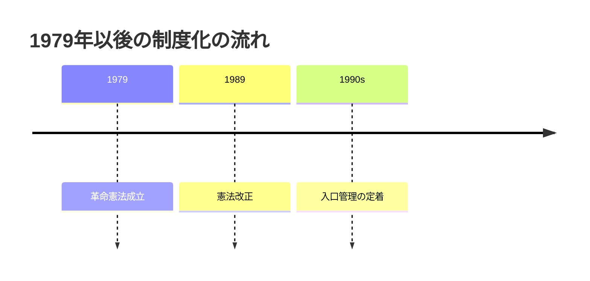
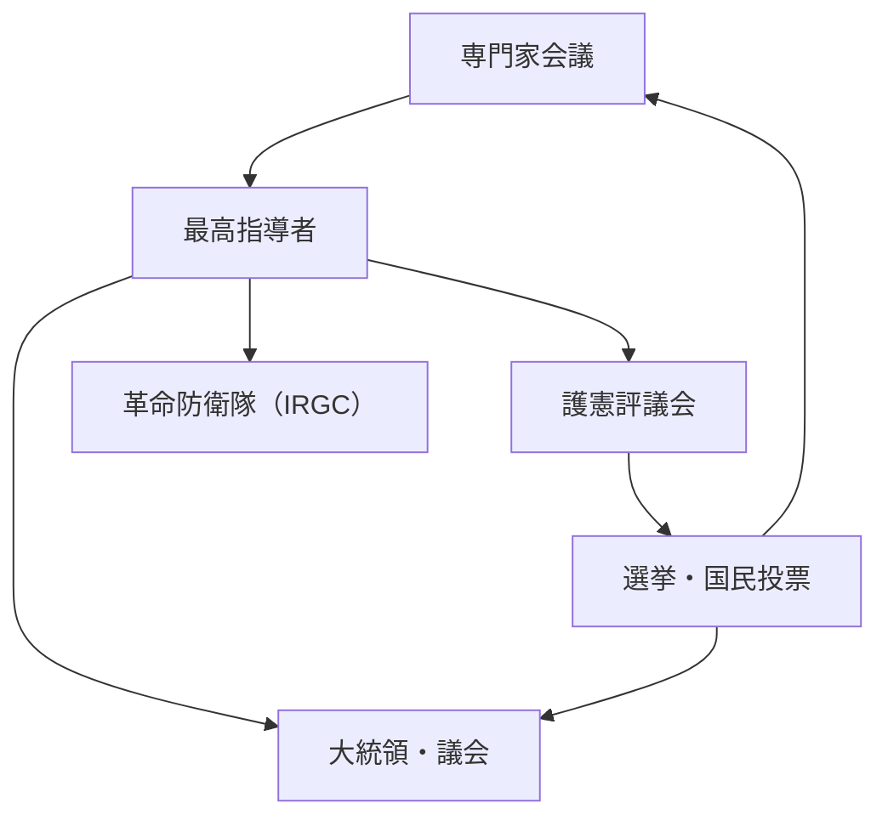

# Power structure and governance structure after the Iranian revolution
## 1. Executive Summary
After the 1979 revolution, Iran is neither a simple "religious state" nor a normal parliamentary government system. The constitution institutionalizes `velayat-e faqih`, or ``jurist rule,'' placing the supreme leader at the top of the state, and intertwining the Assembly of Experts, the Guardian Council, the judiciary, the Revolutionary Guards, and the electoral system. Although there is an elected president and parliament, the selection of candidates, legal compliance checks, and final control over the military and public security rely heavily on non-elected bodies.
The core of this structure is that the supreme leader is not simply a religious authority, but is designed as a constitutional unification point that straddles the military, judiciary, Guardian Council, broadcasting, and religious foundations. On the other hand, since the Expert Council is responsible for selecting and dismissing the supreme leader, there remains a mechanism that, at least formally, constrains the top. However, candidates for that conference also go through screening by the Guardian Council, making it a closed structure in which the body that supervises supervisors is once again supervised.
In short, Iran's post-revolutionary system is a system in which ``there is a president and a parliament, but the final allocation of sovereignty lies with the supreme leader.'' In practical terms, the issues at stake are not who makes the laws, but who passes the candidates, who stops the laws, and who controls the military and security apparatus.
Source note: The framework of the Constitution is based on [Constitute Project, Constitution of the Islamic Republic of Iran (1989 revision)](https://www.constituteproject.org/constitution/Iran_1989?lang=en). For practical readings of the Assembly of Experts, the Guardian Council, the Judiciary, and the Revolutionary Guards, refer to [USIP Iran Primer: The Assembly of Experts](https://iranprimer.usip.org/resource/assembly-experts), [The Guardian Council](https://iranprimer.usip.org/resource/guardian-council), [The Judiciary](https://iranprimer.usip.org/resource/judiciary), [The Islamic Revolutionary Guard Corps](https://iranprimer.usip.org/resource/islamic-revolutionary-guard-corps), and [The Supreme Leader](https://iranprimer.usip.org/resource/supreme-leader).
## 2. Constitutional Design

The 1979 constitution did not limit the ideals of the Iranian revolution to an abstract declaration, but fixed it in the distribution of power. Article 5 states that the Twelve Imams will be ruled by "just and pious jurists" during their period of seclusion, and Article 107 stipulates that a council of experts will select the leaders. Article 110 enumerated the powers of the supreme leader, including the supreme command of the military, the appointment of the head of the judiciary, and the appointment of jurist members of the Guardian Council.
The 1989 revision has great institutional significance. Leadership authority was concentrated in a single supreme leader, and the relationship with the expert council was made clearer. This also means that post-revolutionary religious orthodoxy was fixed as a ``delegation to a single jurist,'' rather than a ``council of multiple religious authorities.''
Article 6 provides that the principal institutions of the Republic shall be governed by elections and referendums. On the other hand, Articles 91 and 94 require parliamentary bills to be examined by the Guardian Council, and Article 99 gives the Council the power to supervise elections and referendums. In other words, Iran's system is designed in such a way that ``there are elections, but the constitutional organs control the entry and exit points of the elections.''
Source note: Confirmation of the constitutional provisions was conducted mainly on [Constitute Project, Constitution of the Islamic Republic of Iran](https://www.constituteproject.org/constitution/Iran_1989?lang=en). We checked the wording of Articles 5, 6, 91, 94, 99, 107, 110, and 111, and referred to [USIP Iran Primer: The Supreme Leader](https://iranprimer.usip.org/resource/supreme-leader) and [The Assembly of Experts](https://iranprimer.usip.org/resource/assembly-experts) for the meaning of the system.
## 3. Relationship with major institutions
The following is a correspondence table of the minimum number of institutions that should be known in order to understand this system.
| Institution | How to be selected | Main authority | Relationship with other institutions |
| ------------------ | ------------------------------------------------------------------------- | --------------------------------------------------------------- | ------------------------------------------------------------ |
| Supreme leader | Selected and dismissed by the expert panel | Supreme command of the military, appointment of the judicial chief, appointment of half of the Constitutional Guardian Council, control of major broadcasting, etc. | The top of the system. Coordinating governance from outside electoral institutions |
| Expert Meeting | Selected through elections rather than a referendum, but candidates are examined by the Constitutional Guardian Council | Selection, supervision, and dismissal of the supreme leader | Formally, the supreme leader is bound, but the Guardian Council can control the entrance process || Constitutional Guardian Council | 6 jurists appointed by the supreme leader, 6 lawyers selected by parliament based on the recommendation of the Attorney General | Examination of legal suitability, supervision of elections and referendums, screening of candidates | Gatekeeper for both parliament and elections |
| President | Directly elected by popular vote. However, candidates are subject to screening | As head of the executive branch, oversees domestic affairs, economy, and administration | Cannot handle matters that fall under the authority of the supreme leader |
| Parliament (Majles) | Elected by referendum. However, there is candidate screening | Law enactment, budget, and supervision | Statutory laws are subject to review by the Guardian Council |
| Judiciary | The head of the judiciary is appointed by the supreme leader | Supervises the courts, prosecutors, and legal system development | The head of the judiciary is involved in the selection of legal staff for the Guardian Council |
| Revolutionary Guards Corps (IRGC) | A standing military organization under the control of the supreme leader | The key to the defense of the revolution and the regime, as well as external and internal security | Parallel to the regular army, serves as the central axis of regime defense |
| Electoral system | Including presidential, parliamentary, expert meeting, and referendum | Entrance to representative selection | Subject to supervision and candidate screening by the Guardian Council |
Source note: The above table was organized by comparing [Constitute Project の憲法本文](https://www.constituteproject.org/constitution/Iran_1989?lang=en) with [USIP Iran Primer: The Supreme Leader](https://iranprimer.usip.org/resource/supreme-leader), [The Guardian Council](https://iranprimer.usip.org/resource/guardian-council), [The Judiciary](https://iranprimer.usip.org/resource/judiciary), [The Assembly of Experts](https://iranprimer.usip.org/resource/assembly-experts), [The Islamic Revolutionary Guard Corps](https://iranprimer.usip.org/resource/islamic-revolutionary-guard-corps).

There are three points in the diagram. First, the supreme leader is placed at a higher level across military, judicial, and supervisory institutions. Second, the Constitutional Guardian Council controls not only legal review but also the entry point for elections. Third, although the Expert Council can choose the supreme leader, candidate members are also examined by the Constitutional Guardian Council.
Source note: Figure integrates [Constitute Project](https://www.constituteproject.org/constitution/Iran_1989?lang=en), [USIP Iran Primer: The Supreme Leader](https://iranprimer.usip.org/resource/supreme-leader), [The Assembly of Experts](https://iranprimer.usip.org/resource/assembly-experts), [The Guardian Council](https://iranprimer.usip.org/resource/guardian-council).
## 4. Supreme Leader and Expert Meeting
The Supreme Leader is the center of the Iranian system. According to Article 110 of the Constitution, it controls key points of the state, including the supreme command of the military, the authority to declare war and peace, the appointment of the chief justice, the appointment of the head of the broadcasting organization, and the appointment of the jurists of the Guardian Council. Although the president is the constitutional head of government, he cannot override the institutional superiority of the supreme leader.
The Council of Experts is said to be able to select, supervise and, if necessary, dismiss the supreme leader. This is the point where ``religious guidance is not unlimited'' and formally serves as an institutional brake on the highest authority. However, candidates are selected through the Guardian Council, so opponents cannot freely flow in. The system is designed to facilitate self-reproduction.
Article 111 also stipulates what to do if a vacancy occurs in the position of supreme leader. In other words, the system has been constitutionalized not only for ``individual charisma'' but also for ``rules for succession in the event of a vacancy.'' This shows that post-revolutionary Iran is not an interim government, but an institutional state that envisions long-term rule.
Source note: The relationship between the Supreme Leader and the Expert Council is organized by [USIP Iran Primer: The Supreme Leader](https://iranprimer.usip.org/resource/supreme-leader) and [The Assembly of Experts](https://iranprimer.usip.org/resource/assembly-experts). Constitutional provisions referred to [Constitute Project, Article 107-111](https://www.constituteproject.org/constitution/Iran_1989?lang=en).
## 5. Guardian Council and electoral system
The Guardian Council is the most important gatekeeper of Iranian politics. According to Article 91, it is composed of 12 members, with six jurists appointed by the supreme leader and six jurists selected by the parliament with the recommendation of the attorney general. Article 94 requires the review of bills passed by parliament, and Article 96 authorizes the review to check ``compatibility with Islamic law and the constitution.''
The important point in practice is the "supervision of elections and referendums" based on Article 99. Presidential, parliamentary, and expert council elections are formalities, but candidates are vetted in advance, so the scope of competition is institutionally controlled. Therefore, it is accurate to view Iranian elections not as a ``free market for power change,'' but as a ``device that periodically rearranges the options within the regime.''
Although the president is elected by the people, Article 113 of the Constitution only positions the president as the nation's highest executive branch after the supreme leader, leaving final adjustments to territorial sovereignty with the supreme leader. Although the parliament is also elected by the people, it does not have complete legislative power because legislation cannot be finalized unless it passes the examination under Article 94.
Source note: The composition of the Guardian Council and election supervision was referred to [Constitute Project, Articles 91, 94, 96, 99](https://www.constituteproject.org/constitution/Iran_1989?lang=en). For practical narrowing down of elections, refer to [USIP Iran Primer: The Guardian Council](https://iranprimer.usip.org/resource/guardian-council) and [The Assembly of Experts](https://iranprimer.usip.org/resource/assembly-experts).
## 6. Judiciary and control of law
Iran's judiciary is designed to be an independent institution, with the head of the judiciary appointed by the Supreme Leader. Article 157 stipulates that the Supreme Leader appoints the head of the judiciary, and Article 160 creates a system in which the president appoints the Minister of Justice, but the candidate must be proposed by the head of the judiciary. In other words, law enforcement is not the sole authority of the president, but is influenced by the supreme leader through the attorney general.
This design allows the judiciary to operate as a ``central apparatus connected to the supreme leader,'' while formally retaining the separation of powers between the legislative, executive, and judicial branches. The core of the system is who chooses the top judiciary, rather than the finality of the verdict itself.
Source note: Main points about the judicial system referenced [USIP Iran Primer: The Judiciary](https://iranprimer.usip.org/resource/judiciary) and [Constitute Project, Articles 156-160](https://www.constituteproject.org/constitution/Iran_1989?lang=en).
## 7. Connection between the Revolutionary Guards and religious authorities
The Revolutionary Guards Corps (IRGC) is separate from the regular army and is specified in Article 150 of the Constitution as a standing military organization to protect the revolution and the regime. Article 143 positions the conventional army in the defense of national independence and territorial integrity, and Article 150 leaves the Revolutionary Guards as guardians of the revolution and its achievements. This shows that Iran's security is not separated into "national defense" and "regime defense."
The supreme leader holds the highest command of the military and stands above the IRGC chain of command, making it the nexus between religious authority and armed organizations. USIP describes the IRGC as one of Iran's most powerful security and military organizations, noting its political and economic infiltration. In practice, the IRGC functions not only as an external force but also as a domestic stabilization and repression device.
For this reason, religious authority in Iran is not limited to the ``authority of a preacher,'' but emerges as a governing power that unifies the military, security, and judiciary. The difficulty in post-revolutionary Iran is not that religion and state are not separate, but that their combination has become institutionally multi-layered, overlapping the electoral system.
Source note: IRGC institutional position referred to [Constitute Project, Articles 143 and 150](https://www.constituteproject.org/constitution/Iran_1989?lang=en) and [USIP Iran Primer: The Islamic Revolutionary Guard Corps](https://iranprimer.usip.org/resource/islamic-revolutionary-guard-corps).
## 8. Practical reading
There are three practical points to consider when looking at this system. First, it is a mistake to categorize Iranian politics into whether there will be an election or not. In reality, elections are held, but candidate selection and legal review are controlled by higher-ranking institutions. Second, the supreme leader's authority is not conveyed through symbols, but through military, judicial, and supervisory institutions. Third, the IRGC needs to be read not just as a military organization but as a core institution for maintaining the regime.
From the perspective of policy analysis, looking at the presidential office alone is insufficient when it comes to diplomacy toward Iran, designing sanctions, evaluating political change scenarios, and considering military deterrence. What actually influences decisions are the Supreme Leader, the Guardian Council, the judiciary, the IRGC, and the electoral controls that reproduce them.
There are limits. What I have shown here is the constitutional design and its institutional consequences, and I have not delved into the factional conflicts of individual authorities, economic interests, revolutionary history, or regional proxy forces. Therefore, in order to read actual decision-making, it is necessary to separately track individual data on personnel, budget, sanctions avoidance, and military operations in addition to institutional analysis.
## 9. Reference information
- [Constitute Project, Constitution of the Islamic Republic of Iran](https://www.constituteproject.org/constitution/Iran_1989?lang=en)
- [USIP Iran Primer: The Supreme Leader](https://iranprimer.usip.org/resource/supreme-leader)
- [USIP Iran Primer: The Assembly of Experts](https://iranprimer.usip.org/resource/assembly-experts)
- [USIP Iran Primer: The Guardian Council](https://iranprimer.usip.org/resource/guardian-council)
- [USIP Iran Primer: The Judiciary](https://iranprimer.usip.org/resource/judiciary)
- [USIP Iran Primer: The Islamic Revolutionary Guard Corps](https://iranprimer.usip.org/resource/islamic-revolutionary-guard-corps)
