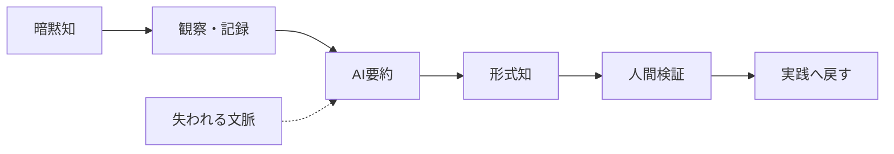
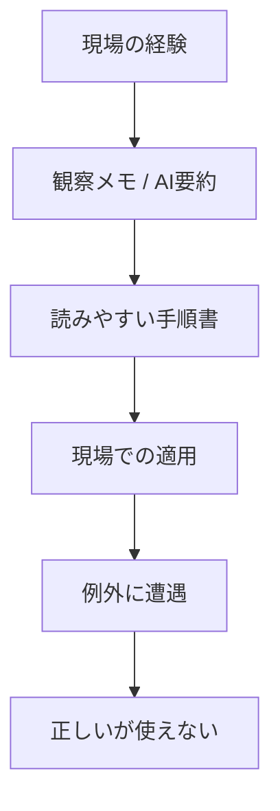

# Relationship between tacit knowledge, explicit knowledge, and AI summary

## 1. Executive Summary

In conclusion, it is appropriate to use generative AI as a "device that compresses and reorganizes explicit material," rather than "a device that understands tacit knowledge as it is." Among the SECI models, AI is strong against `外化` and `連結`, while `共同化` and `内面化` remain as supplements. This is because tacit knowledge itself is embedded in the context of embodiment, mastery, value judgment, and place even before it is documented.
The practical arguments of this paper are the following four points.

1. Tacit knowledge is not "knowledge that has not yet been written down," but is the background structure that supports the act of knowing.
2. LLM is useful for summarizing, translating, retrieving, and classifying explicit text, but it is not a substitute for physical knowledge and responsible judgment.
3. Summaries create distortions not only by reducing the amount of information, but also by omitting exceptions, priorities, clues for judgment, and responsibilities.
4. In practice, the safest two-step approach is to have AI do the "primary sorting" and humans take on "meaning-giving, verification, and assumption of responsibility."
   Source note: Polanyi's tacit knowledge can be found in [The Tacit Dimension](https://press.uchicago.edu/ucp/books/book/chicago/T/bo6035368.html) from the University of Chicago Press and [The Structure of Consciousness](https://polanyisociety.org/mp-structure.htm) from the Polanyi Society. For SECI, Nonaka & Takeuchi's [The Knowledge-Creating Company](https://hbr.org/1991/11/the-knowledge-creating-company-2) and the book version [Google Books 項目](https://books.google.com/books/about/The_Knowledge_Creating_Company.html?id=pSHhzwEACAAJ) are the primary information entry points. The limitations of LLM can be easily identified by reading [Bender & Koller](https://aclanthology.org/2020.acl-main.463.pdf), which presents a grounding critique of text-only learning, and [Brown et al.](https://arxiv.org/abs/2005.14165), which presents the expansion and versatility of language models, side by side.

## 2. Background and research history

This theme is easier to understand if you connect at least three genealogies.
| Period | Literature | Role |
| ----------- | ----------------------------------------------------- | ---------------------------------------------------------- |
| 1958 / 1966 | Polanyi, _Personal Knowledge_ / _The Tacit Dimension_ | The basis that tacit knowledge lies within the act of knowing |
| 1991 / 1995 | Nonaka & Takeuchi, _The Knowledge-Creating Company_ | tacit / explicit round trip and SECI organization |
| From 2020 | Brown et al., Bender & Koller, subsequent hallucination research | Visualizes that LLM is powerful, but has limitations in grounding and factuality |
Polanyi's point is not just that "we know more than we can put into words." What is more important is the structure in which knowing is the integration of `from-to`, with peripheral awareness supporting the focal object. Therefore, the inability to convert tacit knowledge into complete sentences is not a failure, but belongs to the structure of knowledge itself.
Source note: Polanyi's `subsidiary awareness` and `focal awareness` are arranged in [The Structure of Consciousness](https://polanyisociety.org/mp-structure.htm). The representative proposition of "tacit knowledge", "we can know more than we can tell," can also be confirmed in the introduction to [The Tacit Dimension](https://press.uchicago.edu/ucp/books/book/chicago/T/bo6035368.html).
Nonaka & Takeuchi's SECI is a model of organizational knowledge creation in which tacit knowledge and explicit knowledge circulate in a spiral through `社会化` `外化` `連結` `内面化`. It should be noted here that SECI is not a promise that "everything can be documented," but rather a blueprint for knowledge transfer. AI can speed up some parts of this blueprint, but it won't replace the physical learning itself.
Source note: The basic explanation of SECI can be traced starting from [HBR の原文](https://hbr.org/1991/11/the-knowledge-creating-company-2) and [Google Books の書誌項目](https://books.google.com/books/about/The_Knowledge_Creating_Company.html?id=pSHhzwEACAAJ). The expression "blueprint" here is a practical interpretation from published literature.

## 3. Scope of LLM's ability to handle tacit knowledge

### 3.1 Cognitive perspective

LLM has a strong ability to handle patterns that already appear in sentences. If you have explicit text such as meeting notes, case studies, FAQs, minutes, emails, and procedure manuals, you are good at summarizing, formatting, comparing, and cross-searching. Brown et al.'s few-shot ability is a typical example, allowing the model to make fairly broad generalizations from the specified context.
However, this ability does not mean "experienced". Bender & Koller argued that even if a language model learns text distribution, this alone does not provide world-grounded semantic understanding. In other words, you can learn `何がよく一緒に書かれるか` in LLM, but `現場でそれが本当に起きたか` and `その判断に責任を負えるか` are a different matter.

### 3.2 Linguistic perspective

Translation and summarization are effective ways to make tacit knowledge explicit, but they are also dangerous. This is because the summary is always `選択`. The model leaves words that stand out from the context and tends to drop infrequent but important notes. In particular, exceptional conditions, reservations, doubts, failure cases, and field-specific metaphors are the first to be flattened out in the summary. This is an estimate based on published research and practical observations.
Source note: Issues of factuality and fidelity in LLM are addressed in [survey](https://arxiv.org/abs/2311.05232), which deals with hallucinatory and disloyal summaries, and in subsequent studies where the quality of summaries depends on alignment with reference documents. The "flattening" here is a practical estimate based on these studies, and is not a direct assertion of a single paper.

### 3.3 Practical process perspective

Knowledge transfer does not end with handing out texts. In practice, it involves teacher-student relationships, review, repetition, sharing failures, and adapting to differences in environment. LLM is strong in the collection, formatting, search, translation, and classification parts of this process. On the other hand, `見て覚える` `やってみて修正する` `文脈に応じて止める` in the field requires human feedback. This is another way of saying that SECI's `社会化` and `内面化` cannot be completed with just text processing.
Source note: This paragraph is an estimate from published information that connects SECI's `社会化` and `内面化` with Polanyi's tacit knowledge and Bender & Koller's grounding problem. AI can mainly assist `外化` and `連結`, with training, observation, and embodiment remaining for `共同化` and `内面化`.

## 4. What gets lost in a summary?

There are at least four mechanisms by which summaries create distortions.

1. **Exception disappears**
   The more useful knowledge is, the more exceptions there will be. But summaries are easy to average, and exceptions are treated as noise.
2. **Value judgments weaken**
   "What to prioritize" and "where to stop" are determined more by empirical rules than by text. It is easy to leave only the conclusion in the summary and lose the basis for prioritization.
3. **Body knowledge disappears**
   Mastery includes preverbal discomfort, touch, and a sense of timing. Text summary does not arrive here.
4. **Responsibility becomes invisible**
   If the information about who made the decision and under what conditions disappears, it is likely to be misused in subsequent processes.

What's important about this diagram is that it's not just the "details" that are lost. Details include exception conditions, decision thresholds, and lines of responsibility. Therefore, the failure of AI summarization appears not as a lack of information but as a lack of practical control. This is an estimate from published literature.
Source note: Polanyi's `from-to` structure is in [The Structure of Consciousness](https://polanyisociety.org/mp-structure.htm). [hallucination survey](https://arxiv.org/abs/2311.05232) has summarized the points where LLM can fail in factuality and fidelity. The specific failure modes of summaries can be easily understood by reading together with [On Faithfulness and Factuality in Abstractive Summarization](https://aclanthology.org/2020.acl-main.173/) and [A Survey of Hallucination in Natural Language Generation](https://arxiv.org/abs/2311.05232), which deal with faithfulness and factuality.

## 5. Compatibility between SECI and AI

| SECI stage      | Compatibility with AI | When to use                                                             | Typical failures                                          |
| --------------- | --------------------- | ----------------------------------------------------------------------- | --------------------------------------------------------- |
| Socialization   | Low                   | Collecting dialogue logs and creating starting points for conversations | Substitutes for face-to-face observation                  |
| Externalization | Middle to high school | Interview summaries, SOP drafts, case organization                      | Exceptions, confusion, and basis for judgment are missing |
| Concatenation   | High                  | Cross-document summarization, translation, tagging, and search          | Mixing sources, recirculating old knowledge               |
| Internalization | Low to medium         | Learning quizzes, scenario generation, review support                   | Actual embodiment does not occur                          |

This table does not directly apply SECI theory to AI. Rather, it is a practical estimate of a safe division of roles when using AI. It makes more sense to view AI as an editing aid that speeds up `外化` and `連結` rather than an extractor of tacit knowledge.
Source note: The basic structure of SECI is based on [HBR](https://hbr.org/1991/11/the-knowledge-creating-company-2). Compatibility with AI is estimated from published information that combines Polanyi's tacit knowledge theory and LLM's grounding/fidelity constraints.

## 6. Practical guidelines

If generative AI is to be included in knowledge management, the following order is realistic.

1. **Leave original text**
   Keep conversation logs, interview notes, failure cases, and real customer testimonials. Don't just use the summary as the original.
2. **Separate AI summaries and human annotations**
   Clarify how much is machine-generated and where is human judgment.
3. **Specify exceptions/pending/failures**
   The better the knowledge, the more conditions for its applicability and inapplicability.
4. **Write the clues before the steps**
   Leave "what did you see to make that decision" before the conclusion.
5. **Re-verify on-site**
   The evaluation is not based on the readability of the summary, but on whether it can be reproduced in practice.
6. **Translation paired with original language**
   For multilingual development, a set includes the original text, translated text, glossary, and intention memo.
   Recommended recording items are as follows.
   | Item | Record example |
   | -------------- | ---------------------------- |
   | Situation | Who was watching what and when |
   | Clues for judgment | Numbers, signs, discomfort, customer reactions |
   | Exception conditions | Under which conditions does it not apply |
   | Failure example | What broke and why it failed |
   | Person in charge | Who made the final decision |
   | Update date | When to re-inspect |
   Source note: The above is a summary of Polanyi's tacit knowledge theory and Nonaka's SECI in terms of practical knowledge management. If you have concerns about AI summarization or translation fidelity, please refer to [hallucination survey](https://arxiv.org/abs/2311.05232) and [Bender & Koller](https://aclanthology.org/2020.acl-main.463.pdf).

## 7. Risks/Limitations

There are three misconceptions to avoid on this topic.

1. Tacit knowledge is not an unfinished product that can be fully transcribed someday.
2. LLM is not just a tool for pretending to understand. There is great value in compressing and reorganizing explicit knowledge.
3. However, summarization through LLM does not automatically preserve local context, exceptions, responsibilities, and embodiment.
   Therefore, the success or failure of AI utilization should be measured not by `要約の長さ` but by `例外を残せたか`, `判断の根拠を残せたか`, and `現場で再現できたか`.
   Source note: The irreducibility of tacit knowledge is [Polanyi Society](https://polanyisociety.org/mp-structure.htm) and [The Tacit Dimension](https://press.uchicago.edu/ucp/books/book/chicago/T/bo6035368.html). LLM's limitations depend on [Bender & Koller](https://aclanthology.org/2020.acl-main.463.pdf), and its usefulness depends on [Brown et al.](https://arxiv.org/abs/2005.14165). `測るべき` here is a practical estimate based on these studies.

## 8. Recommended policy

The practical application of this can be summarized in the following sentence.

> AI does not "extract" tacit knowledge, but increases the initial speed of making it explicit. The final meaning and responsibility lies with humans.
> This approach allows AI to act as training wheels for knowledge management, but avoids forcing mastery and judgment into automation. If you want to preserve tacit knowledge, it is better to use the summary as a "gateway to return to the primary source" rather than throwing it away.
> Source note: The above is an integrated estimation of Polanyi's tacit knowing and SECI in light of LLM's grounding/fidelity constraints. For primary sources, see [The Tacit Dimension](https://press.uchicago.edu/ucp/books/book/chicago/T/bo6035368.html), [The Structure of Consciousness](https://polanyisociety.org/mp-structure.htm), [The Knowledge-Creating Company](https://hbr.org/1991/11/the-knowledge-creating-company-2), [Bender & Koller](https://aclanthology.org/2020.acl-main.463.pdf).
