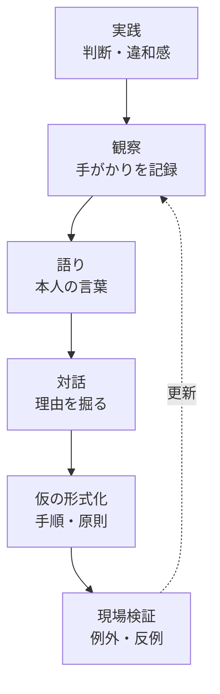
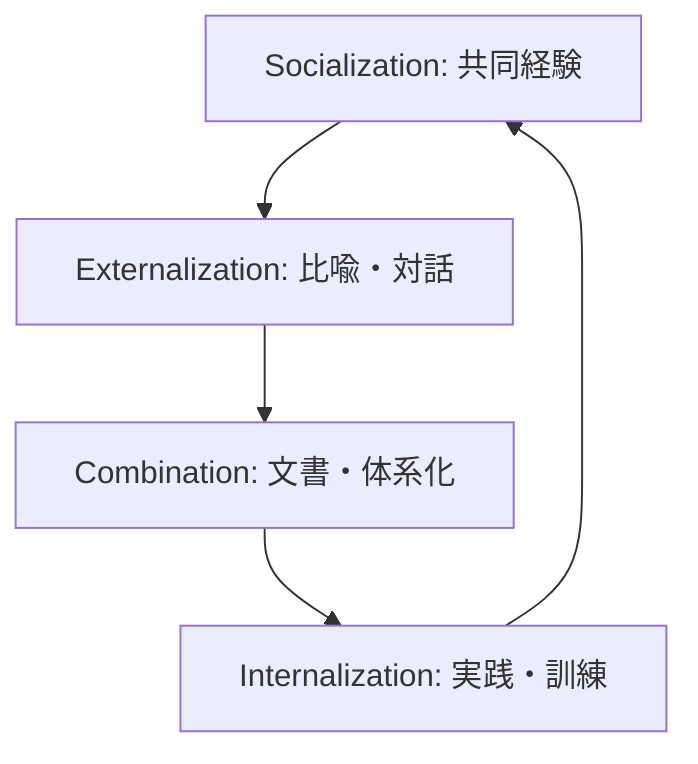
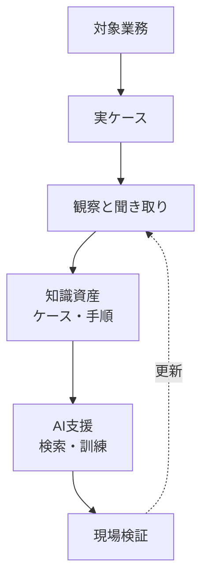

# Definition of tacit knowledge, business theory, trends in the generative AI era
## 1. Executive Summary
Although tacit knowledge is ``knowledge that cannot be put into words,'' this short definition alone is of little use. More precisely, it is the background, physical, social, and situation-dependent knowledge that makes certain actions, judgments, observations, conversations, research, manufacturing, sales, diagnosis, and designs possible, but that is not focused on by the person concerned in propositions.
Polanyi's famous proposition is ``we can know more than we can tell.'' However, what is important here is not the ``unspeakable mystery,'' but the relationship between what we are focusing on and the peripheral clues that support it. Craftsmen, researchers, doctors, salespeople, engineers, and managers often use the questions ``Where should I look,'' ``What's wrong,'' ``Shouldn't I pursue this further now,'' and ``Who should I check with?'' as embodied caution before checklists.
Source note: [The Tacit Dimension](https://press.uchicago.edu/ucp/books/book/chicago/T/bo6035368.html) from the University of Chicago Press introduces Polanyi's central proposition as "we can know more than we can tell" and describes tacit knowledge as involving traditions, practices, values, and prior judgments within scientific knowledge.
Tacit knowledge theory in business can be broadly divided into three genealogies. First, a genealogy that explains organizational knowledge creation through the mutual transformation of tacit and explicit knowledge, such as Nonaka's SECI model. Second, a lineage that sees actual work, learning, and innovation as embedded in communities of practice rather than formal procedures, such as communities of practice leading to Brown and Duguid and Wenger. Thirdly, it is a lineage of practical methods, such as Cognitive Task Analysis, that structurally elicit the cognitions, cues, branching of judgments, and failure avoidance of experts.
The trend in the era of generative AI is not to ``extract all tacit knowledge to AI,'' but to ``use AI to assist the process of human observation, discussion, reflection, and verification.'' LLM, RAG, conversational agents, and business log analysis are useful for picking up pieces of tacit knowledge. However, since tacit knowledge is not linked to missing documents but to practices, situations, bodies, communities, and evaluation criteria, if a summary created by AI is regarded as "organizational knowledge", it will destroy the decision-making structure in the field.

## 2. Definition of tacit knowledge
It is a mistake to understand tacit knowledge only as the opposite of explicit knowledge. Explicit knowledge is easily shared in the form of documents, formulas, specifications, manuals, code, data models, and diagrams. Tacit knowledge includes, but is not limited to, knowledge that has not been verbalized. This includes things that transform into other knowledge the moment they are put into words, things that rely on physical manipulation or a collection of perceptions, and things that depend on community norms and context.
Tacit knowledge is easier to handle if it is divided into at least the following four layers.
| Layers | Content | Business Examples | Ease of Formalization |
| ------------ | ---------------------------------- | -------------------------------------------- | ---------------- |
| Undocumented knowledge | Things that can be said but have not been written yet | Approval routes that only veterans know, points to note for each customer | Expensive |
| Judgment clue | The person uses it, but the explanation is rough | Signal that "this case is dangerous" | Moderate |
| Embodied skills | Embedded in the body, perception, and repeated practice | Craftsmanship skills, examination, customer service, and debugging skills | Low |
| Community norms | Language usage, evaluation criteria, and tacit agreement | What is called a "good design" and "unreasonable proposal" | Low but observable |
The significance of this classification is to avoid monolithic instructions to ``convert tacit knowledge into explicit knowledge.'' If the knowledge is undocumented, it should be documented. Cognitive Task Analysis and case reviews are effective for determining clues. Embodied skills require videos, imitation, practice, and feedback. For communal norms, it is necessary to observe community-of-practice conversations, reviews, and failure handling rather than individual interviews.
Source note: Collins' [Tacit and Explicit Knowledge](https://www.degruyterbrill.com/document/doi/10.7208/9780226113821/html) is known for organizing tacit knowledge into relational, somatic, and collective knowledge. The summary on the publisher's page also explains how tacit knowledge, which has traditionally been grouped together, is broken down into three parts.
## 3. Polanyi: Tacit knowledge is "knowledge that acts as a background"
Polanyi's point is not to view knowledge as a ``collection of explicit propositions.'' When people recognize faces, they do not add up clues such as the eyes, nose, mouth, outline, voice, and mood one by one to form propositions. While relying on details, the focus is on "the person." The same is true for experienced practitioners, who rely on individual clues to focus on things like, ``This is likely to be a quality incident,'' ``This customer is not satisfied yet,'' and ``This design will fail in the future.''
From this, tacit knowledge has two important implications. First, tacit knowledge is not an anti-scientific intuition. Scientific discoveries and professional judgments also have tacit aspects such as how to find problems, experimental habits, discomfort in measured values, and how to formulate valid questions. Second, tacit knowledge cannot always be completely externalized. We can talk, but storytelling is not a replacement for practice, but a guide to returning to practice.
Source note: The publisher's commentary for [The Tacit Dimension](https://press.uchicago.edu/ucp/books/book/chicago/T/bo6035368.html) connects tacit knowledge with tradition, inherited practices, implemented values, and prejudgments. This provides the basis for reading tacit knowledge not only as an individual's intuition but also as a background condition of science and communities of practice.
## 4. Wittgenstein: The risks of paraphrasing and the grammar of practice
If we are to connect the ``Tractise on Logical Philosophy'' and ``Philosophical Inquiry'' that users have read to tacit knowledge, the difference between the first and second periods is important. In his early years, Wittgenstein thought about the pictorial theory that propositions represent the world and the limits of what can be said. Here, language is treated strictly as a mirror of the world's logical forms. In his later Philosophical Inquiries, meaning is not considered to be a fixed object behind words, but rather to be found in language games, usage, and form.
This turn provides a strong warning against the business use of tacit knowledge. Replacing the words used in the workplace with other words not only changes the expression, but also erases the judgment criteria, relationships with other parties, confirmation techniques, responsibility in the event of failure, and subtle strengths and weaknesses that were used there. For example, when a veteran says, ``It's better to put this matter to rest,'' if you rephrase that to ``lower the priority,'' you may lose time, the psychology of the other party, internal politics, the maturity of information, and the next observation point.
Source note: [Ludwig Wittgenstein](https://plato.stanford.edu/archives/fall2023/entries/wittgenstein/) in the Stanford Encyclopedia of Philosophy organizes language-games in Philosophical Inquiry as understanding of meaning connected to action. Similarly, [Rule-Following and Intentionality](https://plato.stanford.edu/entries/rule-following/index.html) explains that the debate over rule-abiding concerns the nature of language and thought.
The risk of paraphrasing is particularly great when externalizing tacit knowledge. In an interview, the moment the interviewer summarizes, ``This is what it means,'' it becomes difficult for experts to argue. Summarization moves the conversation forward, but it also erases the distinctions used in the field. Therefore, in tacit knowledge research, before turning paraphrases into artifacts, it is necessary to preserve the original narrative, actual situations, exceptions, counterexamples, and paraphrases that the person in question dislikes.
## 5. Cat-twist problem: An example where observation precedes theory.
The cat-twist problem is a useful metaphor for tacit knowledge. At first glance, the phenomenon in which a falling body appears to change direction without receiving any external torque appears to violate conservation of angular momentum. However, the premise of viewing the object as a rigid body is wrong. The body transforms, changes shape, and changes direction as a whole.
The lesson from this example is not that ``what cannot be explained is irrational,'' but that ``the granularity of observations and coarse assumptions of models can lead us to mistakenly estimate that correct practice is impossible.'' The same goes for tacit knowledge. If we look at the actions of experts only in terms of fixed procedures, judgment criteria, inputs and outputs, we will not be able to see why they are able to make such judgments. However, when observing the body, gaze, timing, environment, tools, reactions of others, and community norms, the parts that can be formalized and the parts that should be preserved as practice are divided.
Source note: [The physics of cats](https://www.nature.com/articles/s42254-025-00824-6) in Nature Reviews Physics introduces the historical problem in which the righting reflex of cats appeared to violate conservation of angular momentum, leading to photographic sequences at the end of the 19th century and the work of Kane and Scher (1969). Here, the assumption that a cat is a rigid body leads to errors in observation is used as a metaphor for tacit knowledge.
## 6. Business Theory 1: Nonaka's SECI Model
A representative theory that spread tacit knowledge in the business field is Nonaka's theory of organizational knowledge creation. Nonaka (1994) argued that organizational knowledge emerges from a continuous dialogue between tacit and explicit knowledge and showed four modes of transformation. Socialization is the sharing of tacit knowledge to tacit knowledge, Externalization is the expression of tacit knowledge to explicit knowledge, Combination is the integration of explicit knowledge into explicit knowledge, and Internalization is the embodiment of explicit knowledge into tacit knowledge.

The strength of this model is that it views knowledge not as mere information processing, but as a creative process that extends to individuals, teams, organizations, and between organizations. In particular, his approach to treating tacit knowledge as an object for organizations to design ``places'', ``dialogues'', ``metaphors'', and ``practices'' rather than confining it to individuals had a major impact on the practice of knowledge management.
Source note: Nonaka's [A Dynamic Theory of Organizational Knowledge Creation](https://www.uky.edu/~gmswan3/575/Nonaka_1994.pdf) states that organizational knowledge is created from a continuous dialogue between tacit and explicit knowledge, and presents four transformation modes and knowledge spirals. You can also check the DOI and publication information on INFORMS [論文ページ](https://pubsonline.informs.org/doi/abs/10.1287/orsc.5.1.14).
However, the SECI model is not a panacea. The expression that tacit knowledge can be converted into explicit knowledge often gives rise to the misunderstanding that ``everything can be documented.'' In reality, it is not the tacit knowledge itself that can be externalized, but the narratives, metaphors, procedures, judgment examples, cases, and models that rely on tacit knowledge. If we do not go back to practice and internalize it, we will end up with a proliferation of documents that are disconnected from the field, rather than knowledge creation.
Source note: Frontiers in Psychology's [Managing Knowledge in Organizations](https://www.frontiersin.org/journals/psychology/articles/10.3389/fpsyg.2019.02730/full) summarizes that while SECI is a representative theory of knowledge management, the empirical support is fragmentary, much of the research is biased toward theoretical studies and case studies, and there are problems with measurement and generalization.
## 7. Business Theory 2: Communities of Practice
Brown and Duguid's communities of practice focus on the gap between formal procedures and actual work. Organizational charts, job descriptions, and manuals may appear to explain the job, but learning and innovation in the field often occurs in informal conversations, collaboration, troubleshooting, failure stories, tool mastery, and peripheral participation.
From this perspective, tacit knowledge is not ``an asset held in an individual's head,'' but ``something acquired through participation in a community of practice.'' Therefore, the typical management measure that leads to the loss of tacit knowledge is not a lack of interviews with veterans, but the destruction of communities of practice. Excessive division of labor, short-term KPIs, excessive shift to chat, reduction of review time, self-study onboarding, and abolishment of on-site companionship will cut off the circuit of reproduction of tacit knowledge.
Source note: Brown and Duguid's [Organizational Learning and Communities-of-Practice](https://pubsonline.informs.org/doi/10.1287/orsc.2.1.40) argues that formal descriptions of work obscure how things actually work, and that informal communities of practice generate learning and innovation.
## 8. Business Theory 3: Cognitive Task Analysis
Cognitive Task Analysis is a group of methods that reveal what experts see, what clues they emphasize, at what points they diverge in judgment, and what mistakes they avoid. It is difficult for experts themselves to explain their own cognitive processes in interviews that simply ask, ``Tell me some tips.'' Therefore, like Critical Decision Method and Applied Cognitive Task Analysis, we systematically explore specific situations, important judgments, clues, alternatives, exceptions, and points that beginners overlook.
In business practice, it can be applied to knowledge transfer for those planning to retire, accident/failure reviews, sales project reviews, medical/manufacturing/maintenance proficiency skills, software design reviews, security judgments, employment interviews, investment decisions, etc. The key is to return to the actual case rather than listening to the person's abstract beliefs.
Source note: Brown, Power, and Gore's [Cognitive Task Analysis: Eliciting Expert Cognition in Context](https://journals.sagepub.com/doi/10.1177/10944281241271216) explains how the increasing complexity of the workplace increases the value of preserving and sharing expert skills and tacit knowledge, and how ACTA and CDM can be used to document expert cues and strategies.
## 9. Critical issues when dealing with tacit knowledge
The term tacit knowledge is useful, but it is also dangerous. First, simply calling undocumented information ``tacit knowledge'' makes the discussion ambiguous. Second, too much respect for everything that experts cannot explain leads to unverifiable authoritarianism. Third, if we think that everything can be made explicit, we destroy mastery, context, physicality, and community norms.
Particularly in business, the term tacit knowledge can sometimes become a euphemism for "individualization." Some cases of personalization include cases where documentation is simply lacking, cases where authority design is poor, cases where business processes are immature, and cases where evaluation systems impede knowledge sharing. If we call all of this ``tacit knowledge,'' then only a knowledge base development project will begin, rather than on-site observation.
Therefore, the first step in tacit knowledge management is not to respect tacit knowledge, but to classify it.
| Questions to ask | What you need to know |
| ------------------------------------------------ | ------------------------------------------------ |
| That can be explained by the person himself/herself, but maybe he just hasn't written it down yet | Documentation, FAQs, and procedures are sufficient |
| Can you explain it by returning to a concrete situation? | Case reviews and CTAs are effective |
| Is it difficult to get the message across without videos or accompanying people? | Needs imitation, practice, and feedback |
| Reliance on community criteria | Need to maintain review culture, terminology, and community of practice |
| What happens when you make an AI summary | It is necessary to preserve the original utterance, counterexample, context, and boundary conditions |
## 10. Trends in the era of generative AI
### 10.1 Knowledge management moves from “document search” to “dialogue and practical support”
Generative AI is rapidly transforming internal document searches, FAQs, meeting minutes summaries, inquiry handling, proposal writing, and onboarding support. However, from the perspective of tacit knowledge, simply making documents searchable is not enough. Rather, what is important is the flow of listening to experts' judgments on a case-by-case basis, preserving the words used in the field, recording counterexamples and boundary conditions, and verifying them in the next practice.
Source note: Microsoft's [Work Trend Index 2025](https://www.microsoft.com/en-us/worklab/work-trend-index/2025-the-year-the-frontier-firm-is-born) explains how AI and agents will transform knowledge work, based on knowledge worker surveys from 31 countries, LinkedIn labor market data, and Microsoft 365 productivity signals. This is a corporate report that includes the context of Microsoft's products, so caution should be taken when making generalizations.
### 10.2 AI skilling will be a redesign of communities of practice, not just tool training
When introducing AI, prompt training and tool distribution alone are not enough. We need to decide what to leave to AI, what humans should observe, where to verify it, which narratives to preserve, and which narratives to discard. This is as much a redesign of communities of practice as it is skills training.
Source note: OECD's [Bridging the AI skills gap](https://www.oecd.org/en/publications/bridging-the-ai-skills-gap_66d0702e-en.html) says that while AI is gaining importance in the workplace and the demand for AI literacy among professionals as well as the general workforce increases, there is limited understanding of whether the training supply is sufficient. OECD [Skills Outlook 2025](https://www.oecd.org/content/dam/oecd/en/publications/reports/2025/12/oecd-skills-outlook-2025_ac37c7d4/26163cd3-en.pdf) also points to the complex impact of generative AI, both as a substitute and as a complement.
### 10.3 Tacit knowledge extraction using LLM is progressing from the research stage to implementation exploration
After 2025, there will be an increasing number of studies using LLM and conversational agents to store and transfer tacit knowledge. The directions are exit interviews, onboarding, heuristic extraction of experts, discovery of knowledge holders within the organization, and extraction of fragmented knowledge from conversations. However, many of these are still at the research and proposal stage, and it cannot be said that AI has acquired tacit knowledge itself.
Source note: Uchihira's [Tacit Knowledge Management with Generative AI](https://arxiv.org/abs/2603.21866) proposes GenAI SECI, which uses generative AI to handle tacit and explicit knowledge in an integrated manner, as conventional knowledge management tends to be biased toward explicit knowledge. Benderoth et al.'s [Socially Interactive Agents for Preserving and Transferring Tacit Knowledge in Organizations](https://arxiv.org/abs/2508.19942) proposes support for tacit knowledge transfer using LLM, RAG, and interactive agents. Both are arXiv papers and are treated as new research trends rather than peer-reviewed empirical studies.
### 10.4 Business logs, conversation logs, and process mining serve as auxiliary lines for observation
Traditional tacit knowledge research relies on expert interviews and field observations. From now on, you can combine tickets, pull requests, Slack, CRM, call recordings, meeting minutes, troubleshooting logs, and operation logs to trace the traces of actual decisions. This is powerful, but logging is not the entirety of your practice. What remains in the log is only part of the action, and moreover, only the traces left after it has been recorded. Silence, gaze, hesitation, the atmosphere, the reaction of the other person, and the use of tools must be separately observed.
## 11. Practical implementation policy
It is better to start tacit knowledge management with observable operational risks than with building a knowledge base. For example, select specific problems such as ``The ability to deal with disabilities due to veteran retirement is at risk,'' ``The assessment of sales projects is not conveyed to younger employees,'' ``The quality of design reviews differs from person to person,'' and ``Important context is missing in AI summaries.''
The recommended process is as follows.
1. Select one target business. Focus on decision situations where the cost of failure is high, rather than company-wide tacit knowledge.
2. Collect real cases. Include not only successful examples, but also failure examples, examples of confusion, and exception handling.
3. Preserve the narrations of experts in their original words. Don't replace it with standard terminology from the beginning.
4. Separate observations and interviews. Don't mix up what you say with what you actually see.
5. Extract decision clues, branches, boundary conditions, and beginners' misunderstandings.
6. Format it into steps, checklists, case collections, videos, review perspectives, and AI prompts.
7. Try it out in the field, collect counterexamples and update.

## 12. Principles to follow in the AI ​​era
First, do not use the AI ​​summary as the original. In tacit knowledge research, the original utterance, original case, observation memo, video, and situation at the time of judgment are recorded. AI summaries are an entry point, not evidence.
Second, include a differential review in your paraphrases. When replacing the words of experts with standard terminology, check to see what was lost in this rephrasing. Ambiguous words, metaphors, hesitation, emphasis, order, and exceptions are especially easy to fail.
Third, do not treat tacit knowledge as an asset that can be taken away from people. Sharing tacit knowledge depends on recognition, trust, attribution, authority, and psychological safety. Projects that simply extract knowledge from retirees may increase documentation in the short term, but destroy the knowledge-sharing culture in the long term.
Fourth, formalized knowledge must be put back into practice. Checklists, RAGs, FAQs, and AI agents are only valuable if they improve judgment in the field. Formalization is not the end point, but the material for retraining.
## 13. Recommended policy
The most realistic policy for dealing with tacit knowledge in business is to ``document what can be documented, and design what cannot be documented as observation, training, community, and case reviews.''
The ideas of putting all tacit knowledge into AI, making it into a manual, and asking experienced experts are all weak ideas. Good design uses multiple media.
| Types of knowledge | Main media | How to use AI | Points to note |
| -------------- | -------------------------------- | ------------------------ | --------------------------- |
| Undocumented facts | Wikis, FAQs, instructions | Search, create first draft, eliminate duplicates | Clarify approvers |
| Decision clues | Case collection, review perspective | Question generation, similar case search | Keep original case |
| Embodiment skills | Videos, accompanying, practice | Review questions, generation of teaching materials | Don't think you can learn from videos alone |
| Community norms | Reviews, conversations, onboarding | Organizing discussions and extracting points | Avoid using too much standard language |
| Strategic insight | Decision log, hypothesis memo | Search for counter-evidence, sort out assumptions | Doubt rationalization after the fact |
The practical core that can be drawn from this reading experience is that tacit knowledge is not only ``something that cannot be said yet,'' but also ``something that changes when you say it.'' Therefore, practitioners who deal with tacit knowledge must be observers before they are explainers. Before paraphrasing, we must look at which words are used in which situations, to whom, and in conjunction with which actions.
## Reference information
- Michael Polanyi, [The Tacit Dimension](https://press.uchicago.edu/ucp/books/book/chicago/T/bo6035368.html), University of Chicago Press.
- Ikujiro Nonaka, [A Dynamic Theory of Organizational Knowledge Creation](https://www.uky.edu/~gmswan3/575/Nonaka_1994.pdf), Organization Science, 1994.
- John Seely Brown and Paul Duguid, [Organizational Learning and Communities-of-Practice](https://pubsonline.informs.org/doi/10.1287/orsc.2.1.40), Organization Science, 1991.
- Harry Collins, [Tacit and Explicit Knowledge](https://www.degruyterbrill.com/document/doi/10.7208/9780226113821/html), University of Chicago Press, 2010.
- Stanford Encyclopedia of Philosophy, [Ludwig Wittgenstein](https://plato.stanford.edu/archives/fall2023/entries/wittgenstein/).
- Stanford Encyclopedia of Philosophy, [Rule-Following and Intentionality](https://plato.stanford.edu/entries/rule-following/index.html).
- Stanford Encyclopedia of Philosophy, [Private Language](https://plato.stanford.edu/entries/private-language/).
- Olivia Brown, Nicola Power, Julie Gore, [Cognitive Task Analysis: Eliciting Expert Cognition in Context](https://journals.sagepub.com/doi/10.1177/10944281241271216), Organizational Research Methods, 2025.
- OECD, [Bridging the AI skills gap](https://www.oecd.org/en/publications/bridging-the-ai-skills-gap_66d0702e-en.html), 2025.
- OECD, [Skills Outlook 2025](https://www.oecd.org/content/dam/oecd/en/publications/reports/2025/12/oecd-skills-outlook-2025_ac37c7d4/26163cd3-en.pdf), 2025.
- Microsoft, [Work Trend Index 2025](https://www.microsoft.com/en-us/worklab/work-trend-index/2025-the-year-the-frontier-firm-is-born), 2025.
- Naoshi Uchihira, [Tacit Knowledge Management with Generative AI: Proposal of the GenAI SECI Model](https://arxiv.org/abs/2603.21866), arXiv, 2026.
- Martin Benderoth et al., [Socially Interactive Agents for Preserving and Transferring Tacit Knowledge in Organizations](https://arxiv.org/abs/2508.19942), arXiv, 2025.
- Nature Reviews Physics, [The physics of cats](https://www.nature.com/articles/s42254-025-00824-6), 2025.
