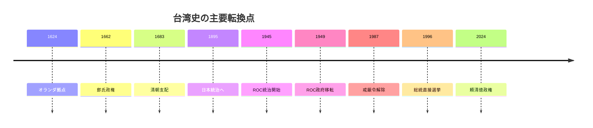
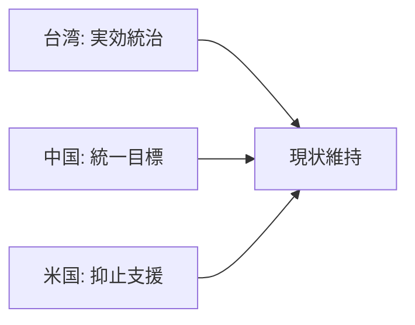

## 1. Executive Summary

Taiwan is not just an "island in conflict with China." It has multiple historical layers: the Dutch and Spanish powers since the 17th century, the Zheng family government, Qing Dynasty rule, Japanese rule, postwar rule by the Republic of China, separation from the People's Republic of China since 1949, and democratization since 1987. Currently, Taiwan is a democratic government with a de facto independent government, military, currency, and electoral system, and is not widely recognized as a member state of the United Nations.
Source note: The Taiwanese government's history page explains that since 1949, "Taiwan and China have been under different governments," and that the PRC has never ruled Taiwan. Reference: [Taiwan.gov.tw, History](https://www.taiwan.gov.tw/content_3.php). On the contrary, the Chinese government has clearly stated its position in its 2022 White Paper that "Taiwan is part of China." Reference: [PRC State Council, The Taiwan Question and China's Reunification in the New Era](https://english.www.gov.cn/archive/whitepaper/202208/10/content_WS62f34f46c6d02e533532f0ac.html?wptouch_preview_theme=enabled).
Taiwan's international importance can be summarized into three things. First, it is the core of semiconductors, especially advanced logic foundries. Second, the Taiwan Strait is a major route for global maritime trade. Third, it is the focus of military, technological, and alliance politics in the US-China competition. The Taiwan emergency is not just a regional conflict, but simultaneously shakes supply chains, financial markets, alliance credibility, and international order.
Source note: Taiwan's statistics authority estimates the real GDP growth rate in 2025 to be 8.68%, accounting for exports supported by demand for emerging technologies such as AI, and expanded production of semiconductors, computers, and electro-optical products. Reference: [DGBAS, GDP Preliminary Estimate for 2025Q4](https://eng.stat.gov.tw/News_Content.aspx?n=2317&s=235721). CSIS estimates that as of 2022, approximately $2.45 trillion, or more than one-fifth of global maritime trade, will have passed through the Taiwan Strait. Reference: [CSIS, Disruptions to Trade in the Taiwan Strait](https://www.csis.org/analysis/disruptions-trade-taiwan-strait-would-severely-impact-chinas-economy).

## 2. The flow of history

It would be misleading to view Taiwan's history only as "a part of Chinese history" or as "an island completely unrelated to China." Based on an indigenous society, from the 17th century onwards, outside forces and Han people immigrated to the country, and in 1885 it became a province of the Qing Dynasty, and it experienced Japanese rule from 1895 to 1945. After 1945, Taiwan was ruled by the Republic of China, and as a result of the Communist Civil War in 1949, the Republic of China government moved to Taiwan. This is where the prototype for the current issue was born.
Source note: The chronology of Taiwan's government includes major milestones as Dutch base in 1624, Zheng Chenggong in 1662, Qing Dynasty rule in 1683, Taiwan province in 1885, Treaty of Shimonoseki in 1895, and transfer of ROC government and martial law in 1949. Reference: [Taiwan.gov.tw, History](https://www.taiwan.gov.tw/content_3.php).
After the war, Taiwan's political system shifted from a long period of authoritarianism to democracy. After the February 28 Incident in 1947, martial law from 1949 to 1987, and the White Terror, it led to the lifting of martial law in 1987, the abolition of temporary provisions in 1991, the direct election of the president in 1996, and the change of government in 2000. Taiwan's current political legitimacy rests not only on the continuation of the Republic of China's constitution, but also on repeated elections by Taiwanese residents.
Source note: Taiwan's government chronology lists the lifting of martial law in 1987, full re-election in 1991-1992, the first direct presidential election in 1996, and the first change of government between political parties in 2000 as milestones in democratization. Reference: [Taiwan.gov.tw, History](https://www.taiwan.gov.tw/content_3.php).

## 3. Relationship with China

The core of China-Taiwan relations lies in the mismatch between the "claims of sovereignty" and the "facts of governance" over Taiwan. The Chinese government regards Taiwan as part of China and regards national unification as its historical mission. Taiwan explains that the Republic of China government effectively rules Taiwan and the surrounding islands, and that the PRC has never ruled Taiwan. These two terms are not just a difference in language; they affect participation in international organizations, military operations, diplomatic recognition, and economic exchanges.
Source note: The Chinese government's 2022 White Paper states that Taiwan is part of China and aims to achieve national unification. Reference: [PRC State Council, 2022 Taiwan White Paper](https://english.www.gov.cn/archive/whitepaper/202208/10/content_WS62f34f46c6d02e533532f0ac.html?wptouch_preview_theme=enabled). The Taiwanese government explains that the ROC has ruled Taiwan and other areas since 1949, and that the PRC does not govern the ROC-administered areas. Reference: [Taiwan.gov.tw, History](https://www.taiwan.gov.tw/content_3.php).

Practical stability has been achieved through a combination of ambiguity and deterrence rather than complete agreement. Taiwan will strengthen its own democratic politics and defense capabilities. China will pursue unification goals and maintain military, diplomatic, and economic pressure. While the United States does not officially recognize Taiwan as a nation, it provides defense equipment based on the Taiwan Relations Act and opposes changes to the status quo through force or coercion.

## 4. Major industries

The core of Taiwan's economy is the ICT manufacturing industry, with semiconductors at the top. In 2025, exports and manufacturing will grow significantly due to the demand for AI, and DGBAS estimates the real GDP growth rate for the whole of 2025 to be 8.68%. Growth in the manufacturing industry is supported by increased production of semiconductors, computers, and electronic and optical products.
Source note: DGBAS explains that the manufacturing industry will grow by 24.68% year-on-year in the fourth quarter of 2025, mainly due to expansion in semiconductors, computers, and electronic and optical products. Reference: [DGBAS, GDP Preliminary Estimate for 2025Q4](https://eng.stat.gov.tw/News_Content.aspx?n=2317&s=235721).
The main industries can be classified as follows.
| Industry | Position | Implications in international politics |
| -------------------- | ---------------------------------------------------------------- | -------------------------------------------------- |
| Semiconductor manufacturing | Mature nodes such as advanced logic foundries centered on TSMC and UMC | Directly connected to AI, smartphones, data centers, automobiles, and defense industries |
| IC design/electronic components | MediaTek, Realtek, electronic components/substrates/packaging | Combining with US fabless companies and electronic equipment companies around the world |
| ICT equipment/EMS | Contract manufacturing of PCs, servers, network equipment, and electronic equipment | Involved in the supply network for AI servers and cloud investment |
| Precision machinery/machine tools | Semiconductor equipment peripherals, industrial machinery, automation | Supporting the base of the manufacturing industry |
| Petrochemicals and materials | Plastics, chemicals, and materials supply | Electronic materials and export industry base |
| Services, finance, and logistics | Wholesale and retail, finance, transportation, and professional services | Domestic infrastructure that supports manufacturing and trade-centered economies |
The importance of TSMC is not simply that there is a large company in Taiwan. TSMC is a central company that has established a division of labor model in which fabless companies design and specialized foundries manufacture, and is also linked to the competitiveness of US companies such as NVIDIA, Apple, and AMD. This interdependence embeds Taiwan in both U.S. industrial and security policy.
Source note: CSIS notes that Taiwan's semiconductor industry is integrated into U.S. consumer electronics, automotive, AI, and dual-use technologies, and explains that TSMC's pure-play foundry model supported the growth of U.S. fabless companies. Reference: [CSIS, Silicon Island](https://www.csis.org/analysis/silicon-island-assessing-taiwans-importance-us-economic-growth-and-security). TSMC itself describes its pure-play foundry business and global customer base in its 2025 annual report. Reference: [TSMC 2025 Annual Report](https://investor.tsmc.com/sites/ir/annual-report/2025/2025%20Annual%20Report_E.pdf).

## 5. Importance in international politics

Taiwan's importance can be better understood by understanding it on three levels: geopolitics, technology, and institutions.
First, the Taiwan Strait is a maritime traffic route in East Asia. The Taiwan emergency affects not only Taiwan and China, but also the logistics of companies in Japan, South Korea, Southeast Asia, the United States, and Europe. CSIS estimates that approximately $2.45 trillion in cargo will pass through the Taiwan Strait in 2022, representing more than one-fifth of global maritime trade. Since China's own imports and exports are heavily dependent on the Taiwan Strait, a blockade or quarantine-type crisis would also cause significant damage to the Chinese economy.
Source note: Taiwan Strait trade value and China dependence are based on [CSIS, Disruptions to Trade in the Taiwan Strait](https://www.csis.org/analysis/disruptions-trade-taiwan-strait-would-severely-impact-chinas-economy).
Second, Taiwan is the core of the advanced semiconductor supply chain. AI, cloud, smartphones, automobiles, and defense equipment are built on a huge international division of labor across design, manufacturing equipment, materials, EDA, foundries, and advanced packaging. Among these, Taiwan occupies a position close to the bottleneck for manufacturing and mass production. For this reason, Taiwan's stability is not just "support for democracy" but also the economic security of the United States and its allies.
Source Note: CSIS notes that semiconductors are in almost every electronic system, and that Taiwan's semiconductor industry supports important and emerging technology industries in the United States. Reference: [CSIS, Silicon Island](https://www.csis.org/analysis/silicon-island-assessing-taiwans-importance-us-economic-growth-and-security).
Third, Taiwan is a test case for the international order. From the United States' perspective, peace and stability in the Taiwan Strait is an issue of international concern related to "regional and global security and prosperity." On the other hand, China views the Taiwan issue as an internal affairs and sovereignty issue. This difference in perception makes military deterrence and diplomatic crisis management difficult.
Source Note: The 2022 U.S. National Security Strategy positions peace and stability in the Taiwan Strait as critical to regional and global security and prosperity and a matter of international concern. Reference: [White House, National Security Strategy 2022](https://www.whitehouse.gov/wp-content/uploads/2022/11/8-November-Combined-PDF-for-Upload.pdf).

## 6. US recognition and past statements

Although the United States' understanding of Taiwan has changed over time, the framework of practice since 1979 has remained fairly consistent. Officially, it recognizes the PRC as China's sole legitimate government and maintains unofficial relations with Taiwan. At the same time, the Taiwan Relations Act, three U.S.-China joint communiqués, and six guarantees will be combined to emphasize Taiwan's self-defense capabilities and peace in the Taiwan Strait.
| Year | Remarks/Documents | Key points of US recognition |
| --------: | ---------------- | ------------------------------------------------------------------------------------------------ |
| 1950 | Truman Statement | Following the Korean War, the 7th Fleet is ordered to prevent an attack on Taiwan. Taiwan's future status will depend on the restoration of security in the Pacific, peace with Japan, and consideration by the United Nations. |
| 1972 | Shanghai Communiqué | The United States recognizes the position of Chinese people on both sides of the Taiwan Strait that there is "one China, and Taiwan is part of China," and states that it will not object to this position. |
| 1979 | Taiwan Relations Act | Continued commercial and cultural relations with Taiwan even after official recognition was severed, and established a policy of providing defensive weapons and maintaining the ability to resist force and coercion. |
| 1982 | Six Guarantees | Guarantees such as not setting an end date for arms sales to Taiwan, not consulting with the PRC in advance, and not changing the US position regarding Taiwan's sovereignty. |
| 2022 | National Security Strategy | While maintaining the one-China policy and not supporting Taiwan independence, we consider peace and stability in the Taiwan Strait to be a matter of international concern. |
| 2021-2022 | Biden Remarks | Biden has made multiple statements indicating involvement in the defense of Taiwan, but the administration has explained that this is not a change in policy. |
Source Note: The 1950 Truman Statement is [Harry S. Truman Library](https://www.trumanlibrary.gov/library/public-papers/173/statement-president-situation-korea). The 1972 Shanghai Communiqué was [AIT, Shanghai Communique](https://web-archive-2017.ait.org.tw/en/us-joint-communique-1972.html). Taiwan Relations Act is [AIT, Taiwan Relations Act](https://web-archive-2017.ait.org.tw/en/taiwan-relations-act.html). The six guarantees are [AIT, Declassified Cables: Six Assurances](https://web-archive-2022.ait.org.tw/our-relationship/policy-history/key-u-s-foreign-policy-documents-region/six-assurances-1982/index.html). The 2022 National Security Strategy is [White House, National Security Strategy](https://www.whitehouse.gov/wp-content/uploads/2022/11/8-November-Combined-PDF-for-Upload.pdf).
What is important about this trend is that the United States' "One China Policy" and China's "One China Principle" are not the same. The United States recognizes the PRC as China's sole legitimate government, but with respect to Taiwan, it "recognized" the position of cross-strait Chinese people in the Shanghai Communiqué, and institutionalized working relations and defense assistance with Taiwan in the Taiwan Relations Act and the Six Guarantees. Therefore, US policy simultaneously includes "not recognizing Taiwan as a state" and "viewing military force and coercion against Taiwan as a problem."
Source note: The Taiwan Relations Act states that U.S. policy is the expectation that Taiwan's future will be determined by peaceful means, the provision of defensive weapons, and the maintenance of the ability to resist force and coercion. Reference: [AIT, Taiwan Relations Act](https://web-archive-2017.ait.org.tw/en/taiwan-relations-act.html). The six guarantees include that the United States will not change its position regarding Taiwan's sovereignty and that it will not force Taiwan to negotiate with the PRC. Reference: [AIT, Six Assurances](https://web-archive-2022.ait.org.tw/our-relationship/policy-history/key-u-s-foreign-policy-documents-region/six-assurances-1982/index.html).

## 7. Practical reading

There are three simplifications that should be avoided when understanding Taiwan.
First, look at Taiwan only in terms of two options: "Is Taiwan part of China or an independent country?" In reality, Taiwan has a high degree of effective governance and democratic legitimacy, but international recognition is limited. Unless we understand this, we will not be able to figure out the system design for international organizations, trade, and military support.
Second, decide that "because we have semiconductors, we will definitely protect the United States." Semiconductors increase Taiwan's strategic importance, but they also provide a reason for the United States and Japan to diversify their production. The silicon shield is both a deterrent factor and a concept that visualizes the risk of concentration in Taiwan.
Third, see Taiwan as an economic problem for China. In Chinese government documents, Taiwan is talked about as an issue of national reunification, sovereignty, and national rejuvenation. The gains and losses of semiconductors and trade alone cannot sufficiently predict China's actions.

## 8. Reference information

- [Taiwan.gov.tw, History](https://www.taiwan.gov.tw/content_3.php)
- [PRC State Council, The Taiwan Question and China's Reunification in the New Era](https://english.www.gov.cn/archive/whitepaper/202208/10/content_WS62f34f46c6d02e533532f0ac.html?wptouch_preview_theme=enabled)
- [DGBAS, GDP Preliminary Estimate for 2025Q4](https://eng.stat.gov.tw/News_Content.aspx?n=2317&s=235721)
- [TSMC 2025 Annual Report](https://investor.tsmc.com/sites/ir/annual-report/2025/2025%20Annual%20Report_E.pdf)
- [CSIS, Disruptions to Trade in the Taiwan Strait](https://www.csis.org/analysis/disruptions-trade-taiwan-strait-would-severely-impact-chinas-economy)
- [CSIS, Silicon Island](https://www.csis.org/analysis/silicon-island-assessing-taiwans-importance-us-economic-growth-and-security)
- [AIT, Taiwan Relations Act](https://web-archive-2017.ait.org.tw/en/taiwan-relations-act.html)
- [AIT, Shanghai Communique](https://web-archive-2017.ait.org.tw/en/us-joint-communique-1972.html)
- [AIT, Declassified Cables: Six Assurances](https://web-archive-2022.ait.org.tw/our-relationship/policy-history/key-u-s-foreign-policy-documents-region/six-assurances-1982/index.html)
- [Harry S. Truman Library, Statement by the President on the Situation in Korea](https://www.trumanlibrary.gov/library/public-papers/173/statement-president-situation-korea)
- [White House, National Security Strategy 2022](https://www.whitehouse.gov/wp-content/uploads/2022/11/8-November-Combined-PDF-for-Upload.pdf)
