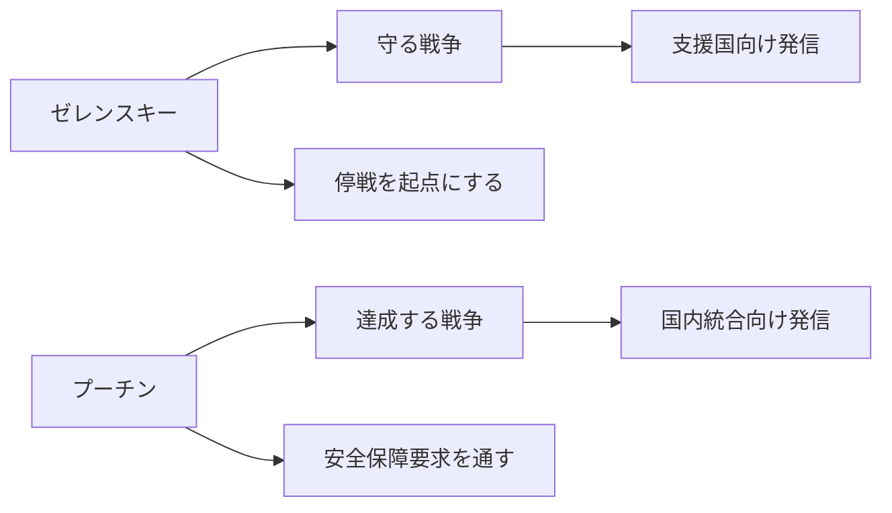

# Differences in war objectives seen from recent statements between Zelensky and Putin

## 1. Executive Summary

As of May 2026, Zelenskiy and Putin's statements, while using the same words "ceasefire" and "peace," actually point to different war plans. In an official message on May 24, 2026, Zelenskiy stated that the international community is supported by "the defenders of human life," on May 7 he called for a "total and unconditional ceasefire," and on May 23 he announced sanctions against those involved in the occupation and invasion. The central objectives here are national survival, territorial recovery, and increasing pressure on Russia to obtain favorable cease-fire terms. Source notes: [President of Ukraine, 2026-05-24 address](https://www.president.gov.ua/en/news/gotuyemo-kroki-yaki-mozhut-aktivizuvati-nashu-spilnu-protidi-104421), [President of Ukraine, 2026-05-07 address](https://www.president.gov.ua/en/news/ukrayinska-poziciya-maksimalno-prozora-j-chesna-ukrayina-bud-104281), [President of Ukraine, 2026-05-23 sanctions announcement](https://www.president.gov.ua/en/news/ukrayina-zastosuvala-sankciyi-shodo-okupantiv-yaki-vidpovida-104557).
Putin said at a February 24, 2026 Federal Security Service executive meeting that Russia will protect its "historical and border areas" including Donbass and Novorossia, ensuring Russia's security. At the Ministry of Defense Executive Meeting on December 17, 2025, it was recognized that Russia must achieve its "special military operation objectives" and that NATO is preparing for a confrontation with Russia. The central objective here is to pass Russia's security demands, including the neutralization of Ukraine and the creation of a buffer zone, both military and political. Source note: [Kremlin, 2026-02-24 FSB board](https://en.special.kremlin.ru/events/president/transcripts/79216), [Kremlin, 2025-12-17 board of the Ministry of Defence](https://en.special.kremlin.ru/events/president/transcripts/78801).
The difference between the two is not just rhetoric. Zelenskiy's idea is to "create security based on a ceasefire," while Putin's idea is similar to "stability will only come after achieving the objectives of war." Therefore, the most important question in negotiations is not "who wants peace," but "which border and security conditions should be considered the final line." Source note: [President of Ukraine, 2026-05-07 address](https://www.president.gov.ua/en/news/ukrayinska-poziciya-maksimalno-prozora-j-chesna-ukrayina-bud-104281), [Kremlin, 2026-02-24 FSB board](https://en.special.kremlin.ru/events/president/transcripts/79216).

## 2. What did you compare?

In this paper, we compared the following primary information available at the time of report creation:

1. Zelenskiy's public statements on May 24, May 23, May 17, and May 7, 2026.
2. Putin's official statements on February 24, 2026 and December 17, 2025.
3. Differences in the people to whom statements are directed.
4. Consistency with actual military and diplomatic actions.
   In this comparison, the statements of the parties involved are not taken as their "true feelings." Instead, separate messages for domestic, external, and negotiation purposes. Source note: [President of Ukraine official news archive](https://www.president.gov.ua/en/news), [Kremlin official events archive](https://en.kremlin.ru/events/president).

Source note: The diagram summarizes Zelenskyy's statements on 2026-05-07 / 05-24 and Putin's statements on 2026-02-24 / 2025-12-17. The purpose is not to follow chronological order, but to confirm at a glance the differences in views on war.

## 3. Comparison table

| Issues                     | Zelensky                                                                                       | Putin                                                                                                             | How to read                                                                   |
| -------------------------- | ---------------------------------------------------------------------------------------------- | ----------------------------------------------------------------------------------------------------------------- | ----------------------------------------------------------------------------- |
| War objectives             | National defense, territorial recovery, protection of civilians, unity of supporting countries | Achieving the "goals of special military operations" and ensuring the security of Donbass, Novorossia, and Russia | Zelenskyy is on the defensive, Putin is on the offensive with security claims |
| Conditions for a ceasefire | A complete and unconditional ceasefire is the starting point                                   | Russia's goals should be achieved first, and negotiations should be carried out within that framework             | The order of the ceasefire is reversed, and no compromises have been reached  |
| Territory                  | Assuming restoration of internationally recognized borders                                     | Treating "historical border areas" as Russia's security space                                                     | Disagreeing assumptions regarding the legal status of territory               |
| NATO / Security            | Aiming for a future security framework that includes the EU and NATO                           | Recognition that NATO is preparing for confrontation with Russia                                                  | Zelensky approaches, Putin seeks containment and counter                      |
| Message for Japan          | The side that protects human life has legitimacy                                               | This is a fight to protect national security                                                                      | Both create a narrative to maintain domestic unity                            |
| External message           | Call for aid, sanctions, and additional pressure                                               | Get Russia to accept its terms, not concessions                                                                   | More of a pressure war than negotiation                                       |

Source note: Zelensky side is based on [2026-05-24 address](https://www.president.gov.ua/en/news/gotuyemo-kroki-yaki-mozhut-aktivizuvati-nashu-spilnu-protidi-104421), [2026-05-23 sanctions announcement](https://www.president.gov.ua/en/news/ukrayina-zastosuvala-sankciyi-shodo-okupantiv-yaki-vidpovida-104557), [2026-05-17 address](https://www.president.gov.ua/en/news/nasha-dalekobijnist-ce-te-sho-znachno-zminyuye-situaciyu-ta-104465), [2026-05-07 address](https://www.president.gov.ua/en/news/ukrayinska-poziciya-maksimalno-prozora-j-chesna-ukrayina-bud-104281). Putin's side is based on [2026-02-24 FSB board](https://en.special.kremlin.ru/events/president/transcripts/79216) and [2025-12-17 Ministry of Defence board](https://en.special.kremlin.ru/events/president/transcripts/78801).

## 4. Zelensky's message

One thing that has remained consistent in Zelenskiy's recent statements is that he speaks of war as "defense." In his remarks on May 24, 2026, he said that he was preparing measures to activate "common defense" with supporting countries in response to Russian attacks. This is not just an emotional appeal, but a declaration of intent to combine air defense, sanctions, military support, and diplomatic cooperation into the same package. Source note: [President of Ukraine, 2026-05-24 address](https://www.president.gov.ua/en/news/gotuyemo-kroki-yaki-mozhut-aktivizuvati-nashu-spilnu-protidi-104421).
On May 17, he said Ukraine's long-range capabilities would be a "game changer," and on May 23 he announced sanctions against those involved in the occupation and invasion. What we can see from this is that Zelensky is not only calling for a ceasefire, but also that he is seeking to raise Russia's military, logistics, and political costs as a prerequisite for ceasefire negotiations. Source note: [President of Ukraine, 2026-05-17 address](https://www.president.gov.ua/en/news/nasha-dalekobijnist-ce-te-sho-znachno-zminyuye-situaciyu-ta-104465), [President of Ukraine, 2026-05-23 sanctions announcement](https://www.president.gov.ua/en/news/ukrayina-zastosuvala-sankciyi-shodo-okupantiv-yaki-vidpovida-104557).
In his May 7 statement, he said Ukraine's position was "utmost transparent and honest" and stressed the need for a full and unconditional ceasefire. In other words, Zelensky's ceasefire theory takes the order of "stop the fighting first, and then settle security and conditions." This is a way of saying it to avoid losing political legitimacy, even if it is militarily disadvantageous. Source note: [President of Ukraine, 2026-05-07 address](https://www.president.gov.ua/en/news/ukrayinska-poziciya-maksimalno-prozora-j-chesna-ukrayina-bud-104281).
References to "occupied people" and "prisoners of war" also continue in the context of May 7. The domestic message here is that war objectives include the return of people, not just territory. Therefore, Zelensky's war objectives are structured to talk about the restoration of legal sovereignty and the restoration of humanity as one. Source note: [President of Ukraine, 2026-05-07 address](https://www.president.gov.ua/en/news/ukrayinska-poziciya-maksimalno-prozora-j-chesna-ukrayina-bud-104281).

## 5. Putin's message

Putin's most recent public statements continue to refer to the war as a "special military operation" and are predicated on achieving its goals. At a February 24, 2026 Federal Security Service executive meeting, Russia stated that it must protect "historical and border areas" including Donbass and Novorossia and ensure Russia's security. This is a way of saying that prioritizing the accomplishment of war objectives is more important than prioritizing a ceasefire. Source note: [Kremlin, 2026-02-24 FSB board](https://en.special.kremlin.ru/events/president/transcripts/79216).
In official statements on December 17, 2025, NATO acknowledged that it was preparing for a confrontation with Russia. "Security" here is not simply defense, but is treated as an issue of external boundaries to protect Russia's sphere of influence. Putin's statements thus link the Ukraine war to the reorganization of the security order across Europe. Source note: [Kremlin, 2025-12-17 Ministry of Defence board](https://en.special.kremlin.ru/events/president/transcripts/78801).
In terms of ceasefire conditions, Putin has not deviated from the order of "achieving military and political goals first." At least from the most recent official statements that we have been able to confirm, there does not seem to be any willingness to propose an unconditional ceasefire. Rather than denying negotiation, it is appropriate to interpret this as a position that places one's own war objectives at the entrance to negotiations. Source note: [Kremlin, 2026-02-24 FSB board](https://en.special.kremlin.ru/events/president/transcripts/79216), [Kremlin, 2025-12-17 Ministry of Defence board](https://en.special.kremlin.ru/events/president/transcripts/78801).

## 6. Different uses for domestic, international, and negotiation purposes

Zelenskiy's comments are intended for at least three recipients.

1. For domestic purposes, justify the war as "defense."
2. For the international community, continue support and sanctions.
3. For negotiations, put the ceasefire first, and leave territorial and security discussions to the back burner.
   Putin's statements can also be divided into three layers.
4. For the domestic market, talk about national security and the restoration of historical territory.
5. Push Russia's security demands to the international community on the premise of countering NATO.
6. For negotiations, it suggests that a ceasefire can only be achieved if Russia's goals are accepted.
   This difference is not simply a matter of speech. The way in which statements are placed can narrow or expand the room for negotiation. Source notes: [President of Ukraine, 2026-05-07 address](https://www.president.gov.ua/en/news/ukrayinska-poziciya-maksimalno-prozora-j-chesna-ukrayina-bud-104281), [President of Ukraine, 2026-05-24 address](https://www.president.gov.ua/en/news/gotuyemo-kroki-yaki-mozhut-aktivizuvati-nashu-spilnu-protidi-104421), [Kremlin, 2026-02-24 FSB board](https://en.special.kremlin.ru/events/president/transcripts/79216), [Kremlin, 2025-12-17 Ministry of Defence board](https://en.special.kremlin.ru/events/president/transcripts/78801).

## 7. Are statements consistent with actual actions?

From a consistency standpoint, Zelensky's side is relatively easy to understand. The May 17th statement about long-range capabilities, the May 24th statement activating a "common defense," and the May 23rd sanctions announcement all go hand in hand with actions to increase pressure on Russia. In other words, diplomatic messages and military/sanction enforcement are pointing in the same direction. Source notes: [President of Ukraine, 2026-05-17 address](https://www.president.gov.ua/en/news/nasha-dalekobijnist-ce-te-sho-znachno-zminyuye-situaciyu-ta-104465), [President of Ukraine, 2026-05-23 sanctions announcement](https://www.president.gov.ua/en/news/ukrayina-zastosuvala-sankciyi-shodo-okupantiv-yaki-vidpovida-104557), [President of Ukraine, 2026-05-24 address](https://www.president.gov.ua/en/news/gotuyemo-kroki-yaki-mozhut-aktivizuvati-nashu-spilnu-protidi-104421).
Putin's side, at least in public statements, continues to strongly talk about achieving war objectives and countering NATO, which is easily consistent with an actual continuation of the offensive. However, consistency here means that the "narrative that justifies continued attacks" and the "continuation of attacks themselves" are consistent, and does not mean consistency toward peace. In other words, Putin's statement is more likely to be read as an explanation for continuing military action rather than a halt to it. Source note: [Kremlin, 2026-02-24 FSB board](https://en.special.kremlin.ru/events/president/transcripts/79216), [Kremlin, 2025-12-17 Ministry of Defence board](https://en.special.kremlin.ru/events/president/transcripts/78801).
Based on publicly available information, both sides maintain that they only seek concessions from the other party. Zelenskyy calls for a ceasefire and support, while Putin calls for goals and security demands. Therefore, the differences in statements should not be seen as diplomatic orders, but rather as differences in the order in which wars are ended. Source note: [President of Ukraine, 2026-05-07 address](https://www.president.gov.ua/en/news/ukrayinska-poziciya-maksimalno-prozora-j-chesna-ukrayina-bud-104281), [Kremlin, 2026-02-24 FSB board](https://en.special.kremlin.ru/events/president/transcripts/79216).

## 8. What should you change to change your perspective?

The following four points will change our outlook going forward.

1. To what extent will Zelensky maintain an unconditional ceasefire without territorial negotiations?
2. Will Putin accept a limited cease-fire or partial agreement while maintaining “achievement of goals”?
3. To what extent will NATO, the EU, and the US institutionalize Ukraine's security?
4. Will battlefield attrition be significant enough to change either side's negotiating position?
   At present, it is estimated from publicly available information that it is more likely that a piecemeal agreement or a limited cease-fire will occur first, rather than a complete compromise. This is because territory, sanctions, and security are interconnected and cannot be solved by just one item. Source note: [President of Ukraine, 2026-05-07 address](https://www.president.gov.ua/en/news/ukrayinska-poziciya-maksimalno-prozora-j-chesna-ukrayina-bud-104281), [Kremlin, 2026-02-24 FSB board](https://en.special.kremlin.ru/events/president/transcripts/79216).

## 9. Practical implications

It is important for Japanese policy makers, export control officials, and those in charge of energy, shipping, and insurance to not jump to the conclusion that his remarks are a sign of peace. Zelenskiy's statement is a signal to request assistance and increase pressure at the same time, and Putin's statement is a justification for continuing the offensive and demanding security. Neither of these assumes that the risks will disappear in the short term. Source note: [President of Ukraine, 2026-05-24 address](https://www.president.gov.ua/en/news/gotuyemo-kroki-yaki-mozhut-aktivizuvati-nashu-spilnu-protidi-104421), [Kremlin, 2026-02-24 FSB board](https://en.special.kremlin.ru/events/president/transcripts/79216).
In practice, it is appropriate to consider the following three points at the same time.

1. Whether there are ceasefire talks.
2. Air defense, missiles, long-range strikes, and sanctions enforcement.
3. Continued institutional support from NATO, the EU, and the US.
   Only when these three points are in place can we judge whether statements are turning into action. A statement alone often indicates a continuation of conflict. Source note: [President of Ukraine official news archive](https://www.president.gov.ua/en/news), [Kremlin official events archive](https://en.kremlin.ru/events/president).

## 10. Risks/Limitations

There are three limitations to this paper. First, since official statements include political stagecraft, they do not necessarily reflect actual decision-making. Second, this comparison is limited to official documents made public at the time the report was written, and cannot cover private negotiations or behind-the-scenes contacts. Third, the meaning of Russia's statements cannot be determined uniquely because they are designed to simultaneously carry out domestic governance and external threats. Source note: [President of Ukraine official news archive](https://www.president.gov.ua/en/news), [Kremlin official events archive](https://en.kremlin.ru/events/president).
Therefore, the conclusion here is not "which side has the real intention?" but "which line of negotiation is indicated by the public statements?" Publicly available information shows that Zelenskiy is prioritizing defense and a ceasefire, while Putin is prioritizing achieving goals and demanding security, and it is this difference in order that is causing the current stalemate. Source note: [President of Ukraine, 2026-05-07 address](https://www.president.gov.ua/en/news/ukrayinska-poziciya-maksimalno-prozora-j-chesna-ukrayina-bud-104281), [Kremlin, 2026-02-24 FSB board](https://en.special.kremlin.ru/events/president/transcripts/79216).

## 11. Reference information

- [President of Ukraine, 2026-05-24 address](https://www.president.gov.ua/en/news/gotuyemo-kroki-yaki-mozhut-aktivizuvati-nashu-spilnu-protidi-104421)
- [President of Ukraine, 2026-05-23 sanctions announcement](https://www.president.gov.ua/en/news/ukrayina-zastosuvala-sankciyi-shodo-okupantiv-yaki-vidpovida-104557)
- [President of Ukraine, 2026-05-17 address](https://www.president.gov.ua/en/news/nasha-dalekobijnist-ce-te-sho-znachno-zminyuye-situaciyu-ta-104465)
- [President of Ukraine, 2026-05-07 address](https://www.president.gov.ua/en/news/ukrayinska-poziciya-maksimalno-prozora-j-chesna-ukrayina-bud-104281)
- [Kremlin, 2026-02-24 FSB board](https://en.special.kremlin.ru/events/president/transcripts/79216)
- [Kremlin, 2025-12-17 Ministry of Defence board](https://en.special.kremlin.ru/events/president/transcripts/78801)
