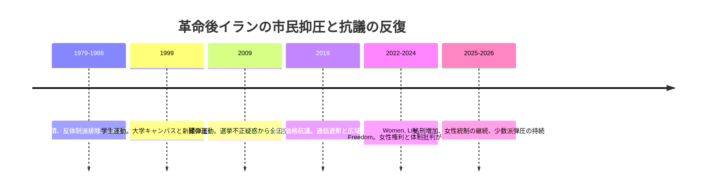
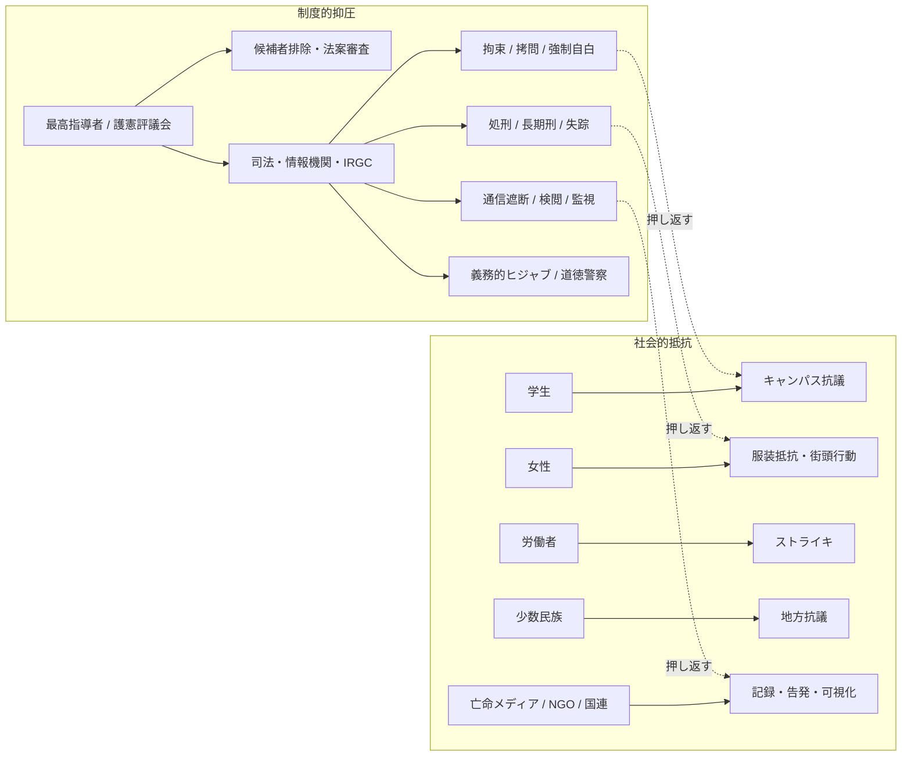

# イラン体制による市民抑圧と抗議運動の歴史

作成日: 2026-05-21
調査方式: narrative review / policy analysis
対象: 1979年革命後のイランにおける市民抑圧の制度化、抗議運動の反復、情報源の限界を整理する

## 1. エグゼクティブサマリー

1979年革命後のイランでは、市民抑圧は一過性の弾圧ではなく、司法、革命防衛隊（IRGC）、情報機関、選挙管理、道徳警察、検閲、処刑を組み合わせた制度として固定化した。抗議運動は1980年代の粛清、1999年学生運動、2009年緑の運動、2019年抗議、2022年以降の「Women, Life, Freedom」へと反復し、そのたびに参加層と要求は拡大したが、国家側も監視、拘束、インターネット遮断、強制自白、候補者排除をより細かく組み合わせる方向へ適応した。

重要なのは、イランの抑圧を「宗教国家だから起きる抽象的な抑圧」とだけ見ると見誤ることだ。実際には、日常生活の細部にまで届く規律化が、法制度と治安機構を通じて実装されている。女性の服装規制、学校や職場からの排除、言論・出版・ネット規制、少数派地域への重点弾圧、処刑の多用が互いに連結し、抗議を社会の周縁へ押し戻してきた。

ただし、亡命メディア、市民証言、国連報告、人権団体の資料にはそれぞれ限界がある。とくに国連の独立事実調査団自身が、証拠の多くを被害者・証人の証言、公開映像、オープンソース資料、国外の関係者から集めているため、検証性は高い一方で、国内で沈黙を強いられた多数派の経験は取りこぼしやすい。したがって、本稿は各種資料を突き合わせて「何が繰り返されたか」を描き、個別の死者数や拘束者数は調査範囲に応じて差が出る前提で読む。

出典メモ: 2022年以降の評価は [OHCHR 独立事実調査団の2024年更新報告](https://www.ohchr.org/sites/default/files/documents/hrbodies/hrcouncil/ffmi-iran/FFM-Iran-Update-13-September-2024.pdf) と [OHCHR 2024年報告要旨](https://www.ohchr.org/sites/default/files/documents/countries/iran/20240717-SR-Iran-Findings.pdf) を中心に置き、2026年時点の継続的抑圧は [Human Rights Watch, World Report 2026: Iran](https://www.hrw.org/world-report/2026/country-chapters/iran) で補強した。1980年代から2009年までの通史は [Amnesty International の1988年虐殺報告](https://www.amnesty.org/en/latest/research/2018/12/iran-the-1988-prison-massacres/) と [Human Rights Watch, World Report 2010: Iran](https://www.hrw.org/world-report/2010/country-chapters/iran) を参照した。

## 2. 抑圧が制度化した理由

革命後体制の特徴は、選挙を残しながら、その入口と出口を非選挙機関が押さえる点にある。候補者審査、法案審査、治安機関の統合、司法トップの任命、放送・情報空間の管理が一体で運用されると、抗議は「街頭の問題」ではなく、制度の中に取り込まれる。結果として、国家は抗議の規模が小さいうちに指導者を拘束し、規模が大きくなると通信遮断や大量拘束へ移る。

この構造の中では、女性、学生、労働者、少数民族、宗教少数派が、それぞれ別の理由で圧力を受けながら、抗議局面では同じ抑圧装置に接続される。女性への服装規制は「文化」の問題に見えるが、実際には公共空間への参加条件を管理する政治技術であり、少数派地域の弾圧は「治安」の問題に見えるが、実際には中心権力に対する潜在的不服従を先回りして潰す運用である。

## 3. 主要局面の年表

| 時期 | 引き金 | 抑圧の典型 | 抵抗の形 | 読みどころ |
|---|---|---|---|---|
| 1980年代 | 革命後の権力再編、イラン・イラク戦争、反体制派排除 | 革命裁判、政治犯処刑、長期拘禁、失踪 | 地下活動、亡命、家族による記録 | 反対派の物理的消去が体制維持の一部になった |
| 1999年 | 学生運動と改革派紙面の弾圧 | 大学への突入、拘束、拷問、新聞統制 | 学生デモ、大学キャンパス中心の連帯 | 改革期待が治安弾圧で折られた |
| 2009年 | 大統領選不正疑惑と緑の運動 | 大規模拘束、強制自白、メディア統制 | 都市中間層の街頭抗議、象徴色の運動 | 選挙抗議が体制批判へ接続した |
| 2019年 | 燃料価格急騰 | 実弾発砲、通信遮断、広域殺傷 | 地方都市を含む一斉抗議 | インターネット遮断が抑圧の一部として可視化された |
| 2022年以降 | マフサ・アミニ死と女性権利要求 | 監視、拘束、処刑増加、道徳警察再強化 | 女性の服装抵抗、ゼネスト、学校抗議 | 「Women, Life, Freedom」が制度批判へ拡張した |

出典メモ: 1980年代の粛清と1988年虐殺は [OHCHR 特別報告者の2024年報告](https://www.ohchr.org/sites/default/files/documents/countries/iran/20240717-SR-Iran-Findings.pdf) と [Amnesty International の1988年報告](https://www.amnesty.org/en/latest/research/2018/12/iran-the-1988-prison-massacres/) を参照。1999年、2009年、2019年は [Human Rights Watch の1999年学生運動関連報告](https://www.hrw.org/reports/1999/iran/Iran99o.htm)、[Human Rights Watch の学生抗議に関する記事](https://www.hrw.org/news/2004/07/06/iran-five-years-after-protests-release-students)、[Amnesty International の2009年報告](https://www.amnesty.org/en/documents/MDE13/123/2009/en/)、[Human Rights Watch, World Report 2010: Iran](https://www.hrw.org/world-report/2010/country-chapters/iran)、[Amnesty International の2019年死亡者数集計](https://www.amnesty.org/en/latest/news/2020/09/iran-2019-protests-death-toll/)、[Human Rights Watch のインターネット遮断報告](https://www.hrw.org/news/2019/11/15/iran-total-internet-blackout-following-fuel-price-protests) を使った。2022年以降は [OHCHR 2024年更新報告](https://www.ohchr.org/sites/default/files/documents/hrbodies/hrcouncil/ffmi-iran/FFM-Iran-Update-13-September-2024.pdf) と [Human Rights Watch, World Report 2026: Iran](https://www.hrw.org/world-report/2026/country-chapters/iran) を参照した。

## 4. 1980年代の粛清と政治犯処刑

1980年代前半の弾圧は、革命の敵を排除する段階から始まった。左派、イスラム左派、君主制支持者、クルド運動、反体制宗教派などが「革命への脅威」として処理され、法廷外の処罰や短い審理ののちに処刑された。1988年の政治犯大量処刑は、その極点である。OHCHRの特別報告者は、1980年代の処刑と失踪が体系的であり、1988年の大量処刑が国際法上きわめて深刻な人権侵害に当たる可能性を指摘している。

この局面の重要点は、処刑が単なる「過去の過ち」ではなく、以後の抑圧に対する恐怖の基底を作ったことだ。家族が真相を知らされないまま埋葬され、追悼や公開記憶も抑えられたため、国家暴力は記録されにくい形で社会に沈殿した。以後の抗議運動では、拘束者の家族が沈黙を強いられる構造が繰り返し現れる。

出典メモ: 1980年代については [OHCHR 特別報告者の調査報告](https://www.ohchr.org/sites/default/files/documents/countries/iran/20240717-SR-Iran-Findings.pdf) が最も使いやすく、1988年の大量処刑の外形は [Amnesty International の1988年報告](https://www.amnesty.org/en/latest/research/2018/12/iran-the-1988-prison-massacres/) が補う。

## 5. 1999年学生運動

1999年の学生運動は、改革期待が残る時期に起きた。改革派新聞『サラーム』の閉鎖をきっかけに、テヘラン大学周辺で抗議が広がり、治安部隊と政権支持の民兵が学生を攻撃した。人権団体は、少なくとも1人の学生死亡、拘束、拷問、大学への監視強化、言論統制を記録している。

この局面は、イラン体制が「知識人と学生の空間」を特に警戒してきたことを示す。大学は社会の将来層が集まり、新聞は政治言説を可視化するため、ここを抑えることは政権批判の回路を切ることに等しい。1999年以降、大学キャンパスは単なる教育空間ではなく、政治的な監視対象として扱われるようになった。

出典メモ: 1999年の学生運動は [Human Rights Watch の1999年イラン報告](https://www.hrw.org/reports/1999/iran/Iran99o.htm) と [Human Rights Watch の回顧記事](https://www.hrw.org/news/2004/07/06/iran-five-years-after-protests-release-students) を突き合わせるのが実務的だが、事実関係の骨格は「新聞閉鎖を契機に学生抗議が武力鎮圧された」という点で一致する。

## 6. 2009年緑の運動

2009年の緑の運動は、選挙不正疑惑から始まり、すぐに制度そのものへの不信へ変わった。HRWは、デモ参加者への暴力、拷問、拘束、裁判所での不公正、メディア統制を報告し、政府公式発表ベースでも少なくとも30人が死亡、数千人が拘束されたと整理している。抗議は都市中間層を中心に広がったが、体制側は改革派の期待を制度内で吸収せず、監視と拘束で押し返した。

2009年の転換点は、国際メディアと市民のスマートフォン証言が、国内検閲を部分的に迂回したことだ。もっとも、映像の拡散は弾圧そのものを止めなかった。むしろ国家は、拘束、強制自白、記者逮捕、通信統制を組み合わせて、情報を遅れてしか届かないものに変えた。

出典メモ: 2009年の経過は [Human Rights Watch, World Report 2010: Iran](https://www.hrw.org/world-report/2010/country-chapters/iran) を基礎に、当時の言論抑圧は [Amnesty International の2009年報告](https://www.amnesty.org/en/documents/MDE13/123/2009/en/) を補助線として使った。

## 7. 2019年抗議とインターネット遮断

2019年11月の燃料価格引き上げは、生活費と統治不信が一気に噴き出す引き金になった。Amnestyは、少なくとも304人が死亡したと報告し、HRWは、11月中旬の全国規模のインターネット遮断が抗議情報の流通を断ち、殺傷の把握を難しくしたと記録した。抗議は100以上の都市・町に広がり、都市中心部だけでなく地方でも同時多発した。

2019年の意味は、国家が「通信遮断も治安対策の一部」と公然と運用した点にある。以後、ネット遮断は単に情報統制の副産物ではなく、抗議鎮圧の中核技術として読まれるようになった。2022年以降のデモでも、検閲、速度低下、アプリ制限、監視強化が同じ文脈で繰り返される。

出典メモ: 2019年は [Amnesty International の死亡者数集計](https://www.amnesty.org/en/latest/news/2020/09/iran-2019-protests-death-toll/) と [Human Rights Watch の通信遮断報告](https://www.hrw.org/news/2019/11/15/iran-total-internet-blackout-following-fuel-price-protests) を併読すると、死傷と情報統制を同時に理解しやすい。

## 8. 2022年以降の「Women, Life, Freedom」

2022年のマフサ・アミニ死亡を契機にした抗議は、過去の改革要求よりも明確に、女性の身体管理そのものを政治問題として可視化した。OHCHRの独立事実調査団は、女性と少女に対する組織的差別、強制的な服装規制、拘束、暴力、殺害を検証し、2024年時点で551人が殺害されたとまとめた。加えて、調査団はこれらの行為が人道に対する罪に当たる可能性を示した。

この局面で重要なのは、抑圧が街頭だけでなく、通学、通勤、買い物、移動、SNS利用にまで伸びたことだ。OHCHRの更新報告は、義務的ヒジャブ規制、監視カメラ、移動制限、学校・職場からの排除、薬局や商店への圧力、SNSや旅行への制約を列挙している。つまり、女性統制は宗教的象徴の問題ではなく、公共空間への参加条件そのものを管理する仕組みとして働いている。

2026年時点でも、Human Rights Watchは、義務的ヒジャブ、恣意的拘束、処刑増加、宗教少数派や少数民族への弾圧が継続していると報告している。これは、2022年の抗議が「一時的な女性運動」ではなく、制度の深部を突いたために、国家側が逆に統治技術を強化したことを意味する。公表情報からの推定として、当局は象徴的譲歩よりも、監視と処罰の細分化を優先している。

出典メモ: 2022年以降の中心資料は [OHCHR 2024年更新報告](https://www.ohchr.org/sites/default/files/documents/hrbodies/hrcouncil/ffmi-iran/FFM-Iran-Update-13-September-2024.pdf) と [Human Rights Watch, World Report 2026: Iran](https://www.hrw.org/world-report/2026/country-chapters/iran) である。義務的ヒジャブ、教育・職場・移動への波及、少数派への圧力はこの2本で概ね追える。

## 9. 市民側の語り、亡命メディア、国連報告の限界

市民証言、亡命メディア、国際NGO、国連報告は、役割が違う。亡命メディアは速報性が高く、当事者の語りを早く拾えるが、都市部・国外接続層・政治活動家に寄りやすい。国際NGOは被害の体系性を示すのに強いが、細かな地理情報や人数推計は報告ごとにばらつく。国連報告は方法論が最も重く、証拠の相互照合に長けるが、政府の非協力と現地アクセスの制約を受ける。

このため、数字の大小だけで優劣を決めない方がよい。たとえば2019年の死亡者数は資料により異なり、2022年の犠牲者数も調査時点や捕捉範囲で動く。重要なのは、各資料が何を数え、どの期間を対象にし、どこまで検証したかを読むことだ。比較すべきなのは数字そのものより、方法と射程である。

出典メモ: 方法論の中心は [OHCHR 独立事実調査団の更新報告](https://www.ohchr.org/sites/default/files/documents/hrbodies/hrcouncil/ffmi-iran/FFM-Iran-Update-13-September-2024.pdf) と [OHCHR 2024年報告要旨](https://www.ohchr.org/sites/default/files/documents/countries/iran/20240717-SR-Iran-Findings.pdf)。亡命メディアは補助線として使い、単独では結論にしない。

## 10. 実務的な読み方

政策分析の観点では、イランの市民抑圧は「一つの事件」ではなく、複数の装置の束として見るべきだ。監視カメラ、司法、道徳警察、選挙の入口管理、通信遮断、処刑、少数派地域の重点治安化は別々に見えても、抗議が起きた瞬間に連携する。したがって、将来の動向を見るときは、街頭デモの人数だけでなく、候補者審査、学校・大学への圧力、ネット規制、処刑件数、少数派地域の治安部隊配置を同時に追う必要がある。

実務上の含意は三つある。第一に、改革派政権の有無だけでは統治の緩和は判断できない。第二に、女性権利は周辺論点ではなく、体制の正当性を測る主要指標である。第三に、抗議運動の評価では、亡命資料と国連資料を対立させるのでなく、相互補完として扱うべきである。ここでの結論は、イランの抵抗が弱いということではなく、抑圧が制度化されているため、可視化される反抗のコストが高いという点にある。

## 11. 参考情報

- [OHCHR 独立事実調査団の2024年更新報告](https://www.ohchr.org/sites/default/files/documents/hrbodies/hrcouncil/ffmi-iran/FFM-Iran-Update-13-September-2024.pdf)
- [OHCHR 2024年報告要旨](https://www.ohchr.org/sites/default/files/documents/countries/iran/20240717-SR-Iran-Findings.pdf)
- [Human Rights Watch, World Report 2026: Iran](https://www.hrw.org/world-report/2026/country-chapters/iran)
- [Human Rights Watch, World Report 2010: Iran](https://www.hrw.org/world-report/2010/country-chapters/iran)
- [Amnesty International, Iran: The 1988 prison massacres](https://www.amnesty.org/en/latest/research/2018/12/iran-the-1988-prison-massacres/)
- [Amnesty International, Iran 2019 protests death toll](https://www.amnesty.org/en/latest/news/2020/09/iran-2019-protests-death-toll/)
