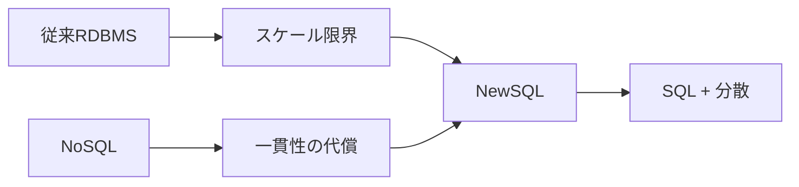
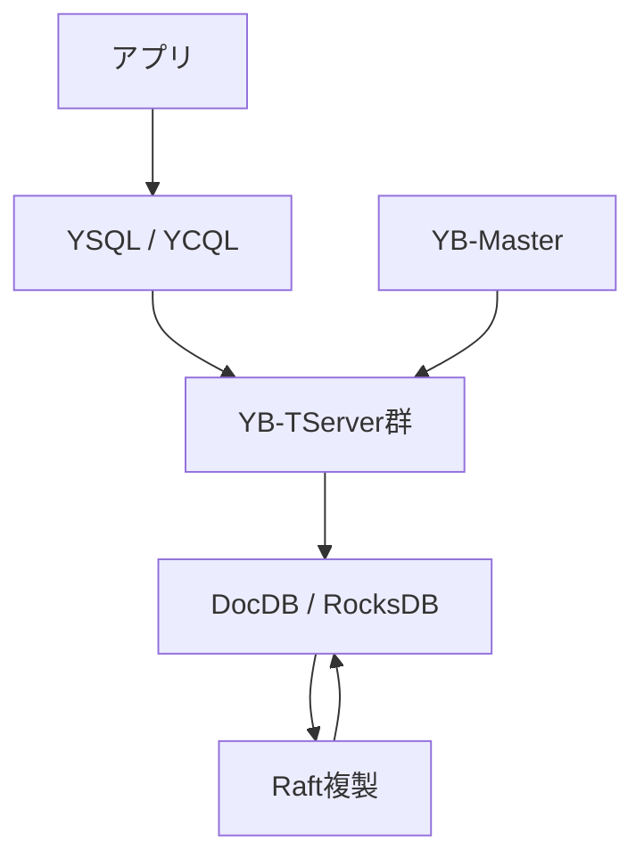
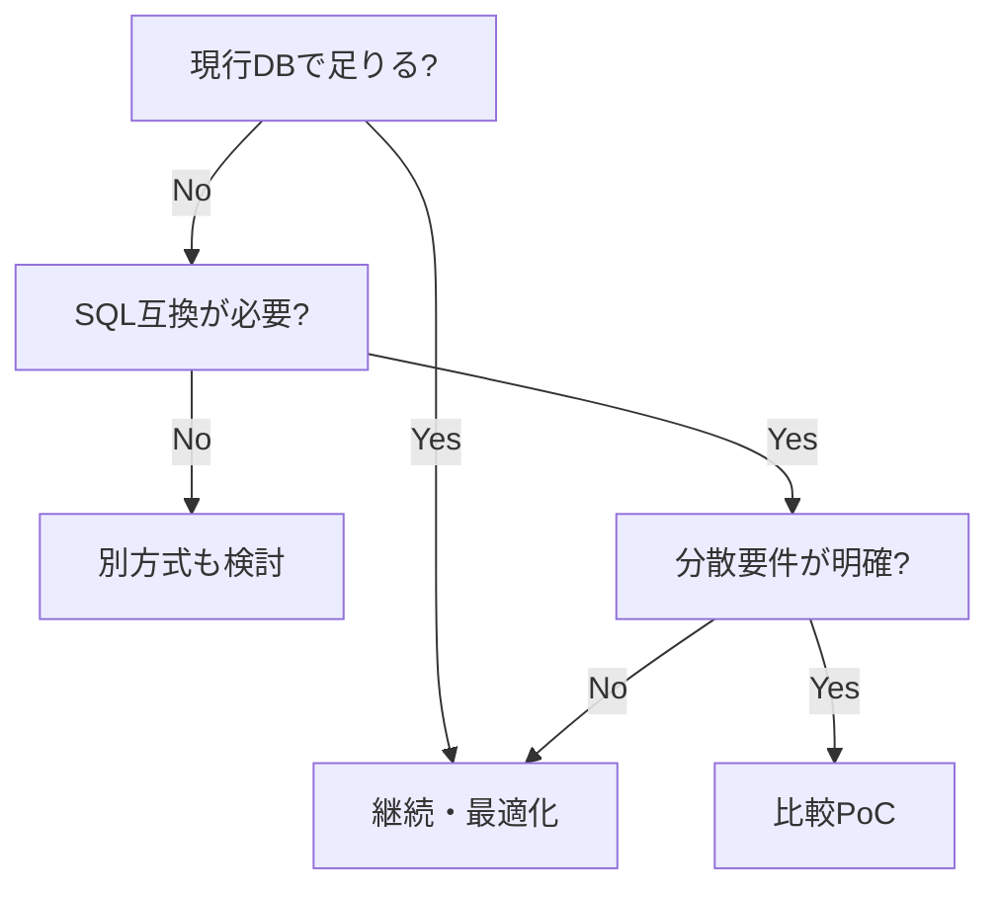

作成日: 2026-05-10
調査方式: 実務面談準備向けのナラティブレビュー / 製品評価
対象: NewSQL / Distributed SQLの重要概念、2026年時点の潮流、YugabyteDBのサービス概要、Yugabyte担当者との面談準備

## 1. エグゼクティブサマリー

NewSQLは、NoSQLが広げた水平スケールと高可用性の要求に対して、SQL、ACIDトランザクション、リレーショナルモデルを捨てずに応答しようとした系譜である。初期は「RDBMSを分散化する」議論だったが、現在の主戦場は `Distributed SQL`、`Cloud-native Postgres compatibility`、`multi-region active-active`、`serverless managed database`、`AI/agent workloads` へ移っている。

出典メモ: CattellのSIGMOD Record調査は、Web 2.0由来のOLTP負荷が従来DBMSの水平スケール限界を突いたこと、NoSQLがACIDや一貫性を一部犠牲にしたこと、そして新しいSQL系システムがSQLとACIDを維持したまま水平スケールを狙ったことを整理している。[Cattell, Scalable SQL and NoSQL Data Stores](https://sigmod.org/publications/sigmodRecord/1012/04.surveys.cattell.pdf) を参照。

YugabyteDBはこの潮流の中で、PostgreSQL互換APIを前面に出した分散SQLデータベースである。中核サービスは、OSSのYugabyteDB、フルマネージドのYugabyteDB Aeon、セルフマネージドDBaaSのYugabyteDB Anywhere、移行ツール/サービスのYugabyteDB Voyagerで構成される。2026年時点で話を聞くなら、単なる「NewSQL製品」ではなく、「PostgreSQL互換のまま、マルチリージョン、クラウド/オンプレ/Kubernetes、レガシーDB移行、AIアプリ基盤まで広げようとしている会社」と見た方がよい。

出典メモ: YugabyteDB公式の製品比較は、Aeon、Anywhere、OSSの提供形態、PostgreSQL runtime compatibility、ACID transactions、multi-region、xCluster、CDC、Voyagerなどを整理している。[Compare YugabyteDB Products](https://www.yugabyte.com/compare-products/) を参照。

Yugabyteが現在強く押し出している領域は、公開情報から見る限り次の4つである。

1. PostgreSQL互換性の強化: v2025.1以降でPostgreSQL 15ベースへ進み、Enhanced PostgreSQL Compatibility Modeの機能を広げている。
2. マネージド/ハイブリッド提供: Aeon、Aeon BYOC、Anywhereで「運用をYugabyteに任せる/自社環境で統制する」を選ばせる。
3. データベースモダナイゼーション: VoyagerでPostgreSQL、MySQL、Oracleなどからの移行を支援し、AI-powered assessment/modernizationを訴求している。
4. AI/agentワークロード: pgvector、MCP Server、LangChain/LlamaIndex等の連携、Mekoというagent-native data layerを前面に出し始めている。

出典メモ: PostgreSQL 15化は [YugabyteDB PostgreSQL 15 features](https://docs.yugabyte.com/stable/api/ysql/pg15-features/) に基づく。AI/agent訴求とMekoは [YugabyteDB latest release](https://www.yugabyte.com/latest-release/) と [Meko documentation](https://docs.mekodata.ai/) に基づく。ここでの「注力」は公式ロードマップではなく、公表済みページ・製品導線からの推定である。

## 2. NewSQLの重要概念

NewSQLを一文で言えば、「SQLとACIDを維持したまま、NoSQL級の水平スケール、耐障害性、分散運用を狙うOLTPデータベース群」である。従来RDBMSは、単一ノード、共有ストレージ、垂直スケール、手動シャーディング、レプリケーション/フェイルオーバーの運用複雑性に弱点があった。NoSQLはこの弱点を突いて、シャーディング、レプリケーション、スキーマ柔軟性、可用性を広げたが、多くの場合、SQL、JOIN、強い一貫性、複数行トランザクションを制限した。

NewSQLはその反動として現れた。重要なのは、NewSQLが単一のアーキテクチャ名ではない点である。Spanner系の時刻APIと合意形成、Calvin系の決定的トランザクション順序、Raft/Paxosで複製される分散KV上のSQL、ストレージとSQL層の分離、既存PostgreSQL/MySQL互換を重視する実装など、複数の設計系譜がある。

出典メモ: Google Spanner論文は、グローバルスケールで同期レプリケーションされたデータベースが、外部一貫性のある分散トランザクションをサポートしたと説明している。[Google Research, Spanner](https://research.google.com/archive/spanner.html) を参照。

重要概念は次の通りである。

| 概念                     | 要点                                                 | 実務上の注意                                              |
| ------------------------ | ---------------------------------------------------- | --------------------------------------------------------- |
| Distributed SQL          | 単一SQL DBに見えるが、内部ではデータを分割・複製する | PostgreSQLそのものと同じ性能特性ではない                  |
| Sharding / tablet        | テーブルを小さな分散単位に分ける                     | primary key、ホットキー、単調増加キーが効く               |
| Raft / Paxos             | 障害時もコミット済みデータに合意する                 | 書き込みはネットワーク距離とquorumの影響を受ける          |
| Multi-region             | 地域障害、低レイテンシ、データ所在に対応する         | 強整合書き込みを大陸間で行うと遅延を避けられない          |
| PostgreSQL compatibility | ORM、driver、SQL資産を活かす                         | 拡張、planner、DDL、transaction semanticsの差分確認が必要 |

## 3. 最近の潮流

### 3.1 「NewSQL」から「Postgres互換の分散DB」へ

初期NewSQLの価値は、SQLとACIDを捨てずに水平スケールできることだった。2026年時点の購買理由はもう少し具体的で、「既存アプリ、ORM、運用者、監査、SQL資産を活かしたい」「ただし単一PostgreSQLではmulti-regionや書き込みスケールが足りない」という形になっている。YugabyteDBはPostgreSQL runtime compatibility、CockroachDBはPostgreSQL wire/protocol互換、SpannerはPostgreSQL interface、Aurora DSQLはPostgreSQL-compatibleを訴求する。

出典メモ: YugabyteDBのYSQLはPostgreSQL query layerのforkを再利用し、データ型、クエリ、式、関数、ストアドプロシージャ、トリガー、拡張などをPostgreSQLと同様に動かす設計だと説明している。[YugabyteDB PostgreSQL 15 features](https://docs.yugabyte.com/stable/api/ysql/pg15-features/) を参照。SpannerはGoogleSQLとPostgreSQLの2 dialectを持つ。[Spanner documentation](https://docs.cloud.google.com/spanner/docs?authuser=0) を参照。

### 3.2 Cloud / Serverless / Managedが標準化する

運用負荷を下げることが、分散SQLの採用条件になっている。分散DBは、合意形成、leader配置、tablet/region配置、backup、upgrade、schema change、CDC、障害復旧を含むため、従来DBより運用面が複雑になりやすい。そこで各社は、フルマネージド、serverless、BYOC、Kubernetes operator、Terraform provider、observability、performance advisorを前面に出している。

出典メモ: YugabyteDB AeonはAWS/Azure/GCP上のfully managed DBaaS、Anywhereは任意環境でのself-managed DBaaSとして説明されている。[YugabyteDB Aeon FAQ](https://docs.yugabyte.com/stable/faq/yugabytedb-managed-faq/)、[YugabyteDB Anywhere](https://docs.yugabyte.com/stable/yugabyte-platform/) を参照。Aurora DSQLはserverlessでインフラ管理不要と説明されている。[AWS Aurora DSQL documentation](https://docs.aws.amazon.com/aurora-dsql/latest/userguide/what-is-aurora-dsql.html) を参照。

### 3.3 AI/agent向けデータ基盤への拡張

2025年以降、分散SQLベンダーはAIアプリケーションを強く意識している。AIアプリでもユーザー、権限、履歴、評価、状態更新などのトランザクションデータは残る。RAGやagent memoryのために、ベクトル検索、全文検索、JSON/ドキュメント、グラフ的関係、監査ログを同じ運用基盤で扱いたい需要もある。

YugabyteDBはpgvectorとHNSW indexing、MCP Server、LangChain/LlamaIndex/Bedrock/Vertex AI連携、Mekoを訴求している。Spannerもvector search、graph、search、AI/ML連携を前面に出している。TiDBもAI agents、transactions、analytics、vector searchを同じページで訴求している。これは、公表情報から見る限り、分散SQLが「グローバルOLTP」だけでなく「AI-native operational data plane」へ広がる動きである。

出典メモ: YugabyteDB latest releaseは、MCP Server、LangChain/OLLama/LlamaIndex/Bedrock/Vertex AI連携、pgvector、Performance Advisor、Mekoを掲載している。[YugabyteDB latest release](https://www.yugabyte.com/latest-release/) を参照。Spanner docsはvector search、MCP、Graph、full-text searchを同じ製品ドキュメントに含めている。[Spanner documentation](https://docs.cloud.google.com/spanner/docs?authuser=0) を参照。TiDBはAI agents、ACID、transactions、analytics、vector searchを訴求している。[PingCAP](https://www.pingcap.com/) を参照。

## 4. YugabyteDBのアーキテクチャ

YugabyteDBは、大きく見ると `YSQL/YCQLのquery layer` と `DocDB storage layer` に分かれる。YSQLはPostgreSQL互換のSQL API、YCQLはCassandra-inspired APIである。ストレージ層では、データをtabletに分割し、DocDBがRocksDB上にデータを保持し、Raftでtabletを複製する。YB-Masterはカタログ管理とクラスタ編成、YB-TServerはtabletの保持とクエリ処理を担う。

出典メモ: YugabyteDB architectureは、query layerとstorage layer、YSQL/YCQL、DocDB on RocksDB、sharding、Raft replication、YB-Master/YB-TServerを説明している。[YugabyteDB Architecture](https://docs.yugabyte.com/stable/architecture/) を参照。

YugabyteDBを理解するうえで重要なのは、「PostgreSQLをそのまま複数台で動かしている」のではなく、PostgreSQL互換のquery layerを分散ストレージ層に接続している点である。このため、PostgreSQLのエコシステム互換性は強い価値だが、性能特性は単一PostgreSQLと同じではない。分散DBでは、primary key設計、tablet分割、region配置、connection pooling、長いトランザクション、schema migration、sequence利用が設計対象になる。

## 5. Yugabyteが提供しているサービス

| サービス            | 概要                                               | 面談での確認点                                                |
| ------------------- | -------------------------------------------------- | ------------------------------------------------------------- |
| YugabyteDB OSS      | Apache 2.0の分散SQLデータベース                    | OSSでどこまで本番運用できるか。商用サポートとの差分           |
| YugabyteDB Aeon     | AWS/Azure/GCP上のfully managed DBaaS               | SLA、リージョン、バックアップ、セキュリティ、運用責任         |
| Aeon BYOC           | 顧客クラウド上に置くmanaged model                  | VPC、KMS、監査、責任分界、ネットワーク要件                    |
| YugabyteDB Anywhere | オンプレ/クラウド/Kubernetes向けself-managed DBaaS | 閉域、Kubernetes、複数クラスタ運用、アップグレード            |
| YugabyteDB Voyager  | 既存DBからの移行ツール/サービス                    | Oracle/PostgreSQL/MySQL移行で詰まるschema/transaction pattern |
| Meko                | agent-native data layer                            | 成熟度、料金、YugabyteDB/Aeonとの関係、MCPと監査              |

出典メモ: Aeon FAQは、AeonをAWS/Azure/GCP上のfully managed YugabyteDB-as-a-Serviceと説明している。[YugabyteDB Aeon FAQ](https://docs.yugabyte.com/stable/faq/yugabytedb-managed-faq/) を参照。Anywhere docsは、on-prem、public cloud、Kubernetes、single-/multi-region topologiesでYugabyteDB universesをdeploy/operateするself-managed DBaaSと説明している。[YugabyteDB Anywhere](https://docs.yugabyte.com/stable/yugabyte-platform/) を参照。Voyager docsは、PostgreSQL、MySQL、OracleからYugabyteDB Aeon/Anywhere/OSSへ移行するend-to-end migrationを説明している。[YugabyteDB Voyager docs](https://docs.yugabyte.com/stable/yugabyte-voyager/) を参照。

MekoはYugabyteDB本体とは別導線で出てきているagent-native data layerである。Mekoの公式ページは、multi-agent systems向けのcollective memory、shared knowledge、decision traces、single MCP endpoint、unified data layerを訴求しており、YugabyteDB上に構築されていると説明している。現時点では成熟した汎用DBサービスというより、YugabyteがAI agent時代のデータ基盤に賭けているシグナルとして見るのが妥当である。

出典メモ: Meko公式サイトは「The Data Layer for Agents That Learn Together」とし、MCP endpoint、vector/SQL/graph/search、serverless architectureを説明している。[Meko](https://mekodata.ai/)、[Meko Documentation](https://docs.mekodata.ai/) を参照。ここでの位置づけは公表情報からの推定である。

## 6. Yugabyteが今注力していると見える領域

| 領域                    | 公開情報から見える動き                                             | 面談で聞くべきこと                                                           |
| ----------------------- | ------------------------------------------------------------------ | ---------------------------------------------------------------------------- |
| PostgreSQL互換性        | PG15ベース、EPCM、CBO、Read Committed、parallel query、DDL/DML改善 | どのPostgreSQL拡張・SQL機能が未対応か。互換性テストは何で見るべきか          |
| Managed / BYOC          | Aeon、Aeon BYOC、Anywhereで運用モデルを分ける                      | 日本企業のネットワーク、KMS、監査、データ所在要件にどう対応するか            |
| Database modernization  | VoyagerでPostgreSQL/MySQL/Oracle移行、AI-powered assessmentを訴求  | Oracle/PostgreSQL移行で失敗しやすいschema/sequence/transaction patternは何か |
| Multi-region resilience | 同期multi-region、geo-partitioning、xCluster、read replicas        | Tokyo/Osakaや日本+海外構成の実績、レイテンシ、RPO/RTO設計                    |
| AI/agent workloads      | pgvector、MCP Server、LangChain/LlamaIndex連携、Meko               | RAG/agent memory用途で、専用vector DBと比べた勝ち筋/限界                     |
| Operational tooling     | Performance Advisor、observability、rolling upgrades、backup/PITR  | 本番SREが見るべきSLO、アラート、障害訓練、アップグレード頻度                 |

出典メモ: v2025.2 LTS release notesは、xCluster automatic mode、connection manager改善、write pipelining、pgvector with indexing、HNSW、PostgreSQL互換機能などを挙げている。[YugabyteDB v2025.2 release notes](https://docs.yugabyte.com/stable/releases/ybdb-releases/v2025.2/) を参照。注力領域は公式ロードマップではなく、公表済みリリースと製品ページからの推定である。

## 7. 導入判断の観点

YugabyteDBが向いているのは、単一PostgreSQLの運用限界が明確で、かつSQL/ACID/既存ツールを維持したいケースである。典型的には、マルチリージョン可用性、無停止に近い運用、書き込みスケール、データレジデンシ、PostgreSQL資産の活用、Oracle/MySQLからのモダナイゼーションが同時に問題になっている組織である。

逆に、単一リージョンで垂直スケールしたPostgreSQL/Auroraが十分に安定している場合、YugabyteDBは過剰投資になりやすい。分散DBは、障害耐性とスケールを得る代わりに、キー設計、トランザクション境界、リージョン配置、運用可視化、互換性検証のコストを持ち込む。NewSQLは「PostgreSQLの完全上位互換」ではなく、「分散システムの制約をSQLの形で扱えるようにする選択肢」である。

## 8. Yugabyte担当者に聞くとよい質問

1. YugabyteDBは「PostgreSQL互換」をどの粒度で定義していますか。wire protocol、SQL dialect、extension、planner behavior、DDL、transaction semanticsで未対応・制約がある部分をどう把握すべきですか。
2. PostgreSQL 15ベース化後、PG16/PG17への追随方針はどうなっていますか。互換性の優先順位は顧客要求、PostgreSQL本家、分散DBとしての安全性のどれで決まりますか。
3. Oracle/PostgreSQL/MySQLからVoyagerで移行する場合、最も詰まりやすいschema pattern、sequence、stored procedure、trigger、transaction patternは何ですか。
4. Aeon、Aeon BYOC、Anywhereの責任分界を、障害対応、backup restore、upgrade、KMS、監査ログ、ネットワーク、SLAの観点で比較するとどうなりますか。
5. 日本リージョンまたは日本企業で、Tokyo/Osaka、Japan/US、Japan/APACのmulti-region構成実績はありますか。実測レイテンシと推奨トポロジは何ですか。
6. xClusterはDR、移行、active-active、分析連携のどれを主用途として推奨していますか。双方向レプリケーションの衝突処理とDDL運用の制約は何ですか。
7. YugabyteDBのpgvector/HNSWは、どの規模・更新頻度・検索要件まで現実的ですか。専用vector DBと比較して勝てる条件、負ける条件は何ですか。
8. MekoはYugabyteDBの商用サービスとしてどの段階ですか。既存のYugabyteDB/Aeon顧客がMekoを使う場合、データ境界、MCP、監査、料金はどうなりますか。
9. Aurora DSQL、Spanner、CockroachDB、TiDBと比較されたとき、Yugabyteが最も勝ちやすいユースケースと、正直に勧めないユースケースは何ですか。
10. PoCをするなら、どのベンチマークより先に、どのアプリ固有ワークロードを持ち込むべきですか。

## 参考情報

本文はこの `content/blog/newsql-yugabyte-brief.mdx` を正本として管理する。
