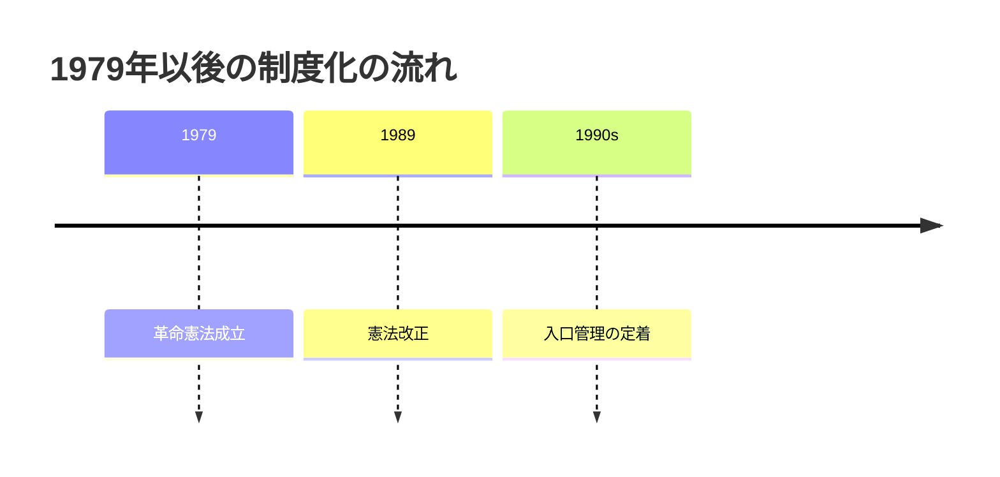
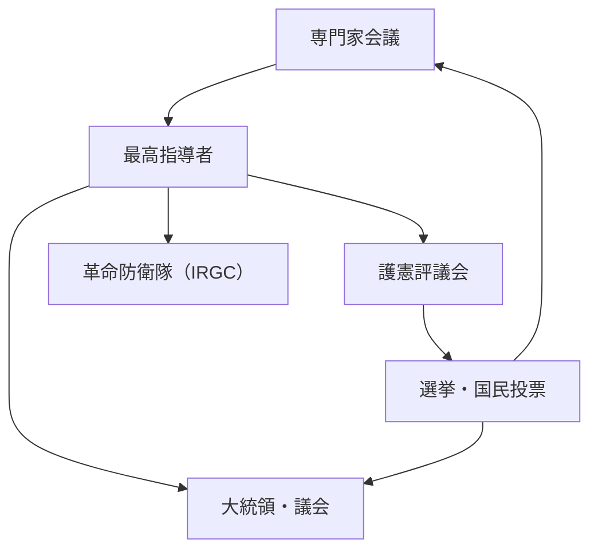

# イラン革命後の権力構造と統治機構

## 1. エグゼクティブサマリー

1979年革命後のイランは、単純な「宗教国家」でも、通常の議院内閣制でもない。憲法は `velayat-e faqih` すなわち「法学者の統治」を制度化し、最高指導者を国家の頂点に置いたうえで、専門家会議、護憲評議会、司法、革命防衛隊、選挙制度を相互に絡ませている。選挙で選ばれる大統領と議会は存在するが、候補者のふるい分け、法律の適合審査、軍事・治安の最終統制は非選挙機関に強く寄っている。

この構造の核心は、最高指導者を単なる宗教的権威ではなく、軍・司法・護憲評議会・放送・宗教財団をまたぐ憲法上の統合点として設計したことにある。他方で、専門家会議は最高指導者の選出と解任を担当するため、少なくとも形式上はトップを拘束する仕組みが残る。ただし、その会議の候補者も護憲評議会の審査を通るため、監督者を監督する機関が再び監督されるという閉じた構造になっている。

要するに、イラン革命後体制は「大統領と議会があるが、主権の最終配分は最高指導者側にある」制度である。実務上の争点は、誰が法を作るかではなく、誰が候補者を通し、誰が法律を止め、誰が軍事・治安機構を統べるかにある。

出典メモ: 憲法の骨格は [Constitute Project, Constitution of the Islamic Republic of Iran (1989 revision)](https://www.constituteproject.org/constitution/Iran_1989?lang=en) に基づく。専門家会議・護憲評議会・司法・革命防衛隊の実務的な読みは [USIP Iran Primer: The Assembly of Experts](https://iranprimer.usip.org/resource/assembly-experts)、[The Guardian Council](https://iranprimer.usip.org/resource/guardian-council)、[The Judiciary](https://iranprimer.usip.org/resource/judiciary)、[The Islamic Revolutionary Guard Corps](https://iranprimer.usip.org/resource/islamic-revolutionary-guard-corps)、[The Supreme Leader](https://iranprimer.usip.org/resource/supreme-leader) を参照した。

## 2. 憲法上の設計

1979年憲法は、イラン革命の理念を抽象的な宣言にとどめず、権力配分として固定した。第5条は、十二イマームの隠遁期における「正義で敬虔な法学者」の統治を掲げ、第107条は専門家会議が指導者を選ぶと定める。第110条は最高指導者の権限を列挙し、軍の最高指揮、司法の長の任命、護憲評議会の法学者メンバーの任命などを含めた。

1989年改正の制度的意味は大きい。指導者権限が単独の最高指導者へ集中し、専門家会議との関係がより明確化された。これは、革命後の宗教的正統性を「複数の宗教権威の合議」ではなく、「ひとりの法学者への委任」として固定した、ということでもある。

第6条は、共和国の主要機関が選挙と国民投票によって運営されると定める。他方、第91条と第94条は、議会法案が護憲評議会の審査を受けることを義務づけ、第99条は同評議会に選挙・国民投票の監督権限を与える。つまり、イランの制度は「選挙はあるが、選挙の入口と出口を憲法機関が握る」形で設計されている。

出典メモ: 憲法条文の確認は [Constitute Project, Constitution of the Islamic Republic of Iran](https://www.constituteproject.org/constitution/Iran_1989?lang=en) を中心に行った。第5条、第6条、第91条、第94条、第99条、第107条、第110条、第111条の文言を照合し、制度の意味づけは [USIP Iran Primer: The Supreme Leader](https://iranprimer.usip.org/resource/supreme-leader) と [The Assembly of Experts](https://iranprimer.usip.org/resource/assembly-experts) を参照した。

## 3. 主要機関の関係

以下は、この体制を理解するうえで最低限押さえるべき機関の対応表である。

| 機関               | どのように選ばれるか                                                   | 主な権限                                                         | 他機関との関係                                               |
| ------------------ | ---------------------------------------------------------------------- | ---------------------------------------------------------------- | ------------------------------------------------------------ |
| 最高指導者         | 専門家会議が選出・解任する                                             | 軍の最高指揮、司法長任命、護憲評議会の半数任命、主要放送統制など | 体制の頂点。選挙機関の外側から統治を調整する                 |
| 専門家会議         | 国民投票ではなく選挙で選ばれるが、候補者は護憲評議会審査を受ける       | 最高指導者の選出・監督・解任                                     | 形式上は最高指導者を拘束するが、入口を護憲評議会に抑えられる |
| 護憲評議会         | 法学者6名を最高指導者が任命、法曹6名を司法長官の推薦に基づき議会が選出 | 法律の適合審査、選挙・国民投票の監督、候補者審査                 | 議会と選挙の両方に対するゲートキーパー                       |
| 大統領             | 国民投票で直接選出。ただし候補者は審査を受ける                         | 行政府の長として内政・経済・行政を統括                           | 最高指導者の権限に属する事項は扱えない                       |
| 議会（マジュレス） | 国民投票で選出。ただし候補者審査あり                                   | 法律制定、予算、監督                                             | 制定法は護憲評議会の審査に服する                             |
| 司法               | 司法長は最高指導者が任命                                               | 裁判所、検察、法制整備の統括                                     | 司法長が護憲評議会の法曹枠選定に関与する                     |
| 革命防衛隊（IRGC） | 最高指導者の統制下にある常備軍事組織                                   | 革命と体制の防衛、対外・対内治安の要                             | 通常軍と並立し、体制防衛の中心軸となる                       |
| 選挙制度           | 大統領、議会、専門家会議、国民投票を含む                               | 代表選出の入口                                                   | 護憲評議会の監督と候補者審査を受ける                         |

出典メモ: 上表は [Constitute Project の憲法本文](https://www.constituteproject.org/constitution/Iran_1989?lang=en) と [USIP Iran Primer: The Supreme Leader](https://iranprimer.usip.org/resource/supreme-leader)、[The Guardian Council](https://iranprimer.usip.org/resource/guardian-council)、[The Judiciary](https://iranprimer.usip.org/resource/judiciary)、[The Assembly of Experts](https://iranprimer.usip.org/resource/assembly-experts)、[The Islamic Revolutionary Guard Corps](https://iranprimer.usip.org/resource/islamic-revolutionary-guard-corps) を突き合わせて整理した。

図のポイントは三つある。第一に、最高指導者は軍事・司法・監督機構をまたいで上位に置かれる。第二に、護憲評議会は法律審査だけでなく、選挙の入口も管理する。第三に、専門家会議は最高指導者を選べるが、その構成員候補は同じく護憲評議会に審査される。

出典メモ: 図は [Constitute Project](https://www.constituteproject.org/constitution/Iran_1989?lang=en) と [USIP Iran Primer: The Supreme Leader](https://iranprimer.usip.org/resource/supreme-leader)、[The Assembly of Experts](https://iranprimer.usip.org/resource/assembly-experts)、[The Guardian Council](https://iranprimer.usip.org/resource/guardian-council) を統合している。

## 4. 最高指導者と専門家会議

最高指導者は、イラン体制の中心である。憲法第110条により、軍の最高指揮、戦争と平和の宣言に関わる権限、司法長の任命、放送機構の長の任命、護憲評議会法学者の任命など、国家の要所を押さえる。大統領は憲法上の行政責任者ではあるが、最高指導者の制度的上位性を超えることはできない。

専門家会議は、最高指導者を選び、監督し、必要なら解任できるとされる。ここが「宗教指導が無制限ではない」点であり、形式的には最高権力者に対する制度的ブレーキになっている。ただし、候補者の選別は護憲評議会を通るため、反対派が自由に流入できるわけではない。体制は自己再生産しやすいように作られている。

第111条は、最高指導者に空席が生じた場合の対応も定める。つまり、体制は「個人のカリスマ」だけでなく「空席時の継承ルール」まで憲法化している。ここに、革命後イランが臨時政権ではなく長期支配を想定した制度国家であることが表れる。

出典メモ: 最高指導者と専門家会議の関係は [USIP Iran Primer: The Supreme Leader](https://iranprimer.usip.org/resource/supreme-leader) と [The Assembly of Experts](https://iranprimer.usip.org/resource/assembly-experts) が整理している。憲法条文は [Constitute Project, Article 107-111](https://www.constituteproject.org/constitution/Iran_1989?lang=en) を参照した。

## 5. 護憲評議会と選挙制度

護憲評議会は、イラン政治の最重要ゲートキーパーである。第91条により12名で構成され、6名の法学者は最高指導者が任命し、6名の法曹は司法長官の推薦を受けて議会が選ぶ。第94条は議会可決法案の審査を要求し、第96条はその審査で「イスラム法と憲法との適合」をチェックする権限を認める。

実務上の重要点は、第99条に基づく「選挙・国民投票の監督」である。大統領選挙、議会選挙、専門家会議選挙は形式上あるが、候補者は事前に審査されるため、競争の範囲は制度的に制御される。したがって、イランの選挙は「権力交代の自由市場」ではなく、「体制内の選択肢を定期的に再配列する装置」と見るのが正確である。

大統領は国民選出だが、憲法第113条は大統領を最高指導者に次ぐ国家の上位行政府と位置づけるにとどまり、領域主権の最終調整は最高指導者側に残る。議会も国民選出だが、第94条の審査を通らなければ法律を完成できないため、立法権も完全ではない。

出典メモ: 護憲評議会の構成と選挙監督は [Constitute Project, Articles 91, 94, 96, 99](https://www.constituteproject.org/constitution/Iran_1989?lang=en) を参照した。選挙の実務的な絞り込みは [USIP Iran Primer: The Guardian Council](https://iranprimer.usip.org/resource/guardian-council) と [The Assembly of Experts](https://iranprimer.usip.org/resource/assembly-experts) を参照した。

## 6. 司法と法の統制

イランの司法は独立機関として設計されているが、その頂点である司法長は最高指導者が任命する。第157条は、最高指導者が司法の長を任命することを定め、第160条は法務大臣を大統領が任命する一方で、その候補が司法長の提案を必要とする仕組みを作る。つまり、法の執行は大統領の単独権限ではなく、司法長を通じて最高指導者側の影響を受ける。

この設計は、立法、行政、司法の三権分立を形式上は残しながら、司法を「最高指導者に連結された中央装置」として運用することを可能にしている。判決の最終性そのものよりも、誰が司法のトップを選ぶかが制度の核心になる。

出典メモ: 司法制度の要点は [USIP Iran Primer: The Judiciary](https://iranprimer.usip.org/resource/judiciary) と [Constitute Project, Articles 156-160](https://www.constituteproject.org/constitution/Iran_1989?lang=en) を参照した。

## 7. 革命防衛隊と宗教権威の接続

革命防衛隊（IRGC）は、通常軍とは別系統で、革命と体制を守るための常備軍事組織として憲法第150条に明記されている。第143条は通常軍を国家の独立と領土保全の防衛に位置づけ、第150条は革命防衛隊を革命とその成果の守護者として残す。ここから、イランの安全保障は「国家防衛」と「体制防衛」が分離されていないことが分かる。

最高指導者が軍の最高指揮を握り、IRGC指令系統の上に立つことが、宗教権威と武力組織の結節点になっている。USIPはIRGCをイランで最も強力な安全保障・軍事組織の一つとして説明し、その政治的・経済的浸透を指摘している。実務上は、IRGCは外征能力だけでなく、国内の統治安定化と抑圧の装置としても機能する。

このため、イランの宗教権威は「説教者の権威」にとどまらず、軍事・治安・司法を束ねる統治権力として現れる。革命後イランの難しさは、宗教と国家が分離していないこと自体ではなく、その結合が制度的に複層化し、しかも選挙制度の上から覆いかぶさっている点にある。

出典メモ: IRGC の制度的位置づけは [Constitute Project, Articles 143 and 150](https://www.constituteproject.org/constitution/Iran_1989?lang=en) と [USIP Iran Primer: The Islamic Revolutionary Guard Corps](https://iranprimer.usip.org/resource/islamic-revolutionary-guard-corps) を参照した。

## 8. 実務的な読み方

この体制を見るときの実務上の要点は三つある。第一に、イラン政治を「選挙があるかないか」で分類すると誤る。実際には、選挙はあるが候補者選定と法審査が上位機関に押さえられている。第二に、最高指導者の権限は象徴ではなく、軍事・司法・監督機構を通じて可動する。第三に、IRGC は単なる軍事組織ではなく、体制維持のコア機関として読む必要がある。

政策分析の観点では、対イラン外交や制裁設計、政変シナリオの評価、軍事抑止の検討において、「大統領府」だけを見ても不十分である。実際に決定を左右するのは、最高指導者、護憲評議会、司法、IRGC、そしてそれらを再生産する選挙の入口管理である。

限界もある。ここで示したのは憲法上の設計とその制度的帰結であり、個々の権力者の派閥対立、経済利益、革命歴史、地域代理勢力までは掘り下げていない。したがって、実際の意思決定を読むには、制度分析に加えて人事、予算、制裁回避、軍事作戦の個別データを別途追う必要がある。

## 9. 参考情報

- [Constitute Project, Constitution of the Islamic Republic of Iran](https://www.constituteproject.org/constitution/Iran_1989?lang=en)
- [USIP Iran Primer: The Supreme Leader](https://iranprimer.usip.org/resource/supreme-leader)
- [USIP Iran Primer: The Assembly of Experts](https://iranprimer.usip.org/resource/assembly-experts)
- [USIP Iran Primer: The Guardian Council](https://iranprimer.usip.org/resource/guardian-council)
- [USIP Iran Primer: The Judiciary](https://iranprimer.usip.org/resource/judiciary)
- [USIP Iran Primer: The Islamic Revolutionary Guard Corps](https://iranprimer.usip.org/resource/islamic-revolutionary-guard-corps)
