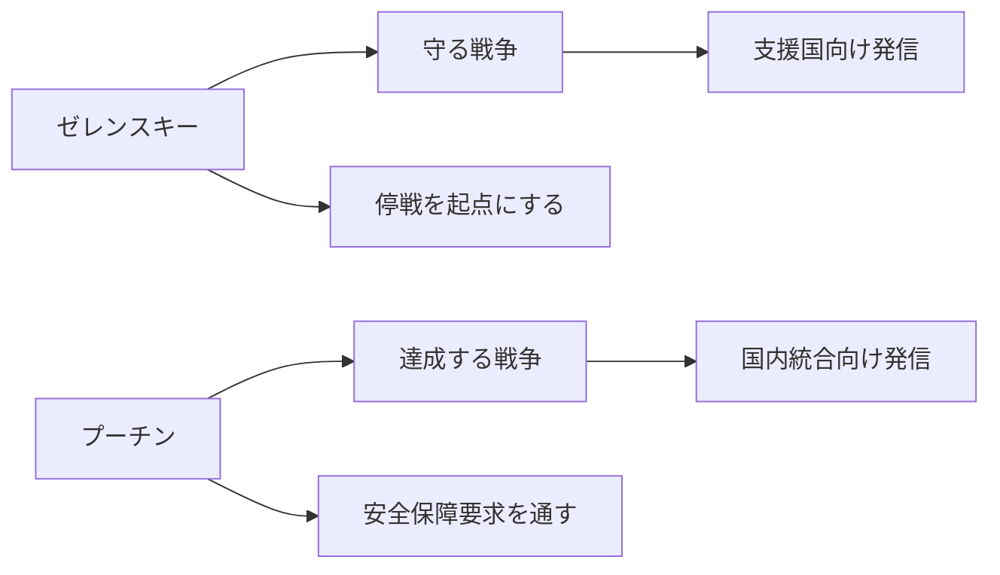

# ゼレンスキーとプーチンの直近発言から読む戦争目的の差異

## 1. エグゼクティブサマリー

2026年5月時点で、ゼレンスキーとプーチンの発言は、同じ「停戦」や「和平」という語を使いながら、実際には別の戦争設計図を示している。ゼレンスキーは、2026年5月24日の公式メッセージで「人の命を守る側」が国際社会を支えていると述べ、5月7日には「全面的で無条件の停戦」を要求し、5月23日には占領や侵略に関与した人物への制裁を公表した。ここでの中心目的は、国家の生存、領土の回復、そしてロシアへの圧力を強めて停戦条件を有利にすることにある。出典メモ: [President of Ukraine, 2026-05-24 address](https://www.president.gov.ua/en/news/gotuyemo-kroki-yaki-mozhut-aktivizuvati-nashu-spilnu-protidi-104421), [President of Ukraine, 2026-05-07 address](https://www.president.gov.ua/en/news/ukrayinska-poziciya-maksimalno-prozora-j-chesna-ukrayina-bud-104281), [President of Ukraine, 2026-05-23 sanctions announcement](https://www.president.gov.ua/en/news/ukrayina-zastosuvala-sankciyi-shodo-okupantiv-yaki-vidpovida-104557).

プーチンは、2026年2月24日の連邦保安局幹部会で、ロシアはドンバスとノヴォロシアを含む「歴史的・国境地域」を守り、ロシアの安全を確保すると述べた。2025年12月17日の国防省幹部会でも、ロシアは「特別軍事作戦の目標」を達成しなければならず、NATO はロシアとの対決に備えているという認識を示した。ここでの中心目的は、ウクライナの中立化や緩衝地帯化を含むロシアの安全保障要求を、軍事・政治の両面で通すことにある。出典メモ: [Kremlin, 2026-02-24 FSB board](https://en.special.kremlin.ru/events/president/transcripts/79216), [Kremlin, 2025-12-17 board of the Ministry of Defence](https://en.special.kremlin.ru/events/president/transcripts/78801).

両者の差は、単なる修辞ではない。ゼレンスキーは「停戦を起点に安全保障を作る」発想で、プーチンは「戦争目的を達成した後にのみ安定が来る」発想に近い。したがって、交渉で最も重要なのは「誰が和平を望むか」ではなく、「どの境界線と安全保障条件を最終線とみなすか」である。出典メモ: [President of Ukraine, 2026-05-07 address](https://www.president.gov.ua/en/news/ukrayinska-poziciya-maksimalno-prozora-j-chesna-ukrayina-bud-104281), [Kremlin, 2026-02-24 FSB board](https://en.special.kremlin.ru/events/president/transcripts/79216).

## 2. 何を比較したか

本稿では、レポート作成時点で確認できる一次情報のうち、次を比較対象にした。

1. ゼレンスキーの 2026年5月24日、5月23日、5月17日、5月7日の公式発言。
2. プーチンの 2026年2月24日と 2025年12月17日の公式発言。
3. 発言が向けられる相手の違い。
4. 実際の軍事・外交行動との整合性。

この比較では、当事者の発言をそのまま「本音」とみなさない。代わりに、国内向け、対外向け、交渉向けのメッセージを分けて読む。出典メモ: [President of Ukraine official news archive](https://www.president.gov.ua/en/news), [Kremlin official events archive](https://en.kremlin.ru/events/president).

出典メモ: 図は、ゼレンスキーの 2026-05-07 / 05-24 発言と、プーチンの 2026-02-24 / 2025-12-17 発言を要約したものだ。目的は時系列ではなく、戦争観の違いを一目で確認することにある。

## 3. 比較表

| 論点 | ゼレンスキー | プーチン | 読み方 |
| --- | --- | --- | --- |
| 戦争目的 | 国家防衛、領土回復、民間人保護、支援国の結束 | 「特別軍事作戦の目標」達成、ドンバスとノヴォロシア、ロシアの安全確保 | ゼレンスキーは防衛戦、プーチンは安全保障主張を伴う攻勢継続 |
| 停戦条件 | 全面的で無条件の停戦を起点にする | ロシアの目的達成が先、交渉はその枠内 | 停戦の順序が逆で、妥協点が噛み合っていない |
| 領土 | 国際的に認められた国境の回復を前提にする | 「歴史的・国境地域」をロシアの安全保障空間として扱う | 領土の法的地位をめぐる前提が一致していない |
| NATO / 安全保障 | EU・NATO を含む将来の安全保障枠組みを志向 | NATO はロシアとの対決準備を進めているという認識 | ゼレンスキーは接近、プーチンは封じ込めと対抗 |
| 国内向けメッセージ | 「人の命を守る側」が正当性を持つ | 国家の安全を守るための戦いである | どちらも国内結束を維持するための物語を作る |
| 対外向けメッセージ | 支援、制裁、追加圧力を呼び込む | 譲歩ではなく、ロシアの条件を受け入れさせる | 交渉ではなく圧力戦の色合いが強い |

出典メモ: ゼレンスキー側は [2026-05-24 address](https://www.president.gov.ua/en/news/gotuyemo-kroki-yaki-mozhut-aktivizuvati-nashu-spilnu-protidi-104421)、[2026-05-23 sanctions announcement](https://www.president.gov.ua/en/news/ukrayina-zastosuvala-sankciyi-shodo-okupantiv-yaki-vidpovida-104557)、[2026-05-17 address](https://www.president.gov.ua/en/news/nasha-dalekobijnist-ce-te-sho-znachno-zminyuye-situaciyu-ta-104465)、[2026-05-07 address](https://www.president.gov.ua/en/news/ukrayinska-poziciya-maksimalno-prozora-j-chesna-ukrayina-bud-104281) に基づく。プーチン側は [2026-02-24 FSB board](https://en.special.kremlin.ru/events/president/transcripts/79216) と [2025-12-17 Ministry of Defence board](https://en.special.kremlin.ru/events/president/transcripts/78801) に基づく。

## 4. ゼレンスキーのメッセージ

ゼレンスキーの直近発言で一貫しているのは、戦争を「防衛」として語ることだ。2026年5月24日の発言では、ロシアの攻撃に対抗して、支援国とともに「共同の防衛」を活性化する措置を準備していると述べた。これは、単なる感情的な訴えではなく、防空、制裁、軍事支援、外交連携を同じパッケージで回す意思表示である。出典メモ: [President of Ukraine, 2026-05-24 address](https://www.president.gov.ua/en/news/gotuyemo-kroki-yaki-mozhut-aktivizuvati-nashu-spilnu-protidi-104421).

5月17日の発言では、ウクライナの長距離能力が「状況を大きく変える」と述べ、5月23日には占領や侵略に関与した人物への制裁を公表した。ここから読めるのは、ゼレンスキーが停戦だけを求めているのではなく、停戦交渉の前提としてロシアの軍事・物流・政治コストを上げようとしていることだ。出典メモ: [President of Ukraine, 2026-05-17 address](https://www.president.gov.ua/en/news/nasha-dalekobijnist-ce-te-sho-znachno-zminyuye-situaciyu-ta-104465), [President of Ukraine, 2026-05-23 sanctions announcement](https://www.president.gov.ua/en/news/ukrayina-zastosuvala-sankciyi-shodo-okupantiv-yaki-vidpovida-104557).

5月7日の発言では、ウクライナの立場は「最大限に透明で正直」であり、全面的で無条件の停戦が必要だと強調した。つまり、ゼレンスキーの停戦論は「先に戦闘を止め、その後に安全保障と条件を詰める」という順序を取る。これは、軍事的に不利でも、政治的な正当性を失わないための言い方でもある。出典メモ: [President of Ukraine, 2026-05-07 address](https://www.president.gov.ua/en/news/ukrayinska-poziciya-maksimalno-prozora-j-chesna-ukrayina-bud-104281).

5月7日の関連文脈では、「占領下の人々」と「捕虜」についての言及も続いている。ここでの国内向けメッセージは、領土だけでなく人の帰還を戦争目的に含めることだ。したがって、ゼレンスキーの戦争目的は、法的主権の回復と人道的回復を一体で語る構造になっている。出典メモ: [President of Ukraine, 2026-05-07 address](https://www.president.gov.ua/en/news/ukrayinska-poziciya-maksimalno-prozora-j-chesna-ukrayina-bud-104281).

## 5. プーチンのメッセージ

プーチンの直近の公式発言は、戦争を「特別軍事作戦」と呼び続け、その目標の達成を前提に置いている。2026年2月24日の連邦保安局幹部会では、ロシアはドンバスとノヴォロシアを含む「歴史的・国境地域」を守り、ロシアの安全を確保しなければならないと述べた。これは、停戦を優先するより、戦争目的の完遂を優先する言い方である。出典メモ: [Kremlin, 2026-02-24 FSB board](https://en.special.kremlin.ru/events/president/transcripts/79216).

2025年12月17日の公式発言では、NATO はロシアとの対決に備えているという認識を示した。ここでの「安全保障」は、単なる防御ではなく、ロシアの影響圏を守るための対外的な境界線の問題として扱われている。したがって、プーチンの発言は、ウクライナ戦争を欧州全体の安全保障秩序の再編と結びつけている。出典メモ: [Kremlin, 2025-12-17 Ministry of Defence board](https://en.special.kremlin.ru/events/president/transcripts/78801).

停戦条件の面では、プーチンは「まず軍事・政治目標を達成する」という順序から離れていない。少なくとも今回確認できた直近の公式発言の範囲では、無条件停戦を積極的に提案する姿勢は見えない。これは、交渉を否定するというより、交渉の入口に自分の戦争目的を置く立場だと解釈するのが妥当である。出典メモ: [Kremlin, 2026-02-24 FSB board](https://en.special.kremlin.ru/events/president/transcripts/79216), [Kremlin, 2025-12-17 Ministry of Defence board](https://en.special.kremlin.ru/events/president/transcripts/78801).

## 6. 国内向け、国際向け、交渉向けの使い分け

ゼレンスキーの発言は、少なくとも三つの受け手に向いている。

1. 国内向けには、戦争を「防衛」として正当化する。
2. 国際社会向けには、支援と制裁を継続させる。
3. 交渉向けには、停戦を先に置き、領土と安全保障の議論を後ろに回す。

プーチンの発言も三層に分けられる。

1. 国内向けには、国家の安全と歴史的領域の回復を語る。
2. 国際社会向けには、NATO への対抗を前提にロシアの安全保障要求を押し出す。
3. 交渉向けには、ロシアの目標を受け入れる形でしか停戦は成立しないと示唆する。

この違いは、単に話法の問題ではない。発言の置き方そのものが、交渉の余地を狭めたり広げたりしている。出典メモ: [President of Ukraine, 2026-05-07 address](https://www.president.gov.ua/en/news/ukrayinska-poziciya-maksimalno-prozora-j-chesna-ukrayina-bud-104281), [President of Ukraine, 2026-05-24 address](https://www.president.gov.ua/en/news/gotuyemo-kroki-yaki-mozhut-aktivizuvati-nashu-spilnu-protidi-104421), [Kremlin, 2026-02-24 FSB board](https://en.special.kremlin.ru/events/president/transcripts/79216), [Kremlin, 2025-12-17 Ministry of Defence board](https://en.special.kremlin.ru/events/president/transcripts/78801).

## 7. 発言と実際の行動は整合しているか

整合性の観点では、ゼレンスキー側は比較的わかりやすい。5月17日の長距離能力の発言と、5月24日の「共同の防衛」を活性化する発言、5月23日の制裁発表は、いずれもロシアに対する圧力を高める行動と並走している。つまり、外交メッセージと軍事・制裁の実行が同じ方向を向いている。出典メモ: [President of Ukraine, 2026-05-17 address](https://www.president.gov.ua/en/news/nasha-dalekobijnist-ce-te-sho-znachno-zminyuye-situaciyu-ta-104465), [President of Ukraine, 2026-05-23 sanctions announcement](https://www.president.gov.ua/en/news/ukrayina-zastosuvala-sankciyi-shodo-okupantiv-yaki-vidpovida-104557), [President of Ukraine, 2026-05-24 address](https://www.president.gov.ua/en/news/gotuyemo-kroki-yaki-mozhut-aktivizuvati-nashu-spilnu-protidi-104421).

プーチン側も、少なくとも公開発言では、戦争目的の達成と NATO への対抗を強く語り続けている点で、実際の攻勢継続と整合しやすい。ただし、ここでの整合は「攻撃継続を正当化する語り」と「攻撃継続そのもの」が一致しているという意味であり、和平に向けた整合ではない。言い換えると、プーチンの発言は軍事行動を止めるためではなく、継続するための説明として読むほうが近い。出典メモ: [Kremlin, 2026-02-24 FSB board](https://en.special.kremlin.ru/events/president/transcripts/79216), [Kremlin, 2025-12-17 Ministry of Defence board](https://en.special.kremlin.ru/events/president/transcripts/78801).

公開情報ベースでは、両者とも「相手にだけ譲歩を求める」構図が崩れていない。ゼレンスキーは停戦と支援を求め、プーチンは目標達成と安全保障要求を求める。したがって、発言の差は外交辞令ではなく、戦争を終える順番の違いそのものだと見るべきである。出典メモ: [President of Ukraine, 2026-05-07 address](https://www.president.gov.ua/en/news/ukrayinska-poziciya-maksimalno-prozora-j-chesna-ukrayina-bud-104281), [Kremlin, 2026-02-24 FSB board](https://en.special.kremlin.ru/events/president/transcripts/79216).

## 8. 何が変われば見方が変わるか

今後の見方を変えるのは、次の4点である。

1. ゼレンスキーが無条件停戦を、領土交渉なしでどこまで維持するか。
2. プーチンが「目標達成」を維持しつつ、限定停戦や部分合意を受け入れるか。
3. NATO・EU・米国が、ウクライナの安全保障をどこまで制度化するか。
4. 戦場での損耗が、どちらかの交渉姿勢を変えるほど大きくなるか。

現時点では、公表情報からの推定として、完全な折り合いよりも、断片的な合意や限定停戦の積み上げが先に起きやすい。これは、領土、制裁、安全保障が互いに連動しているためで、1項目だけでは解決しないからだ。出典メモ: [President of Ukraine, 2026-05-07 address](https://www.president.gov.ua/en/news/ukrayinska-poziciya-maksimalno-prozora-j-chesna-ukrayina-bud-104281), [Kremlin, 2026-02-24 FSB board](https://en.special.kremlin.ru/events/president/transcripts/79216).

## 9. 実務的な含意

日本の政策担当者、輸出管理担当、エネルギー・海運・保険の実務担当にとって重要なのは、発言を「和平の兆し」と早合点しないことだ。ゼレンスキーの発言は支援要請と圧力強化を同時に進めるシグナルであり、プーチンの発言は攻勢継続と安全保障要求の正当化である。どちらも、短期でリスクが消える前提ではない。出典メモ: [President of Ukraine, 2026-05-24 address](https://www.president.gov.ua/en/news/gotuyemo-kroki-yaki-mozhut-aktivizuvati-nashu-spilnu-protidi-104421), [Kremlin, 2026-02-24 FSB board](https://en.special.kremlin.ru/events/president/transcripts/79216).

実務上は、次の3点を同時に見るのが妥当である。

1. 停戦協議の有無。
2. 防空、ミサイル、長距離打撃、制裁の実行。
3. NATO・EU・米国の制度的な支援の継続。

この3点がそろって初めて、発言が行動に移りつつあるかを判断できる。発言単体では、むしろ対立の継続を示すことが多い。出典メモ: [President of Ukraine official news archive](https://www.president.gov.ua/en/news), [Kremlin official events archive](https://en.kremlin.ru/events/president).

## 10. リスク・限界

本稿の限界は三つある。第一に、公式発言は政治的演出を含むため、実際の意思決定をそのまま写すとは限らない。第二に、今回の比較はレポート作成時点で公開された公式文書に限定しており、非公開交渉や裏側の接触は扱えない。第三に、ロシア側の発言は、国内統治と対外威嚇を同時に果たすよう設計されているため、意味を一意に確定できない部分がある。出典メモ: [President of Ukraine official news archive](https://www.president.gov.ua/en/news), [Kremlin official events archive](https://en.kremlin.ru/events/president).

したがって、ここでの結論は「どちらが本心か」ではなく、「公開発言が示す交渉線はどこか」である。公開情報からは、ゼレンスキーは防衛と停戦先行、プーチンは目標達成と安全保障要求先行であり、この順序の差が今の膠着を生んでいる。出典メモ: [President of Ukraine, 2026-05-07 address](https://www.president.gov.ua/en/news/ukrayinska-poziciya-maksimalno-prozora-j-chesna-ukrayina-bud-104281), [Kremlin, 2026-02-24 FSB board](https://en.special.kremlin.ru/events/president/transcripts/79216).

## 11. 参考情報

- [President of Ukraine, 2026-05-24 address](https://www.president.gov.ua/en/news/gotuyemo-kroki-yaki-mozhut-aktivizuvati-nashu-spilnu-protidi-104421)
- [President of Ukraine, 2026-05-23 sanctions announcement](https://www.president.gov.ua/en/news/ukrayina-zastosuvala-sankciyi-shodo-okupantiv-yaki-vidpovida-104557)
- [President of Ukraine, 2026-05-17 address](https://www.president.gov.ua/en/news/nasha-dalekobijnist-ce-te-sho-znachno-zminyuye-situaciyu-ta-104465)
- [President of Ukraine, 2026-05-07 address](https://www.president.gov.ua/en/news/ukrayinska-poziciya-maksimalno-prozora-j-chesna-ukrayina-bud-104281)
- [Kremlin, 2026-02-24 FSB board](https://en.special.kremlin.ru/events/president/transcripts/79216)
- [Kremlin, 2025-12-17 Ministry of Defence board](https://en.special.kremlin.ru/events/president/transcripts/78801)
