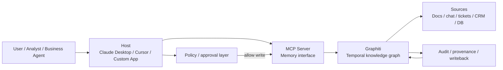
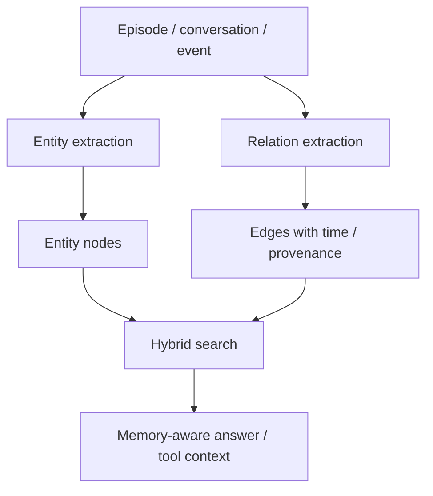
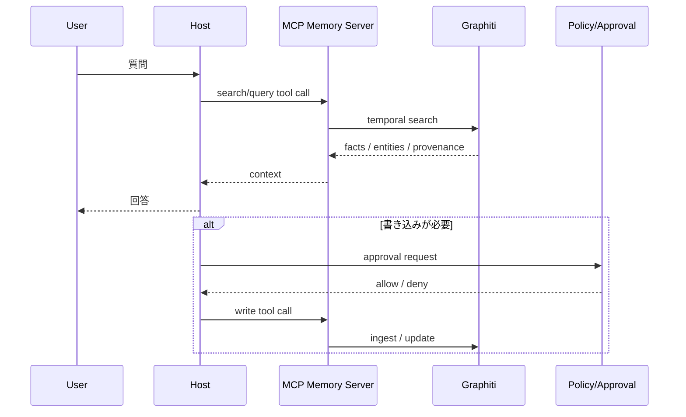
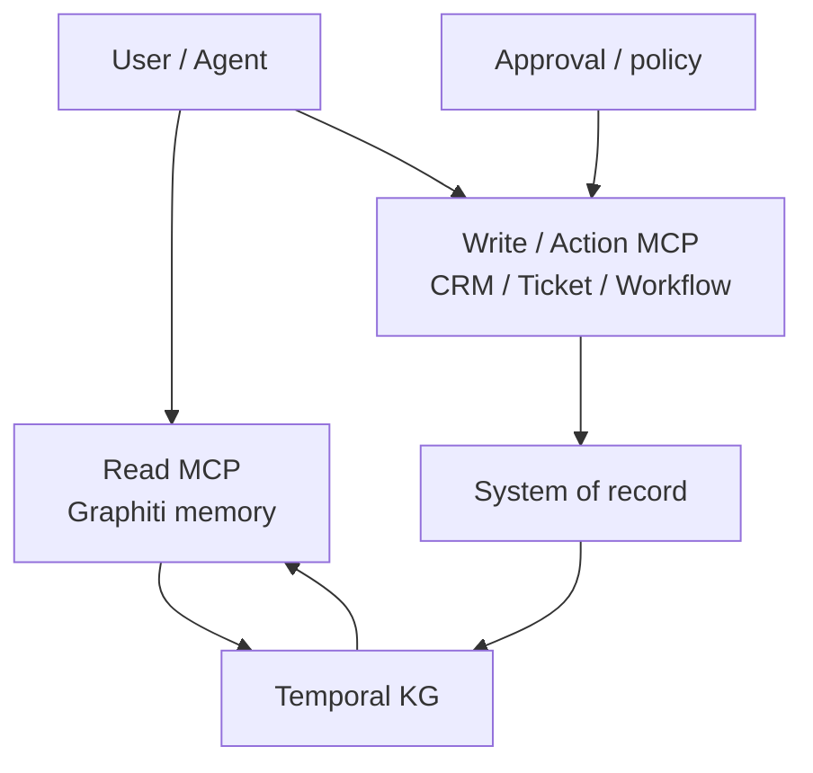
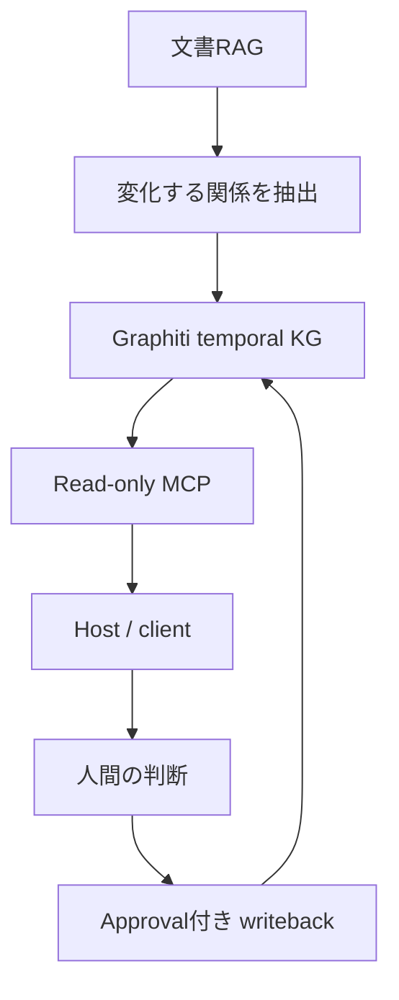

作成日: 2026-05-15
調査方式: 実務意思決定向けの製品評価 / アーキテクチャサーベイ
対象: Graphiti を中心とした temporal knowledge graph 型の長期記憶、MCP サーバとしての公開設計、個人研究・組織ナレッジ・業務エージェントへの導入判断

## 1. エグゼクティブサマリー

Graphiti と MCP を組み合わせると、AI エージェントに「会話セッションをまたいで残る記憶」と「外部クライアントから標準的に呼べる窓口」を同時に与えられる。だが、両者は役割が違う。Graphiti は記憶の内部表現であり、MCP はその記憶をどう公開するかのインターフェースである。ここを混同すると、検索はできるが権限が曖昧、書き込みはできるが監査できない、という実務上の失敗に直結する。

結論を先に言うと、2026 年時点での実務判断は次の通りである。

1. Graphiti は、履歴、関係、状態変化、根拠を扱う必要がある長期記憶に向いている。特に「誰が・いつ・何を・なぜ知っていたか」を残したい場合に価値が高い。
2. MCP は、記憶基盤を Claude Desktop / Cursor / 独自ホストなど複数クライアントへ配るための標準化レイヤーとして有効である。ただし、MCP 自体は記憶の正しさ、権限、評価、データモデルを解決しない。
3. temporal knowledge graph は、関係が変わる、状態が遷移する、出典や時点を追いたい、という問題に効く。一方で、静的な FAQ、単発の文書検索、トランザクションの正本管理には過剰である。
4. 個人研究では、Graphiti か Mem0 で十分なことが多い。組織ナレッジでは、Graphiti だけで完結させず、文書検索、構造化データ、権限、監査ログを別層に置くべきである。業務エージェントでは、記憶と実行を同じ MCP サーバにまとめない方が安全である。
5. 2026 年時点の主要候補は、Graphiti / Zep、Mem0、Letta、GraphRAG である。用途の違いは「動的な関係記憶」「汎用メモリ層」「stateful agent」「静的コーパス向けグラフ RAG」に分かれる。

出典メモ: Graphiti は Zep の知識グラフ基盤として公開されており、ドキュメントでは temporal knowledge graph、hybrid search、custom entity / edge types、MCP server を提供する。MCP は host / client / server の標準接続層であり、tools、resources、prompts を公開する仕様である。これらは [Graphiti docs](https://help.getzep.com/graphiti/graphiti/overview)、[Graphiti MCP server README](https://github.com/getzep/graphiti/blob/main/mcp_server/README.md)、[MCP specification](https://modelcontextprotocol.io/docs/getting-started/intro) に基づく。

## 2. Graphiti が解こうとしている問題

Graphiti が狙うのは、LLM の「コンテキストウィンドウ内の短期記憶」だけでは足りない場面である。会話履歴を単純に要約して詰め込む方法では、関係の変化、属性の更新、以前の発言と後の発言の矛盾、出典の時点、同じ人物や案件の複数表現をうまく扱えない。Graphiti の文脈では、これは temporal knowledge graph として扱うべき問題になる。

Graphiti は、エピソードからエンティティや関係を抽出し、時点情報を持つ知識グラフとして保存する。公式ドキュメントは、custom entity / edge types、graph namespacing、hybrid search、MCP server を提供し、Zep の context infrastructure として使われていることを示している。Zep の公開資料では、Graphiti ベースの memory graph が dynamic unstructured and structured business data を統合すること、そして bi-temporal な扱いで過去の状態と取り込み時刻を区別することが説明されている。

出典メモ: Graphiti の overview は [Graphiti overview](https://help.getzep.com/graphiti/graphiti/overview) と [Graph namespacing](https://help.getzep.com/graphiti/graphiti/graph-namespacing) を参照。Graphiti の custom entity / edge types は [Custom entity and edge types](https://help.getzep.com/graphiti/graphiti/custom-entity-and-edge-types) を参照。Zep の論文は temporal memory graph と bi-temporal model を説明している [ZEP: Using Knowledge Graphs to Power LLM Agent Memory](https://blog.getzep.com/content/files/2025/01/ZEP__USING_KNOWLEDGE_GRAPHS_TO_POWER_LLM_AGENT_MEMORY_2025011700.pdf)。

Graphiti の価値は、単なる「会話ログの保存」ではない。会話から抽出した関係を、後続の会話やツール呼び出しで再利用できる構造に変換する点にある。たとえば「この顧客は先週は導入検討中だったが、今は法務レビュー待ち」「この担当者は異動済み」「この案件は前回とは別スコープ」という差分は、文書のベクトル検索だけでは再構成しにくい。時間と関係を持つグラフに落とすことで、エージェントは「いま何が真で、いつそうなったか」を参照しやすくなる。

## 3. 従来の RAG / ベクトル DB / Knowledge Graph との違い

### 3.1 ベクトル DB

ベクトル DB は、意味的に近い文章や断片を取り出すのに強い。要件が「似た話を探す」「関連文書を集める」「自然文から再利用可能な候補を出す」であれば、最小コストで効く。しかし、ベクトル DB は通常、関係の有効期間、状態遷移、出典、否定された情報、誰がいつ更新したかを自然には保持しない。したがって、会話が長くなるほど「似ているが今は違う」「古いがよく似た文」が混ざりやすい。

出典メモ: RAG は検索された外部知識を生成に接続する方法として整理されている [Lewis et al., 2020](https://arxiv.org/abs/2005.11401)。Graphiti の hybrid search と temporal graph の組み合わせは、単純な semantic retrieval に時間・関係・根拠を足す設計であり、ここでの「ベクトル DB の限界」はその対比からの設計上の推論である。

### 3.2 従来の Knowledge Graph

従来の知識グラフは、明示的な entity / edge / property を持つため、関係を扱うのに向いている。ただし、更新頻度が高い現場では、グラフが静的なスナップショットになりやすい。履歴を別テーブルや別プロパティで持つ運用もあるが、エージェントの memory としては「いつの関係か」を問う API が弱いと再利用しにくい。

Graphiti の temporal 性はここを補う。knowledge graph に時点情報を加えることで、「関係の存在」だけでなく「関係がいつ成立したか」「いつ取り込まれたか」「後で上書きされたか」を扱える。Temporal knowledge graph の研究でも、静的グラフでは動的な進化や時間依存の関係を取りこぼすことが指摘されている。

出典メモ: temporal knowledge graph のサーベイは、静的 KG が時間変化を表現しづらいことを整理している [Temporal Knowledge Graph Reasoning](https://arxiv.org/abs/2403.04782)。Graphiti 側の bi-temporal / namespacing / custom edge types は [Graphiti docs](https://help.getzep.com/graphiti/graphiti/overview) と [custom entity and edge types](https://help.getzep.com/graphiti/graphiti/custom-entity-and-edge-types) に基づく。

### 3.3 RAG

RAG は、モデルの外にある文書を検索して回答に使う設計であり、まず第一選択肢になることが多い。文書中心の Q&A、ポリシー検索、ナレッジベース、法務・人事・社内 FAQ では、RAG が最も単純で運用しやすい。だが RAG は、検索対象が文書単位のままだと、案件、顧客、担当者、例外、承認、変更履歴をまたぐ推論が苦手である。

Graphiti は RAG を置き換えるのではなく、RAG の上に「関係のある記憶」と「時系列の記憶」を足す発想に近い。文書検索で拾った根拠を Graphiti に埋め、Graphiti からエンティティ単位の状況や履歴を引く、という二段構えが実務では安定しやすい。

出典メモ: RAG の原点は [Lewis et al., 2020](https://arxiv.org/abs/2005.11401)。Graphiti の hybrid search は、graph retrieval と semantic search を併用する設計として文書化されている [Graphiti overview](https://help.getzep.com/graphiti/graphiti/overview)。ここでの「RAG を置き換えない」は実務設計上の推論である。

## 4. MCP サーバとして記憶基盤を公開する設計

MCP は、モデルが外部ツール、リソース、プロンプトを扱うための標準プロトコルである。したがって、Graphiti を MCP サーバとして公開すると、Claude Desktop や Cursor のような MCP 対応ホストから、同じ記憶基盤を参照できる。これは実装の再利用性が高い一方、公開面が広がるということでもある。

MCP の利点は三つある。第一に、クライアント側の統合が簡単になる。第二に、memory server を tool / resource / prompt に分解して、読み取り・要約・書き込みを分けられる。第三に、エージェントごとに独自 API を作るより、プロトコル層を共通化できる。

出典メモ: MCP 仕様の入門は [Introduction](https://modelcontextprotocol.io/docs/getting-started/intro) を参照。MCP は host / client / server の三者関係で、tools / resources / prompts を公開する。Graphiti の MCP server は [Graphiti MCP server README](https://github.com/getzep/graphiti/blob/main/mcp_server/README.md) にあり、Claude Desktop / Cursor を対象にしている。

MCP 化のリスクもはっきりしている。

1. **権限の拡散**: 記憶の読み取りだけでなく、書き込みや更新ができると、クライアントやモデルの誤動作がそのまま知識汚染になる。
2. **コンテキスト漏洩**: あるユーザーの記憶を別ユーザーの会話に混ぜる事故が起きやすい。namespace や tenant boundary を最初から分ける必要がある。
3. **過剰な writeback**: モデルが思いついた断片をそのまま記録すると、ノイズと幻覚が長期記憶に残る。
4. **監査の難化**: tool call の連鎖が増えるほど、最終判断の根拠が追いにくい。
5. **プロトコル依存**: 何でも MCP でつなぐと、実際の system of record を曖昧にしたまま「動いた気になる」。

Graphiti MCP server の README は experimental と位置づけているため、現時点では「本番の唯一の正本」として使うより、「読み取り中心の memory façade」として扱う方が安全である。

出典メモ: Graphiti MCP server README は experimental な位置づけで、MCP server として Claude Desktop / Cursor に接続する案内を含む [Graphiti MCP server README](https://github.com/getzep/graphiti/blob/main/mcp_server/README.md)。MCP 認証・承認の考え方は [Authorization](https://github.com/modelcontextprotocol/modelcontextprotocol/blob/main/docs/specification/2025-03-26/basic/authorization.mdx) を参照。ここでの「読み取り中心が安全」は設計上の推論である。

## 5. Temporal knowledge graph が memory に効く場面、効かない場面

### 効く場面

temporal knowledge graph が効くのは、情報が変化し、その変化自体が重要なときである。

1. **関係が変わる**: 顧客と担当者、案件と状態、組織と役割が変わる。
2. **時点が重要**: 「いつそうだったか」が重要で、最新値だけでは足りない。
3. **出典を追いたい**: どの会話、どの文書、どのツール結果から得た記憶かを残したい。
4. **ケース管理**: 問い合わせ、障害、営業案件、採用、法務レビューのように、複数ステップの状態遷移がある。
5. **組織学習**: 過去の意思決定と結果を再利用して、次の判断を改善したい。

Graphiti の bi-temporal モデルは、これらの用途と相性がよい。単純に「見つかった情報」ではなく、「いつ観測し、いつ有効だったか」を分離できるためである。

出典メモ: Zep の公開資料は bi-temporal model を採用し、Graphiti を memory graph として使うことを説明している [ZEP paper](https://blog.getzep.com/content/files/2025/01/ZEP__USING_KNOWLEDGE_GRAPHS_TO_POWER_LLM_AGENT_MEMORY_2025011700.pdf)。ここでの効く場面の整理は、その構造からの推論である。

### 効かない場面

temporal KG が万能ではないことも重要である。

1. **静的な FAQ や規程検索**: 単純な文書検索の方が早い。
2. **短命な会話コンテキスト**: その場の数ターンだけで十分なら、長期記憶は不要である。
3. **正本が別システムにある状態**: 在庫、請求、契約、権限の正本は source of truth に残すべきで、記憶基盤に複製すべきではない。
4. **高リスクの意思決定**: 医療、法務、与信、採用の最終判断は、記憶検索だけで自動化しない方がよい。
5. **大規模コーパスの全文検索**: ドキュメント群が巨大で、関係より網羅性が重要なら、全文検索と RAG が先である。

要するに、temporal KG は「履歴を伴う意味ネットワーク」を必要とする領域で効く。逆に、単なる最新値照会や大量文書の広域検索には、グラフ化のコストが見合わないことが多い。

## 6. 実装パターン

### 6.1 個人研究

個人研究では、最小構成が最も続く。おすすめは、日誌、論文メモ、会話ログ、重要 URL を Graphiti に流し込み、検索と再利用を MCP 経由で行う形である。ここでは、記憶を「自分の思考を後で再利用する索引」と見なす。文書検索だけでは埋もれる「誰と何を決めたか」「どの仮説を棄却したか」を残す用途に向く。

Graphiti を選ぶ理由は、関係と時系列を扱えることにある。Mem0 や Letta でもよいが、Graphiti はエンティティと edge の時間的変化を前面に出しているため、研究メモや探索ログに向いている。

### 6.2 組織ナレッジ

組織ナレッジでは、個人記憶より設計が難しい。理由は、権限、部門境界、保管期間、削除要求、監査、ソースシステムの分散があるからである。したがって、Graphiti は単独の知識ハブではなく、次の 4 層の一部として使うべきである。

1. 文書検索層
2. 構造化データ層
3. temporal KG 層
4. 政策・監査・権限層

実務上は、Graphiti に会話、メール要約、会議メモ、案件履歴を入れ、正本の契約、売上、権限、在庫は既存 DB に残すのが妥当である。組織ナレッジの目的は「知識を一元化すること」ではなく、「再利用可能な関係を安全に配ること」である。

### 6.3 業務エージェント

業務エージェントでは、memory と action を分けることが重要である。memory MCP サーバは read-heavy にし、write は承認フロー付きで限定する。実行系の MCP サーバは別にして、CRM、チケット、ワークフロー、コード変更などの操作を担わせる。こうすると、記憶の汚染と業務操作の暴発を切り分けられる。

このパターンでは、Graphiti は「思い出すための層」であり、業務システムは「確定するための層」である。両者を分けると、間違った記憶が業務データを汚しにくい。

## 7. 2026 年時点の主要 OSS / 商用サービス

| 候補 | 位置づけ | 強み | 注意点 | 実務上の成熟度 |
| --- | --- | --- | --- | --- |
| Graphiti | OSS temporal knowledge graph engine | 時系列、関係、根拠、ハイブリッド検索、MCP server | まだ memory 基盤の専用設計が必要。Graphiti MCP server は experimental | 中 |
| Zep | 商用 context / memory platform | Graphiti ベースの managed 提供、組織向け導線、運用を外出ししやすい | ベンダー依存とデータ所在を確認 | 中〜高 |
| Mem0 | OSS / library / platform | 汎用 memory layer、自己ホストとクラウドの両方、個人から業務まで広い | グラフの深い意味論は設計で補う必要 | 高 |
| Letta | stateful agent platform | agent の永続状態、memory blocks、archival memory を前面に出す | 何をメモリに入れるかの運用設計が要る | 中〜高 |
| GraphRAG | 静的コーパス向け graph RAG | 文書群の関係抽出、探索、要約 | 長期記憶や writeback は主目的ではない | 中 |

出典メモ: Graphiti / Zep は [Graphiti docs](https://help.getzep.com/graphiti/graphiti/overview) と [Zep overview](https://help.getzep.com/overview) を参照。Mem0 は公式 GitHub が memory layer と cloud / self-hosted の導線を示している [mem0 GitHub](https://github.com/mem0ai/mem0)。Letta は公式 docs / GitHub が stateful agent と memory blocks / archival memory を説明している [Letta docs](https://docs.letta.com/) と [Letta GitHub](https://github.com/letta-ai/letta)。GraphRAG は Microsoft の公式リポジトリを参照する [GraphRAG GitHub](https://github.com/microsoft/graphrag)。成熟度は公開情報からの推定である。

### 補足

Mem0 は、記憶を一つのライブラリ/プラットフォームとして抽象化し、自己ホストやクラウドを選べる点が強い。Letta は、エージェント自体を stateful に扱い、memory blocks と archival memory を分ける発想が強い。Graphiti は、関係と時間を強く意識した temporal graph に寄っている。GraphRAG は、主に静的な文書コーパスの探索で使う方が筋がよい。

これらは競合というより、記憶の階層が違う。Graphiti は「関係と変化」を記録する。Mem0 は「汎用メモリ」を広く提供する。Letta は「エージェント状態」を継続させる。GraphRAG は「コーパスを理解可能にする」。

## 8. 導入すべきケース / まだ避けるべきケース

### 導入すべきケース

1. 会話をまたいで、人物、案件、関係、状態が変化する。
2. 過去の発言や観測の時点が重要である。
3. どの根拠からその記憶が生まれたかを追いたい。
4. 個人ではなく、チームや組織のナレッジを再利用したい。
5. memory を複数クライアントに配りたいが、API は標準化したい。

### まだ避けるべきケース

1. 単純な FAQ や文書検索だけで済む。
2. 正本が既存業務システムにあり、記憶基盤に複製したくない。
3. 権限、監査、削除要求、保管期間の運用が未整備である。
4. 幻覚や誤抽出を評価する仕組みがない。
5. 書き込み可能な MCP サーバを、いきなり業務自動化の中核に置こうとしている。

実務上の最短ルートは、まず read-only の memory server として導入し、後から writeback を限定的に開くことである。最初から「記憶も実行も全部 MCP」でまとめると、設計責務が混ざる。

## 9. 推奨方針

Graphiti と MCP を組み合わせるなら、次の順で進めるのがよい。

1. 文書 RAG を先に整える。
2. 変化する関係だけを Graphiti に入れる。
3. MCP は read-only から始める。
4. writeback は approval 付きにする。
5. 記憶と実行の MCP サーバを分ける。
6. 監査ログ、評価セット、削除フローを先に作る。

この順序にすると、Graphiti を「長期記憶の本体」ではなく、「時間を持つ関係インデックス」として安全に使える。MCP はその窓口にすぎないので、公開のしやすさを、設計の甘さの言い訳にしてはいけない。

## 参考情報

- [Graphiti Overview](https://help.getzep.com/graphiti/graphiti/overview)
- [Graphiti Custom Entity and Edge Types](https://help.getzep.com/graphiti/graphiti/custom-entity-and-edge-types)
- [Graphiti Graph Namespacing](https://help.getzep.com/graphiti/graphiti/graph-namespacing)
- [Graphiti MCP server README](https://github.com/getzep/graphiti/blob/main/mcp_server/README.md)
- [Zep Overview](https://help.getzep.com/overview)
- [ZEP: Using Knowledge Graphs to Power LLM Agent Memory](https://blog.getzep.com/content/files/2025/01/ZEP__USING_KNOWLEDGE_GRAPHS_TO_POWER_LLM_AGENT_MEMORY_2025011700.pdf)
- [MCP Introduction](https://modelcontextprotocol.io/docs/getting-started/intro)
- [MCP Authorization](https://github.com/modelcontextprotocol/modelcontextprotocol/blob/main/docs/specification/2025-03-26/basic/authorization.mdx)
- [Mem0 GitHub](https://github.com/mem0ai/mem0)
- [Letta Docs](https://docs.letta.com/)
- [Letta GitHub](https://github.com/letta-ai/letta)
- [GraphRAG GitHub](https://github.com/microsoft/graphrag)
- [Lewis et al., 2020 RAG](https://arxiv.org/abs/2005.11401)
- [Temporal Knowledge Graph Reasoning](https://arxiv.org/abs/2403.04782)
