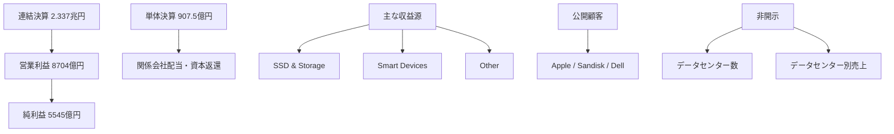

# キオクシア純利益急増の実像

作成日: 2026-05-17
調査方式: 一次情報ベースの企業・財務・市場レビュー
対象: キオクシアホールディングス、2026年3月期決算、NANDフラッシュ、SSD、AIデータセンター向けストレージ

## 1. エグゼクティブサマリー

キオクシアの2026年3月期通期は、売上収益2兆3377億円、営業利益8704億円、親会社の所有者に帰属する利益5545億円だった。前年から大きく伸びたのは事実だが、連結ベースでは「48倍」ではなく約2倍である。

出典メモ: 2026年3月期通期の連結業績は [2026年3月期 決算短信](https://ssl4.eir-parts.net/doc/285A/tdnet/2815552/00.pdf) の概要部分に基づく。

「異常さ」の正体は、持株会社単体の数字を混ぜるとさらに大きく見える点にある。キオクシアホールディングス単体の当期利益は907.5億円で、前年の5.0億円から跳ね上がったが、これは主に関係会社受取配当金と資本返還によるものだ。

出典メモ: 単体当期利益と増加要因は [2026年3月期 決算短信](https://ssl4.eir-parts.net/doc/285A/tdnet/2815552/00.pdf) の個別財務諸表注記に記載されている。

事業の中身はMemory単一セグメントで、売上はSSD & Storage、Smart Devices、Otherに分かれる。主要顧客として Apple Group、Sandisk Group、Dell Group が開示されている一方、データセンター数やデータセンター別売上は公開されていない。

出典メモ: 単一セグメント、用途別売上、主要顧客は [Annual Securities Report FY2024](https://www.kioxia-holdings.com/content/dam/kioxia-hd/en-jp/ir/library/securities/asset/Annual-Securities-Report-FY2024-EN.pdf) p.19-22付近に記載されている。

## 2. 何が伸びたのか

会社の説明では、平均販売価格の上昇と販売数量の増加が業績改善の主因である。AIサーバー向け需要、データセンター向け需要、スマートデバイス需要の正常化が同時に効いたと読むのが自然である。

出典メモ: 「平均販売価格の上昇、販売数量の増加」は [2026年3月期 決算短信](https://ssl4.eir-parts.net/doc/285A/tdnet/2815552/00.pdf) の業績概況にある会社説明。

四半期ベースでも2026年3月期Q4は、売上収益1兆29億円、営業利益5968億円、四半期利益4077億円と非常に強い。これが「ぶっ飛んで見える」印象を作っている。

出典メモ: Q4単体の数値は [2026年3月期 決算短信](https://ssl4.eir-parts.net/doc/285A/tdnet/2815552/00.pdf) p.12-14付近に記載されている。

## 3. どこまでがNANDか

売上の大半はNANDフラッシュとそれを使ったSSD、モバイル向けメモリ関連製品である。ただし、会社は「NANDそのもののチップ売上」だけを切り出してはおらず、SandiskとのJV関連やリテール向けを含むため、外から見える売上は単純な半導体チップ売上ではない。

出典メモ: 用途別売上の区分と Other の位置づけは [Annual Securities Report FY2024](https://www.kioxia-holdings.com/content/dam/kioxia-hd/en-jp/ir/library/securities/asset/Annual-Securities-Report-FY2024-EN.pdf) p.19-22付近に基づく。

## 4. どこが非開示か

公開資料だけでは、主要データセンターが何社あるのか、1データセンター当たりいくら売っているのか、どの案件がどの顧客に紐づくのかは分からない。ここを断定すると推測が混ざるので、実務では「顧客集中」「用途別売上」「ASP」「bit出荷」の4点で見るのが安全である。

出典メモ: 顧客名の開示範囲は [Annual Securities Report FY2024](https://www.kioxia-holdings.com/content/dam/kioxia-hd/en-jp/ir/library/securities/asset/Annual-Securities-Report-FY2024-EN.pdf) に限られ、データセンター別売上の開示はない。

## 5. 実務的な見方

キオクシアは、AIの恩恵を受けるNAND企業ではあるが、GPUやHBMのような「AI純度の高い銘柄」ではない。むしろ、AI時代のデータ保存・検索・推論周辺・HDD置換を支えるストレージ企業として見る方が正確である。

詳細版は `category/semiconductor-memory/kioxia/report.md` に保存している。
