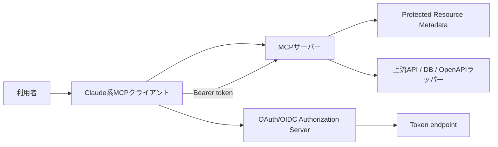
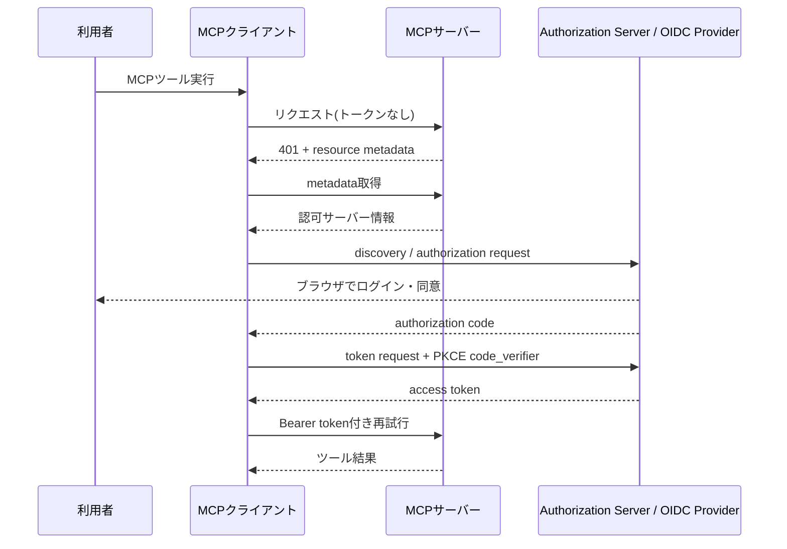
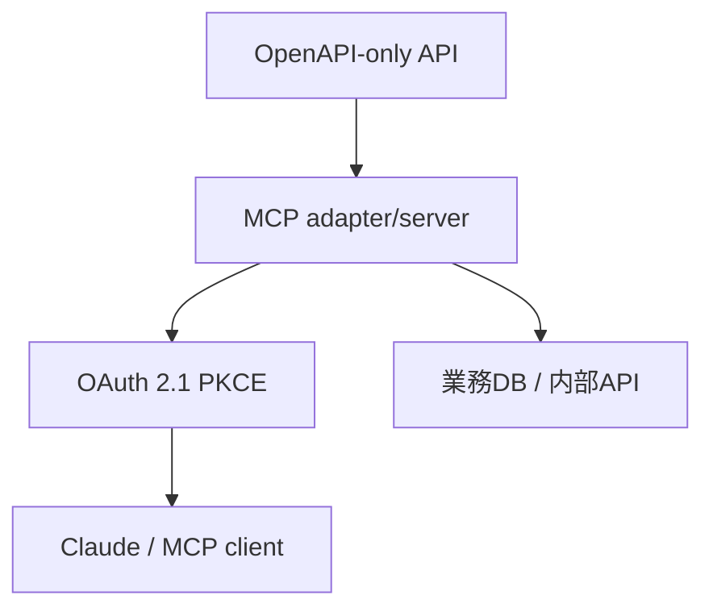
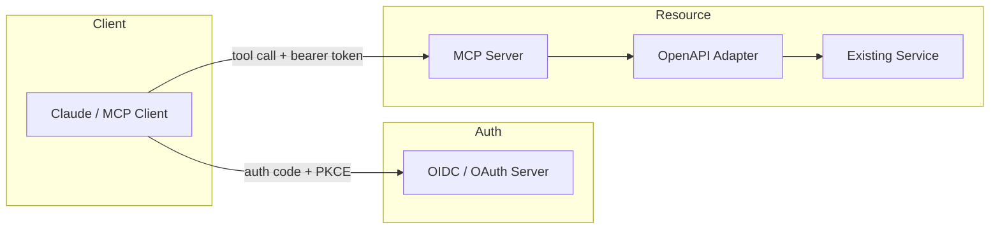

# OAuth 2.1 PKCEフローとMCP認証認可の実務ガイド

作成日: 2026-05-15
調査方式: 仕様調査と製品ドキュメントレビュー
対象: MCPサーバー、OIDCプロバイダー、OAuthクライアント、Claude系クライアント、OpenAPI-onlyな既存APIをMCP化する設計

## 1. エグゼクティブサマリー

MCPサーバーの認証認可は、実務上は「MCPサーバーが保護リソースとして振る舞い、OAuth 2.1 の Authorization Code + PKCE でトークンを取得し、その Bearer token で MCP ツール呼び出しを許可する」流れとして理解すると分かりやすい。MCPの最新公開仕様では、HTTP系のMCPサーバーは Protected Resource Metadata を公開し、クライアントはそこから Authorization Server Metadata と OIDC Discovery をたどって認可サーバーを特定する前提になっている。OAuth 2.1 は2026年5月時点でも Internet-Draft で、Authorization Code flow と PKCE を前提にする整理が主流である。

出典メモ: [MCP Authorization](https://modelcontextprotocol.io/specification/2025-11-25/basic/authorization)、[draft-ietf-oauth-v2-1](https://datatracker.ietf.org/doc/draft-ietf-oauth-v2-1/)、[RFC 7636](https://www.rfc-editor.org/rfc/rfc7636)、[OpenID Connect Discovery 1.0](https://openid.net/specs/openid-connect-discovery-1_0.html)、[RFC 8414](https://www.rfc-editor.org/rfc/rfc8414) を参照。

Claude系の remote connector では、ユーザーは接続先URLを追加し、必要なら OAuth の client ID / secret を渡して接続する。Anthropic の公式案内では、remote MCP は Anthropic 側のクラウド経由で扱われ、サーバー側が DCR を持たない場合でも custom client ID / secret を設定できる。

出典メモ: [Anthropic: Getting started with custom integrations using remote MCP](https://support.anthropic.com/en/articles/11175166-getting-started-with-custom-integrations-using-remote-mcp) と Anthropic の connector 設定案内を参照。

実務上の要点は次のとおりである。

1. MCPサーバーは「業務API」ではなく「保護リソース」であり、401 応答と resource metadata で認可サーバーを案内する。
2. OIDCプロバイダーは、Authorization Server Metadata か OIDC Discovery を通じて `authorization_endpoint` と `token_endpoint` などを公開する。
3. OAuthクライアントは、ブラウザで認可コードを受け取り、PKCE の `code_verifier` でトークン交換する。
4. Claudeは、remote connector の形でこのクライアント役を担う。設定上は「接続先URL」「クライアントID/Secret」「必要なスコープ」が肝になる。
5. OpenAPIだけを持つ既存サービスは、そのままでは MCP クライアントの接続先にはならない。MCPサーバーで OpenAPI をラップして、OAuth 2.1 PKCE をそこで受けるのが実務的である。これは MCP が外部システムへの接続標準であり、クライアントが MCP サーバーに接続するという仕様からの推定である。

出典メモ: [MCP Authorization](https://modelcontextprotocol.io/specification/2025-11-25/basic/authorization) を参照。OpenAPI-only の扱いはこの仕様を踏まえた推定である。

## 2. まず押さえるべき用語

MCP、OIDC、OAuthは役割が異なる。ここを混同すると設定が崩れる。

| 役割              | 何をするか                                                                   | 典型的な実体                               |
| ----------------- | ---------------------------------------------------------------------------- | ------------------------------------------ |
| MCPサーバー       | ツール・リソース・プロンプトを公開する。HTTPでは保護リソースとして振る舞う。 | 自作MCPサーバー、業務システムのMCPラッパー |
| OAuth認可サーバー | 認可コード発行、トークン発行、クライアント認証を担う。                       | Auth0、Keycloak、Entra ID、Okta            |
| OIDCプロバイダー  | OAuthにIDトークンやDiscoveryを加える。                                       | 同上。OIDC Discoveryを公開することが多い   |
| OAuthクライアント | ブラウザ認可を開始し、コードをトークンに交換する。                           | Claude系クライアント、独自MCPクライアント  |
| リソースサーバー  | アクセストークンを検証してAPIを許可する。                                    | MCPサーバー、上流API、API Gateway          |

MCP仕様の認可章では、HTTPサーバーは Protected Resource Metadata を公開し、クライアントはそこから認可サーバーのメタデータを見つけ、OAuth 2.1 の規則で認可を進める。OAuth 2.1 自体は draft だが、Authorization Code と PKCE を中心に整理され、Implicit flow は採らない方向である。

出典メモ: [MCP Authorization](https://modelcontextprotocol.io/specification/2025-11-25/basic/authorization) と [draft-ietf-oauth-v2-1](https://datatracker.ietf.org/doc/draft-ietf-oauth-v2-1/) を参照。

## 3. 通信の流れ

基本フローは Authorization Code + PKCE である。MCPサーバーが最初に 401 を返し、クライアントが resource metadata を見て認可サーバーを見つけ、ブラウザで認可し、コードを token endpoint に渡してトークンを得て、以後は Bearer token を付けて MCP 呼び出しを行う。PKCE は、ブラウザ経由の認可コードを奪われてもトークン交換を阻止するための仕組みで、public client を主対象に設計された。

出典メモ: [RFC 7636](https://www.rfc-editor.org/rfc/rfc7636) と [draft-ietf-oauth-v2-1](https://datatracker.ietf.org/doc/draft-ietf-oauth-v2-1/) を参照。

### 3.1 最初の応答

MCPサーバーは、保護されたエンドポイントに対して無認証アクセスが来たとき、単に 403 で終わるのではなく、認可サーバー情報を含む resource metadata を返す。MCP仕様では、このメタデータを通じてクライアントが次の発見ステップに進む。

出典メモ: [MCP Authorization](https://modelcontextprotocol.io/specification/2025-11-25/basic/authorization) を参照。

### 3.2 認可サーバーの発見

クライアントは、MCPサーバーから得た情報をもとに、まず Authorization Server Metadata を見る。OIDCプロバイダーがあるなら OIDC Discovery も使える。どちらも、authorization endpoint、token endpoint、issuer などの情報をクライアントに伝える。

出典メモ: [RFC 8414](https://www.rfc-editor.org/rfc/rfc8414) と [OpenID Connect Discovery 1.0](https://openid.net/specs/openid-connect-discovery-1_0.html) を参照。

### 3.3 PKCE付き認可コード

クライアントは、`code_verifier` と `code_challenge` を用意して認可リクエストを送る。ユーザーはIdP上で認証・同意し、認可コードを受ける。クライアントは token endpoint にコードと `code_verifier` を送り、アクセストークンを取得する。OAuth 2.1 の整理では、この流れが標準で、PKCEは必須前提として扱うのが実務的である。

出典メモ: [RFC 7636](https://www.rfc-editor.org/rfc/rfc7636) と [draft-ietf-oauth-v2-1](https://datatracker.ietf.org/doc/draft-ietf-oauth-v2-1/) を参照。

### 3.4 MCPツール呼び出し

以後のMCP呼び出しは、Bearer token を付けた通常のHTTPリクエストになる。MCPサーバーはトークンの署名、issuer、audience、scope を検証し、許可されたツールだけを返す。トークンの中身をMCPサーバーがJWT検証で直接見てもよいし、introspection を併用してもよいが、どちらにせよ「トークンを持っているだけ」で全権限を与えない設計が重要である。これは MCP の仕様要件というより、OAuthの実務設計としての推奨である。

出典メモ: [MCP Authorization](https://modelcontextprotocol.io/specification/2025-11-25/basic/authorization) と [RFC 6749](https://www.rfc-editor.org/rfc/rfc6749) を参照。

## 4. どのコンポーネントに何を設定するか

### 4.1 MCPサーバー

MCPサーバーは、まず「何を保護リソースとして公開するか」を決める。実務では、MCPサーバーがそのまま業務システムに直結するのではなく、業務APIの前に置かれる認可境界になることが多い。

最低限必要なのは次の項目である。

- Protected Resource Metadata の公開
- 認可サーバー情報の提示
- 受け入れる scope の定義
- access token の検証
- 401 / 403 の適切な返し分け

MCP仕様は、HTTPベースのサーバーでこの認可メタデータを使うことを前提にしている。つまり、MCPサーバー自身が「OAuthを知らないツールサーバー」ではなく、認可を理解するAPI境界である必要がある。

出典メモ: [MCP Authorization](https://modelcontextprotocol.io/specification/2025-11-25/basic/authorization) を参照。

### 4.2 OIDCプロバイダー / OAuth認可サーバー

認可サーバー側では、少なくとも次を設定する。

- Authorization endpoint
- Token endpoint
- Issuer
- Client registration 方針
- Redirect URI 許可
- Scopes
- 必要なら DCR か client metadata document

MCP仕様は、クライアントが Authorization Server Metadata と OIDC Discovery をたどれることを前提にしている。したがって、IdPは少なくとも Discovery を正しく返せる必要がある。

出典メモ: [RFC 8414](https://www.rfc-editor.org/rfc/rfc8414) と [OpenID Connect Discovery 1.0](https://openid.net/specs/openid-connect-discovery-1_0.html) を参照。

### 4.3 OAuthクライアント

OAuthクライアントは、MCPクライアントの実装そのものか、その背後にある認可ブローカーである。設定すべきものは次のとおり。

- client_id
- 必要なら client_secret
- redirect URI
- 使う scopes
- PKCE support
- refresh token の扱い

OAuth 2.1 では PKCE を前提にし、public client でも安全に code flow を使う方向に整理されている。古い implicit flow を採る理由はない。

出典メモ: [draft-ietf-oauth-v2-1](https://datatracker.ietf.org/doc/draft-ietf-oauth-v2-1/) と [RFC 7636](https://www.rfc-editor.org/rfc/rfc7636) を参照。

### 4.4 Claude系クライアント

Anthropic の公式案内では、remote MCP connector に接続先を追加し、必要に応じて custom client ID / secret を設定できる。つまり Claude 側は、少なくとも remote connector の文脈では OAuth クライアントとして振る舞う。OAuth設定の中心は「このMCPサーバーに対してどの client registration を使うか」である。

出典メモ: [Anthropic: Getting started with custom integrations using remote MCP](https://support.anthropic.com/en/articles/11175166-getting-started-with-custom-integrations-using-remote-mcp) と Anthropic の connector 設定案内を参照。

実務での設定順は次の通りである。

1. MCPサーバーのURLを登録する。
2. サーバーが返す resource metadata から IdP を確認する。
3. Claude 側に client_id を登録する。
4. 必要なら client_secret を登録する。
5. スコープを合意する。
6. ブラウザでログインして同意する。
7. token が保存されたら MCP ツールを実行する。

### 4.5 OpenAPI-onlyな既存サービス

ここは少し注意が必要である。OpenAPI は API の記述形式であって、MCP ではない。したがって、OpenAPIだけを持つ既存サービスは、通常そのままでは Claude の MCP connector の接続先にはならない。実務上は、MCPサーバーを一枚かませて OpenAPI の各 operation を MCP tool にマッピングし、そのMCPサーバーが OAuth 2.1 PKCE を受ける構成にする。これは MCP が外部システムへの接続標準であり、クライアントが MCP サーバーに接続するという仕様からの推定である。

出典メモ: [MCP Authorization](https://modelcontextprotocol.io/specification/2025-11-25/basic/authorization) を参照。OpenAPI-only の扱いはこの仕様を踏まえた推定である。

この構成にすると、OpenAPIの operation をそのままツールとして露出できる。逆に言うと、OpenAPIのまま認可だけを足しても、MCPクライアントが理解するのはMCPの tool schema であるため、その変換層が必要である。

## 5. 初学者向けの最短理解

「誰が誰を認証しているのか」を一言でいうと、次のようになる。

- 利用者は、Claude上で「このMCPツールを使いたい」と指示する。
- Claudeは、MCPサーバーにアクセスする。
- MCPサーバーは、「その利用者が使ってよいかは OAuth で確認して」と返す。
- Claudeは、IdPの画面を開いて利用者にログインしてもらう。
- IdPは、Claudeに「この人はこのスコープで使ってよい」とトークンを渡す。
- Claudeは、そのトークンを持ってMCPサーバーに再アクセスする。
- MCPサーバーは、トークンが正しければツール結果を返す。

要するに、MCPサーバーは「入口」、OIDCプロバイダーは「本人確認と同意」、OAuthクライアントは「代理で取りに行く人」である。

## 6. 実務でよくある落とし穴

### 6.1 401 を返さずに曖昧なエラーで終わる

認可が必要なのに 500 や汎用 403 で返すと、クライアントが何をすべきか分からない。MCPでは resource metadata を返す意味があるので、認可が必要なことを機械可読に伝える方がよい。

出典メモ: [MCP Authorization](https://modelcontextprotocol.io/specification/2025-11-25/basic/authorization) を参照。

### 6.2 OIDC Discovery しか実装していない

MCP仕様は Authorization Server Metadata と OIDC Discovery の両方を前提に読めるようにしておくのが安全である。IdPの都合で片方しか出さないと、クライアント互換性が落ちる。

出典メモ: [RFC 8414](https://www.rfc-editor.org/rfc/rfc8414) と [OpenID Connect Discovery 1.0](https://openid.net/specs/openid-connect-discovery-1_0.html) を参照。

### 6.3 PKCEを省略する

PKCEなしの認可コードは、今の実務では避けるべきである。OAuth 2.1 の方向性は PKCE 必須化であり、public client でも code flow を安全に使うための前提になっている。

出典メモ: [draft-ietf-oauth-v2-1](https://datatracker.ietf.org/doc/draft-ietf-oauth-v2-1/) と [RFC 7636](https://www.rfc-editor.org/rfc/rfc7636) を参照。

### 6.4 スコープ設計が粗すぎる

`read` と `write` だけでは、MCPツールの実体に対して過不足が出やすい。`invoice:read`、`incident:close`、`customer:search` のように、業務対象と行為に合わせて絞る方がよい。これは仕様の強制ではなく、最小権限の実務原則である。

### 6.5 OpenAPIをそのままMCPだと思う

OpenAPIは API 記述、MCPはツール接続プロトコルである。役割が違うので、OpenAPIしかない既存システムは MCP adapter を挟む前提で設計する必要がある。これは仕様の読み替えに基づく推定である。

出典メモ: [MCP Authorization](https://modelcontextprotocol.io/specification/2025-11-25/basic/authorization) を参照。

## 7. 推奨構成

最も扱いやすい構成は次である。

1. MCPサーバーを最前面に置く。
2. MCPサーバーは Protected Resource Metadata を公開する。
3. IdPは OIDC Discovery を返す。
4. OAuthクライアントは Authorization Code + PKCE を使う。
5. Claude系クライアントでは remote connector で接続し、必要なら client ID / secret を設定する。
6. 既存のOpenAPIサービスは MCP adapter で包む。

この構成なら、認可の責務が分離しやすく、Claude 以外の MCP クライアントにも再利用しやすい。

## 8. 結論

MCPのOAuth 2.1 PKCEフローは、細かい設定項目を覚えるより、役割を分けて考える方が早い。MCPサーバーは保護リソース、OIDCプロバイダーは認可の発行元、OAuthクライアントはブラウザ認可とトークン交換の実行者である。Claude系クライアントは remote connector でこのクライアント役を担える。OpenAPI-onlyな既存APIは、MCP adapter を挟まないとそのままでは接続しにくい。実務では、Authorization Code + PKCE、細粒度 scope、明示的な resource metadata、そしてMCP adapter の導入が最小構成になる。

出典メモ: [MCP Authorization](https://modelcontextprotocol.io/specification/2025-11-25/basic/authorization)、[draft-ietf-oauth-v2-1](https://datatracker.ietf.org/doc/draft-ietf-oauth-v2-1/)、[RFC 7636](https://www.rfc-editor.org/rfc/rfc7636)、[Anthropic remote MCP](https://support.anthropic.com/en/articles/11175166-getting-started-with-custom-integrations-using-remote-mcp) を参照。

## 参考情報

- [Model Context Protocol - Authorization](https://modelcontextprotocol.io/specification/2025-11-25/basic/authorization)
- [draft-ietf-oauth-v2-1](https://datatracker.ietf.org/doc/draft-ietf-oauth-v2-1/)
- [RFC 7636: Proof Key for Code Exchange by OAuth Public Clients](https://www.rfc-editor.org/rfc/rfc7636)
- [RFC 6749: The OAuth 2.0 Authorization Framework](https://www.rfc-editor.org/rfc/rfc6749)
- [RFC 8414: OAuth 2.0 Authorization Server Metadata](https://www.rfc-editor.org/rfc/rfc8414)
- [OpenID Connect Discovery 1.0](https://openid.net/specs/openid-connect-discovery-1_0.html)
- [Anthropic: Getting started with custom integrations using remote MCP](https://support.anthropic.com/en/articles/11175166-getting-started-with-custom-integrations-using-remote-mcp)
