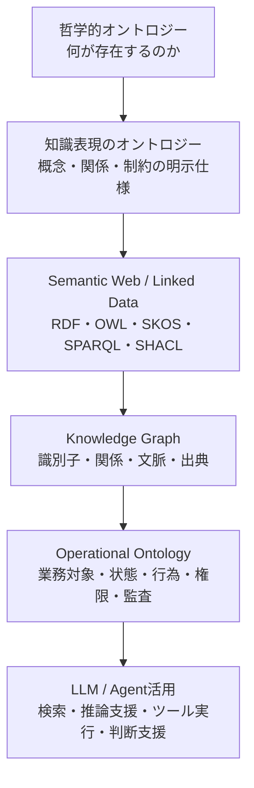
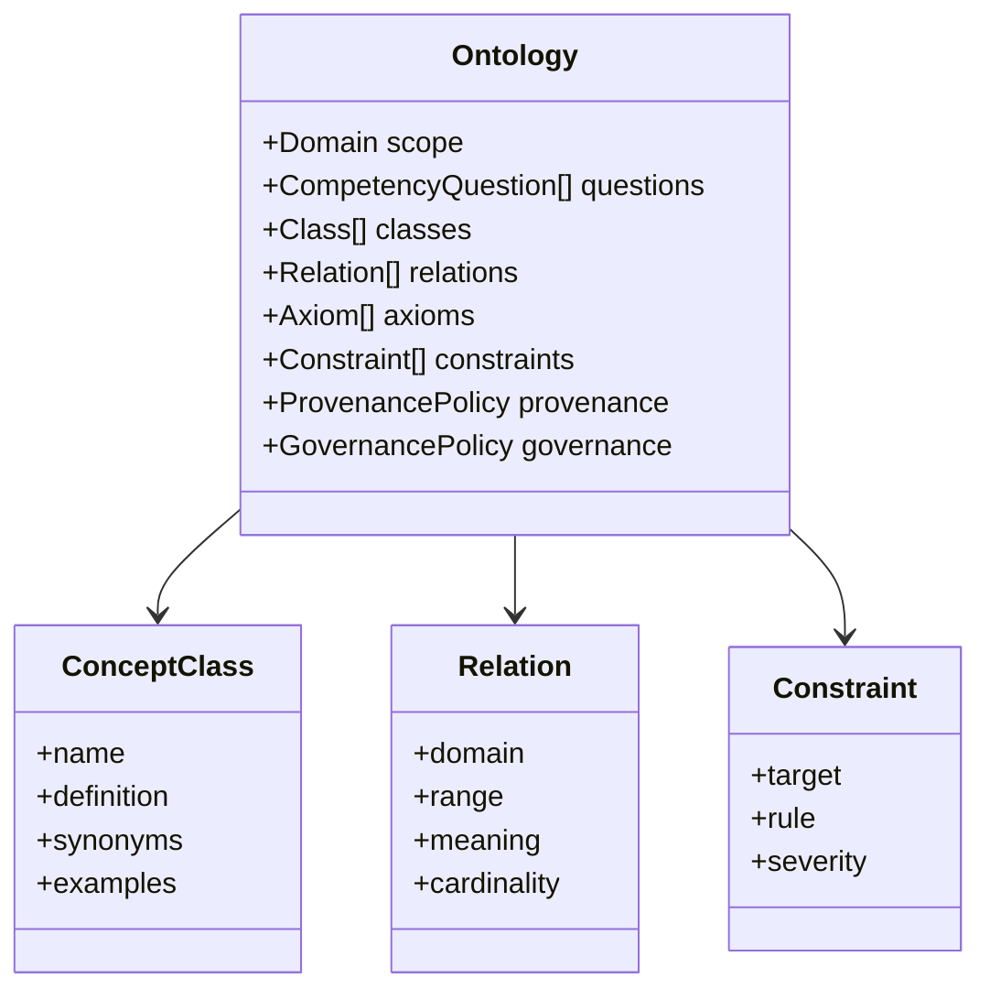
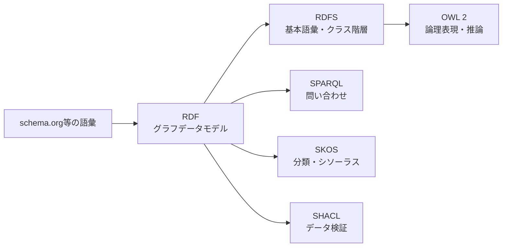
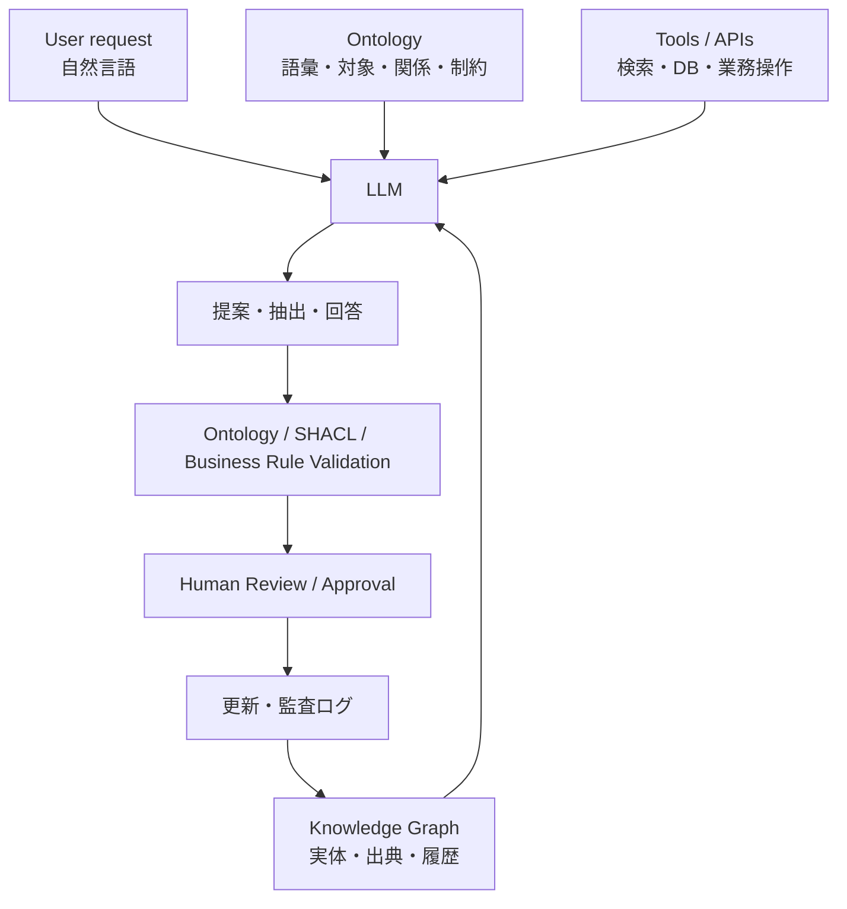
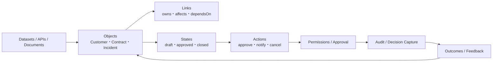
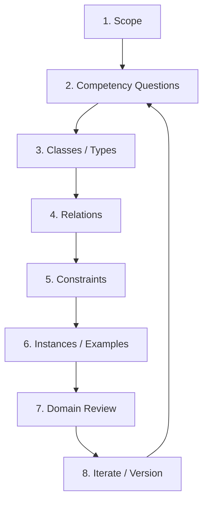
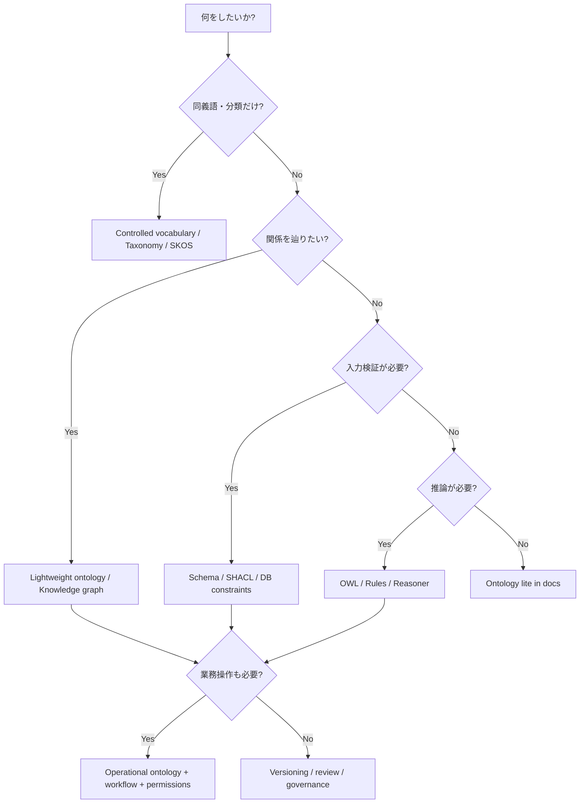
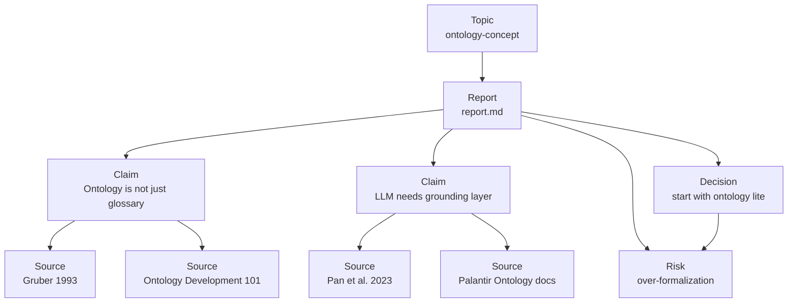

# オントロジー概念の基礎と実務活用

作成日: 2026-05-09
調査方式: ナラティブレビュー
対象: 哲学的オントロジー、知識表現、Semantic Web標準、知識グラフ、業務AIにおける operational ontology


## 1. エグゼクティブサマリー

オントロジーは、文脈によって意味が変わる。哲学では「何が存在するのか」を問う分野であり、情報科学では「ある領域に存在する概念、関係、制約を明示的に定義したもの」を指す。業務AIの文脈では、さらに一歩進んで、顧客、案件、契約、障害、承認、アクション、権限、監査ログを同じ業務世界モデルに載せる設計思想として使われる。

本レポートの結論は以下である。

1. オントロジーは単なる用語集ではない。概念の分類、関係、属性、制約、推論可能性、同一性、出典、更新ルールを含む。
2. taxonomy、controlled vocabulary、schema、data model、knowledge graph はオントロジーと重なるが同一ではない。オントロジーは「何をどういうものとして扱うか」を明示する意味モデルである。
3. RDF/OWL はオントロジーをWeb上で機械可読に表す代表的な標準だが、すべての実務でOWLが必要になるわけではない。分類体系ならSKOS、検証ならSHACL、厳密な推論ならOWL、業務実行ならアプリケーション側の権限・ワークフロー設計が必要になる。
4. LLM時代のオントロジーは、「LLMに意味理解を注入する魔法」ではない。LLMが参照・検索・生成・ツール実行するときの語彙、対象、関係、制約、証跡を揃える情報設計である。
5. 実務では巨大な全社オントロジーから始めるべきではない。最初は特定ユースケースに対して、competency questions、主要オブジェクト、関係、制約、出典、更新責任を定義する ontology lite から始めるのが現実的である。



## 2. まず何が紛らわしいのか

「オントロジー」という言葉が分かりにくい理由は、少なくとも三つの伝統が同じ語を使っているからである。

第一に、哲学の ontology は存在論である。これは「何が存在するのか」「存在者をどのように分類できるのか」「性質、関係、出来事、時間、部分全体、可能性はどのような存在様式を持つのか」を問う。情報システム設計のための用語ではなく、存在や実在のカテゴリーを扱う基礎哲学である。

出典メモ: Stanford Encyclopedia of Philosophy の [Metaphysics](https://plato.stanford.edu/entries/metaphysics/) は、アリストテレスの第一哲学から現代形而上学までの射程を整理している。ここでの ontology は、情報システムのスキーマではなく、存在者一般を問う哲学的問題として扱われる。

第二に、AI・知識表現の ontology は、ある領域における概念化を明示的に仕様化したものである。Gruber (1993) の有名な定義は、オントロジーを「conceptualization の specification」と捉える。ここで重要なのは、対象世界そのものではなく、人間またはシステムがその領域をどう概念化するかを明示する点である。

出典メモ: Gruber の [A Translation Approach to Portable Ontology Specifications](https://doi.org/10.1006/knac.1993.1008) および著者ページの [definition note](https://tomgruber.org/writing/ontolingua-kaj-1993/) は、オントロジーを「概念化の仕様」として位置づける。Noy and McGuinness の [Ontology Development 101](https://protege.stanford.edu/publications/ontology_development/ontology101-noy-mcguinness.html) も、この定義を実務的な開発手順に展開している。

第三に、近年の業務AI・データ基盤では、ontology が semantic layer、canonical data model、business object layer、digital twin に近い意味で使われることがある。Palantir Foundry の Ontology は、RDF/OWL仕様そのものではなく、データ、オブジェクト、関係、アクション、関数、動的セキュリティを統合する operational layer として説明されている。

出典メモ: Palantir の [Ontology overview](https://www.palantir.com/docs/foundry/ontology/overview) は、Ontology を組織の operational layer と説明し、semantic elements と kinetic elements を含むと述べる。これはW3C OWLのような標準言語の説明ではなく、業務プラットフォーム上の実行可能な意味モデルである。

## 3. オントロジーの短い研究史

情報科学におけるオントロジーは、哲学から借りた語を、AIの知識共有と再利用の問題へ移植したところから発展した。1980年代から1990年代の知識ベースシステムでは、専門家の知識をルールやフレームで表現する試みが進んだが、個別システムに閉じた知識は再利用しにくかった。オントロジーは、領域知識を移植可能で共有可能な仕様として定義するための手段になった。

Gruber (1993) の定義は、オントロジーを「特定システムの内部実装」ではなく「知識共有のための明示仕様」として扱った。Guarino (1998) 以降の formal ontology は、概念名の一覧では足りないことを強調した。同一性、依存性、部分全体、性質、役割、出来事のような基礎カテゴリーを誤ると、システム間の意味の接続が壊れるからである。

出典メモ: Guarino の [Formal Ontology and Information Systems](https://www.loa.istc.cnr.it/wp-content/uploads/2020/03/FOIS98.pdf) は、ontology-driven information systems の視点を提示する。Barry Smith の [Basic Concepts of Formal Ontology](https://ontology.buffalo.edu/smith/articles/fois1998.pdf) は、日常世界の対象を扱うための formal ontology の基礎概念を整理している。

2000年代には、Semantic Web がこの系譜をWeb標準へ接続した。RDFはWeb上のリソースについて主語・述語・目的語のトリプルで記述するデータモデルを提供し、OWLはクラス、プロパティ、個体、制約、推論のためのより豊かな表現を提供した。SPARQLはRDFグラフを問い合わせる言語になり、SKOSは分類体系やシソーラスのような半形式的知識組織システムをWeb上で共有しやすくした。

出典メモ: Semantic Web の構想は Berners-Lee, Hendler, and Lassila の [The Semantic Web](https://lassila.org/publications/2001/SciAm.html) を参照。RDFの基本は W3C [RDF 1.1 Primer](https://www.w3.org/TR/rdf-primer/)、OWL 2 は W3C [OWL 2 Primer](https://www.w3.org/TR/owl-primer/) と [OWL 2 Overview](https://www.w3.org/TR/owl2-overview/) を参照。

2010年代以降は、知識グラフという言葉が広く使われるようになった。知識グラフは必ずしも厳密なOWLオントロジーを持つとは限らない。実務では、ノード、エッジ、識別子、出典、文脈、更新履歴を扱う大規模グラフデータとして運用されることが多い。Hogan et al. (2021) は、知識グラフを、動的で大規模なデータ集合を扱うためのグラフベースの知識表現として包括的に整理している。

出典メモ: Hogan et al. の [Knowledge Graphs](https://arxiv.org/abs/2003.02320) は、知識グラフのデータモデル、クエリ言語、スキーマ、識別子、文脈、作成・品質評価・公開を体系的に扱う。知識グラフはオントロジーを含みうるが、両者は同義ではない。

## 4. オントロジーを構成する要素

実務上、オントロジーは次の要素で構成される。

| 要素 | 意味 | 例 |
|---|---|---|
| Domain | 対象領域 | 技術調査、医療、製造、営業、法務 |
| Class / Type | 種類、概念カテゴリ | Source、Claim、Customer、Contract |
| Individual / Instance | 個別対象 | ある論文、ある顧客、ある契約 |
| Property / Attribute | 対象の性質 | 作成日、著者、契約額、リスク度 |
| Relation | 対象間の関係 | cites、supports、owns、dependsOn |
| Axiom / Rule | 成り立つべき制約や推論規則 | 契約は必ず顧客に紐づく |
| Constraint | データが満たすべき検証条件 | 日付必須、ステータス列挙、重複禁止 |
| Provenance | 出典・来歴 | どの文書、誰の発言、どのAPI結果か |
| Governance | 更新責任・承認・権限 | 誰が定義を変えられるか |

この一覧から分かる通り、オントロジーは「単語の意味を説明する辞書」ではない。語彙を定義するだけなら controlled vocabulary で足りる。階層分類だけなら taxonomy で足りる。データ項目の型と必須条件だけなら schema で足りる。オントロジーは、それらを含みつつ、領域をどう概念化し、どの関係と制約を正当なものとして扱うかを明示する。



Noy and McGuinness は、オントロジー開発を「一度で完成する定義作業」ではなく、対象領域と目的を定め、重要な用語を列挙し、クラス階層、プロパティ、制約、インスタンスを反復的に作る工程として説明している。最初に問うべきなのは「世界を完全に分類するにはどうするか」ではなく、「このオントロジーで答えたい質問は何か」である。この質問は competency questions と呼ばれる。

出典メモ: [Ontology Development 101](https://protege.stanford.edu/publications/ontology_development/ontology101-noy-mcguinness.html) は、オントロジー開発を反復的プロセスとして説明し、クラス、スロット、制約、インスタンスを順に設計する。ここでの実務方針は同ガイドの方法を、現代のデータ・AI基盤向けに読み替えている。

## 5. 近い概念との違い

オントロジーを理解するには、近い概念と並べるのが最も早い。

| 概念 | 主な目的 | 典型例 | オントロジーとの関係 |
|---|---|---|---|
| Glossary | 用語の説明 | 社内用語集 | 定義文はあるが、関係・制約・推論は弱い |
| Controlled vocabulary | 表記ゆれ抑制 | タグ一覧、標準コード | 語彙統制の基礎になる |
| Taxonomy | 階層分類 | 業種分類、製品カテゴリ | `is-a` 階層はオントロジーの一部になりうる |
| Thesaurus | 同義語・上位語・関連語 | 図書館件名標目 | SKOSで表しやすい |
| Schema | データ構造 | JSON Schema、DB schema | 型・項目・必須条件を定義するが、概念意味は限定的 |
| Data model | データ設計 | ER図、UMLクラス図 | オントロジーより実装寄りの場合が多い |
| Knowledge graph | 実体と関係のグラフ | Wikidata、企業KG | オントロジーを使って構造化されることがある |
| Semantic layer | BI/分析の共通意味層 | 指標定義、メトリクス層 | 業務語彙の共通化という点で重なる |
| Operational ontology | 業務対象と行為の意味層 | Palantir Foundry Ontology | 意味モデルにアクション・権限・監査を足す |

分類体系や用語集は、オントロジーの入口として有用である。しかし、たとえば「顧客」「契約」「請求」という言葉を定義しただけでは、契約が必ず一つ以上の顧客に紐づくのか、顧客が法人と個人で別クラスなのか、請求の取消はどの状態で許されるのかは分からない。こうした関係・制約・状態遷移・権限が必要になった時点で、単なる用語集からオントロジー設計へ進む。

SKOSは、この境界領域を扱う実務的な標準である。シソーラス、分類体系、件名標目のような semi-formal な知識組織システムをRDFで表現できる。厳密な論理推論を狙うOWLより軽く、既存の分類・タグ体系を機械可読にする用途に向く。

出典メモ: W3C [SKOS Primer](https://www.w3.org/TR/skos-primer/) は、SKOSをシソーラス、分類体系、件名標目のような知識組織システムを表すRDF vocabularyとして説明する。SKOSは、OWLの厳密さとWeb上の弱構造データの間をつなぐ bridge として位置づけられている。

## 6. Semantic Web標準の役割

オントロジーを実装するとき、W3C系の標準は今も重要である。ただし、それぞれの標準は役割が違う。

| 標準・語彙 | 役割 | 実務での使いどころ |
|---|---|---|
| RDF | 主語・述語・目的語のグラフデータモデル | データをWeb識別子で結び、異種データを統合する |
| RDFS | RDF語彙の基本スキーマ | クラス、サブクラス、プロパティの基本定義 |
| OWL 2 | 論理ベースのオントロジー言語 | 整合性検証、分類推論、暗黙知識の明示化 |
| OWL 2 Profiles | 推論性能と表現力の調整 | 大規模分類、DB連携、ルール的推論に合わせる |
| SPARQL | RDFグラフ問い合わせ言語 | RDFデータの検索・集計・結合 |
| SKOS | 分類・シソーラス表現 | タグ、分類体系、件名標目、軽量語彙管理 |
| SHACL | RDFグラフ検証 | 必須項目、型、範囲、整合性チェック |
| schema.org | Web上の構造化データ語彙 | Webページ、メール、JSON-LDの意味注釈 |

RDFはデータモデルであり、OWLはオントロジー言語であり、SHACLは検証言語である。この区別は実務上かなり重要である。OWLは、open world assumption のもとで「明示されていないことは偽とは限らない」と扱う。これはWeb上の分散知識には適しているが、業務データの入力検証では違和感を生みやすい。業務システムで「契約に顧客IDがないならエラー」と言いたい場合、SHACLやアプリケーション側の検証が必要になる。

出典メモ: W3C [RDF 1.1 Primer](https://www.w3.org/TR/rdf-primer/) は、RDF statement を subject、predicate、object の triples として説明する。W3C [OWL 2 Primer](https://www.w3.org/TR/owl-primer/) は、OWLをクラス、プロパティ、個体、データ値を扱うSemantic Web用のオントロジー言語として説明する。W3C [SHACL](https://www.w3.org/TR/shacl/) は、RDF graph を shapes graph に対して検証する制約言語として定義されている。



OWL 2には複数のプロファイルがある。OWL 2 EL、QL、RLは、表現力を制限する代わりに特定の推論タスクを実用的に扱いやすくする。これは「より厳密なオントロジーほど常に良い」という発想への反例である。オントロジー設計では、答えたい質問、データ量、推論の必要性、更新頻度、運用者のスキルに合わせて形式度を選ぶ必要がある。

出典メモ: W3C [OWL 2 Profiles](https://www.w3.org/TR/owl2-profiles/) は、OWL 2 EL、QL、RLを、OWL DLより制限された構文サブセットとして定義する。選択は、オントロジー構造と推論タスクに依存する。

## 7. 上位オントロジーとドメインオントロジー

オントロジーには粒度がある。

| 種類 | 対象 | 例 | 利点 | 注意点 |
|---|---|---|---|---|
| Top-level / Upper ontology | どの領域にも現れる抽象カテゴリ | object、process、quality、role | ドメイン間の相互運用性 | 抽象度が高く、現場に遠い |
| Domain ontology | 特定領域 | 医療、製造、法務、研究管理 | 実務に近い | 領域外に広げにくい |
| Application ontology | 特定アプリ・業務 | 障害対応、調査レポート管理 | すぐ使える | 汎用性は低い |
| Task ontology | 特定タスク | レビュー、承認、検索、推薦 | AI/ワークフローに接続しやすい | 範囲が狭い |

BFOは上位オントロジーの代表例で、ISO/IEC 21838-2:2021として標準化されている。上位オントロジーは、異なるドメインオントロジーを接続するときに役立つ。ただし、個人や小規模チームの実務では、最初からBFOのような上位オントロジーを導入するより、対象ワークフローに必要なクラスと関係を明示するほうが成果につながりやすい。

出典メモ: ISO の [ISO/IEC 21838-2:2021](https://www.iso.org/standard/74572.html) は、Basic Formal Ontologyを top-level ontology の要件に適合するものとして説明する。BFOは相互運用性には有効だが、導入には抽象概念への理解とモデリング規律が必要である。

## 8. LLM時代にオントロジーが再び重要になる理由

LLMは大量の言語パターンから柔軟な応答を生成できるが、業務上の対象を自動的に正しく識別するわけではない。「この顧客」「この契約」「この障害」「この主張」「この出典」がどの実体を指すかは、外部データ、識別子、権限、出典、状態と接続しなければ安定しない。

オントロジーは、LLMの弱点を直接消すのではなく、LLMが使う外部世界の足場を作る。

1. **語彙を揃える**: 同じ意味を別名で呼ぶ、別の意味を同じ名で呼ぶ問題を減らす。
2. **対象を識別する**: 自然言語の「顧客A」をシステム上の一意なオブジェクトに接続する。
3. **関係を明示する**: 主張が出典に支えられる、障害がサービスに影響する、契約が顧客に属する、という関係を定義する。
4. **制約を与える**: 許される状態遷移、必須属性、権限、承認条件を定義する。
5. **検索を改善する**: ベクトル検索だけでは拾いにくい階層、同義語、関係、時間、出典を使える。
6. **評価を可能にする**: LLM出力が定義済みの概念・関係・制約に合っているか検証できる。

Pan et al. (2023) は、LLMと知識グラフの統合を、KG-enhanced LLMs、LLM-augmented KGs、Synergized LLMs + KGs の三方向で整理している。この整理は、オントロジーとLLMの関係にも当てはまる。オントロジーはLLMの入力文脈を補強し、LLMはオントロジーの構築・補完・整合確認を支援できる。ただし、LLMが生成したクラスや関係をそのまま正しいオントロジーとして採用するのは危険である。

出典メモ: Pan et al. の [Unifying Large Language Models and Knowledge Graphs: A Roadmap](https://arxiv.org/abs/2306.08302) は、LLMとKGの統合を三つの枠組みに整理する。Hitzler et al. の [Accelerating Knowledge Graph and Ontology Engineering with Large Language Models](https://arxiv.org/abs/2411.09601) は、LLMが ontology modeling、extension、population、alignment などを加速しうる一方、モジュール性と評価が重要になると論じる。



## 9. 業務AIでの operational ontology

業務AIでは、オントロジーは静的な知識表現だけでは足りない。AIエージェントが業務に関わるなら、どの対象を参照できるか、どの状態なら何を実行できるか、誰の承認が必要か、実行結果がどこに記録されるかを定義する必要がある。この層を operational ontology と呼ぶと分かりやすい。

Palantir Foundry Ontology はこの発想を前面に出している。Objects、properties、links という semantic elements だけでなく、actions、functions、dynamic security という kinetic elements を含む。つまり、単に「注文とは何か」を定義するのではなく、「注文に対して誰が何を実行でき、その結果がどのシステムに反映されるか」まで扱う。

出典メモ: Palantir [Ontology overview](https://www.palantir.com/docs/foundry/ontology/overview) は、Ontologyが datasets、virtual tables、models の上に位置し、それらを現実世界の対象に接続すると説明する。Palantir [Platform overview](https://www.palantir.com/docs/foundry/platform-overview/overview) は、Actionsを企業の verbs として、意思決定をOntologyや外部システムへ永続化するものとして説明している。



この考え方はPalantir固有ではない。業務AIを安全に動かすには、どのプラットフォームでも同じ問題に直面する。RAGで文書を検索できても、検索結果が現在有効か、誰に見せてよいか、どの操作に使ってよいかは別問題である。オントロジーは、この「意味」「状態」「行為可能性」「責任」を一つの設計対象にする。

## 10. オントロジーを作る実務手順

最初から完全なオントロジーを作ろうとすると失敗しやすい。実務では、次の順で小さく作る。

### 10.1 スコープを一文で書く

例: 「このオントロジーは、技術調査レポートにおけるテーマ、出典、主張、証拠、判断、リスクを管理するためのものである。」

スコープ外も明示する。たとえば、論文投稿管理、予算管理、個人学習履歴は初期スコープ外にする。

### 10.2 Competency questions を決める

オントロジーで答えたい質問を先に決める。

- どの主張が、どの出典に支えられているか。
- どの出典は一次情報で、どれは二次情報か。
- どの判断は、どのリスクと前提に依存しているか。
- どの調査テーマは、どのカテゴリに属するか。
- 古くなりやすい情報はどれか。

### 10.3 最小クラスを定義する

最初は5から10個程度でよい。

| Class | 定義 |
|---|---|
| Topic | 調査対象となる問い・テーマ |
| Report | 調査結果をまとめた文書 |
| Source | 根拠として参照する文献・公式資料・仕様 |
| Claim | レポート内の検証可能な主張 |
| Evidence | Claimを支える具体的根拠 |
| Decision | 実務上の判断・推奨 |
| Risk | 限界、未確認事項、失敗可能性 |
| Concept | 再利用したい抽象概念 |

### 10.4 関係を定義する

| Relation | Domain | Range | 意味 |
|---|---|---|---|
| hasSource | Claim | Source | 主張が出典に支えられる |
| supports | Evidence | Claim | 証拠が主張を支持する |
| contradicts | Source / Evidence | Claim | 反証または対立する |
| dependsOn | Decision | Claim / Risk | 判断が前提に依存する |
| belongsTo | Report | Topic | レポートがテーマに属する |
| hasConcept | Report | Concept | レポートが概念を扱う |
| supersedes | Claim / Decision | Claim / Decision | 新しい主張・判断が古いものを置き換える |

### 10.5 制約と検証を決める

最初の制約は少なくてよい。

- Claim は最低1つの Source または Evidence を持つ。
- Source は `primary` / `secondary` / `official` / `paper` / `spec` の種別を持つ。
- Decision は前提、理由、リスクを持つ。
- 時間依存の強い Claim は確認日を持つ。
- 公式ロードマップでない将来予測は「公表情報からの推定」と明記する。

こうした制約は、RDF/SHACLで書いてもよいし、Markdownテンプレート、JSON Schema、TypeScript型、CIチェックで実装してもよい。重要なのは、形式言語を使うこと自体ではなく、何を守るべき意味制約として扱うかである。



## 11. どの程度形式化すべきか

オントロジー設計の失敗は、形式化不足と形式化過剰の両方から起きる。判断基準は「何を達成したいか」である。

| 目的 | 推奨レベル | 実装候補 |
|---|---|---|
| 用語の揺れを減らす | Controlled vocabulary | Markdown、CSV、Notion DB |
| 階層分類したい | Taxonomy / SKOS | SKOS、YAML、DB |
| レポートやソースの関係を辿りたい | Lightweight ontology / KG | property graph、RDF、JSON-LD |
| データ入力を検証したい | Schema + constraints | JSON Schema、SHACL、DB constraint |
| 暗黙関係を推論したい | OWL / rule engine | OWL 2 profile、Datalog |
| 業務操作まで制御したい | Operational ontology | API、権限、監査、ワークフロー |

個人や小規模チームの知識管理では、いきなりOWLで全概念を定義するより、Markdown/JSON/YAMLで ontology lite を作り、必要になった関係だけをグラフ化するほうがよい。大規模な相互運用、外部公開、標準語彙との接続、論理推論が必要になった段階で、RDF/OWL/SHACLを検討する。



## 12. リスクと限界

### 12.1 偽の精密さ

概念名をクラスにしただけで、世界を正確に表現できた気になりやすい。実際には、定義の境界、例外、同義語、組織ごとの用法、更新責任が曖昧なまま残る。オントロジーは現実のコピーではなく、目的に応じたモデルである。

### 12.2 合意形成の不足

オントロジー開発は、技術作業であると同時に合意形成である。「顧客」「契約」「完了」「重大障害」の意味は、部署やシステムによって異なる。合意なしにLLMで抽出した語彙を採用すると、現場の実務意味とずれたモデルができる。

出典メモ: [Ontology Development is Consensus Creation, Not (Merely) Representation](https://arxiv.org/abs/2210.12026) は、参照オントロジー開発を単なる知識表現ではなく合意形成として捉える。LLMによる自動生成は補助になりうるが、合意形成を代替しない。

### 12.3 過剰形式化

すべてを厳密に定義しようとすると、運用負荷が増え、更新されないオントロジーになる。特に変化の速いAI製品、業務ルール、組織体制では、完全性より更新可能性のほうが重要になる場合が多い。

### 12.4 Open world と closed world の混同

OWLのようなWeb向け論理は、明示されていないことを偽とみなさない。一方、業務システムの検証では、必須項目がないならエラーにしたい。オントロジー言語、検証言語、アプリケーション制約の役割を混ぜると、期待した振る舞いと違う結果になる。

### 12.5 LLM任せの危険

LLMは語彙候補、関係候補、定義文、例外パターンを出す補助として有用である。しかし、LLMは組織内の正式定義、権限、責任、現場の暗黙ルールを自動的には知らない。LLMが作ったオントロジーは、必ず出典、例、反例、ドメイン専門家レビュー、テストデータで検証する必要がある。

## 13. 実務での推奨方針

このリポジトリや個人の研究ワークフローで使うなら、最初の目標は「形式的に美しいオントロジー」ではなく、「再利用できる知識資産を迷わず置ける意味モデル」にするべきである。

推奨は以下である。

1. まず `Topic`、`Report`、`Source`、`Claim`、`Evidence`、`Decision`、`Risk`、`Concept` の ontology lite をMarkdownで定義する。
2. 各レポートに、主要な Claim と Source を近接配置する。これは既存の `出典メモ:` ルールと相性がよい。
3. 時間依存の主張には `確認日` を持たせる。AI製品、仕様、価格、ロードマップは必ず再確認対象にする。
4. 分類だけで足りる領域はSKOS的に扱う。たとえば `category/ai-systems`、`category/knowledge-systems` は軽量分類でよい。
5. 将来的に検索・可視化・MCP連携を強めるなら、Markdownのfrontmatter、JSON-LD、または小さなproperty graphへ変換できる形で設計する。
6. OWLは、論理推論や外部語彙との厳密な相互運用が必要になってから検討する。



最小実装としては、以下のようなfrontmatterでも十分に価値がある。

```yaml
topic: ontology-concept
category: knowledge-systems
concepts:
  - ontology
  - knowledge-graph
  - semantic-web
  - operational-ontology
claims:
  - id: claim-ontology-not-glossary
    status: supported
    sources:
      - gruber-1993
      - ontology-101
  - id: claim-llm-needs-grounding-layer
    status: supported
    sources:
      - pan-2023-llm-kg
      - palantir-ontology-overview
review:
  freshness_sensitive: true
  last_checked: 2026-05-09
```

## 14. まとめ

オントロジーは「世界の完全な分類表」ではない。ある目的のために、対象領域をどのような概念、関係、制約、出典、更新責任で扱うかを明示した意味モデルである。

哲学的には存在のカテゴリーを問う。知識表現では共有可能な概念仕様を作る。Semantic WebではRDF/OWL/SKOS/SPARQL/SHACLを通じてWeb上で機械可読にする。業務AIでは、データ、業務対象、状態、行為、権限、監査をつなぐ operational ontology へ拡張される。

LLM時代に重要なのは、オントロジーを神秘化しないことである。LLMの回答品質を上げるための飾りではなく、AIが組織の現実を誤って参照・操作しないようにするための設計資産である。最初は小さく、具体的な問いから始め、実際のデータとレビューで更新し続けるのがよい。

## 参考情報

- Tom Gruber, "A Translation Approach to Portable Ontology Specifications" https://doi.org/10.1006/knac.1993.1008
- Tom Gruber, "Definition of Ontology as Specification" https://tomgruber.org/writing/ontolingua-kaj-1993/
- Natalya F. Noy and Deborah L. McGuinness, "Ontology Development 101" https://protege.stanford.edu/publications/ontology_development/ontology101-noy-mcguinness.html
- Nicola Guarino, "Formal Ontology and Information Systems" https://www.loa.istc.cnr.it/wp-content/uploads/2020/03/FOIS98.pdf
- Barry Smith, "Basic Concepts of Formal Ontology" https://ontology.buffalo.edu/smith/articles/fois1998.pdf
- Tim Berners-Lee, James Hendler, Ora Lassila, "The Semantic Web" https://lassila.org/publications/2001/SciAm.html
- W3C, "RDF 1.1 Primer" https://www.w3.org/TR/rdf-primer/
- W3C, "OWL 2 Web Ontology Language Primer" https://www.w3.org/TR/owl-primer/
- W3C, "OWL 2 Web Ontology Language Document Overview" https://www.w3.org/TR/owl2-overview/
- W3C, "OWL 2 Web Ontology Language Profiles" https://www.w3.org/TR/owl2-profiles/
- W3C, "SKOS Simple Knowledge Organization System Primer" https://www.w3.org/TR/skos-primer/
- W3C, "SHACL Shapes Constraint Language" https://www.w3.org/TR/shacl/
- W3C, "SPARQL 1.1 Query Language" https://www.w3.org/TR/sparql11-query/
- ISO, "ISO/IEC 21838-2:2021 Basic Formal Ontology" https://www.iso.org/standard/74572.html
- Schema.org https://schema.org/
- Aidan Hogan et al., "Knowledge Graphs" https://arxiv.org/abs/2003.02320
- Shirui Pan et al., "Unifying Large Language Models and Knowledge Graphs: A Roadmap" https://arxiv.org/abs/2306.08302
- Pascal Hitzler et al., "Accelerating Knowledge Graph and Ontology Engineering with Large Language Models" https://arxiv.org/abs/2411.09601
- "Ontology Development is Consensus Creation, Not (Merely) Representation" https://arxiv.org/abs/2210.12026
- Palantir, "Ontology overview" https://www.palantir.com/docs/foundry/ontology/overview
- Palantir, "Platform overview" https://www.palantir.com/docs/foundry/platform-overview/overview
- Stanford Encyclopedia of Philosophy, "Metaphysics" https://plato.stanford.edu/entries/metaphysics/
