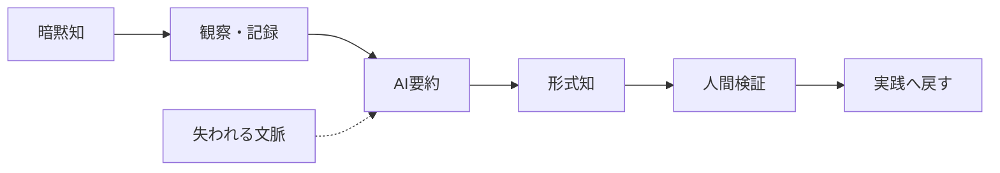
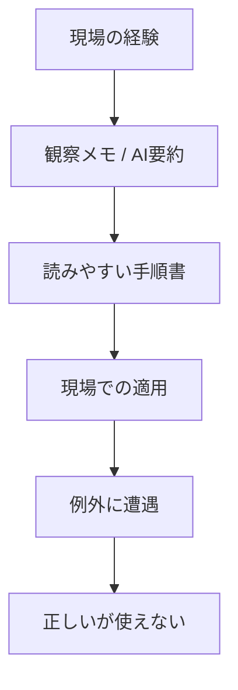

# 暗黙知・形式知・AI要約の関係

作成日: 2026-05-20
調査方式: literature review
対象: 暗黙知の形式知化、生成AIによる要約・翻訳・ナレッジ管理、組織知識移転

## 1. エグゼクティブサマリー

結論から言うと、生成AIは「暗黙知をそのまま理解する装置」ではなく、「明示された材料を圧縮・再編する装置」として使うのが妥当である。SECIモデルのうち、AIは `外化` と `連結` に強く、`共同化` と `内面化` は補助にとどまる。暗黙知そのものは、文書化される前から、身体化・熟達・価値判断・場の文脈に埋め込まれているためである。

本稿の実務上の主張は次の4点である。

1. 暗黙知は「まだ書けていない知識」ではなく、知る行為を支える背景構造である。
2. LLM は明示テキストの要約、翻訳、検索、分類には有効だが、身体知や責任を伴う判断の代替にはならない。
3. 要約は情報量だけでなく、例外、優先順位、判断の手がかり、責任の所在を削ることで歪みを生む。
4. 実務では、AI に「一次整理」をさせ、人間が「意味づけ・検証・責任引き受け」を担う二段構えが最も安全である。

出典メモ: Polanyi の暗黙知は University of Chicago Press の [The Tacit Dimension](https://press.uchicago.edu/ucp/books/book/chicago/T/bo6035368.html) と Polanyi Society の [The Structure of Consciousness](https://polanyisociety.org/mp-structure.htm) で確認できる。SECI は Nonaka & Takeuchi の [The Knowledge-Creating Company](https://hbr.org/1991/11/the-knowledge-creating-company-2) と書籍版の [Google Books 項目](https://books.google.com/books/about/The_Knowledge_Creating_Company.html?id=pSHhzwEACAAJ) が一次情報の入口になる。LLM の限界は、テキストだけの学習に対する grounding 批判を示す [Bender & Koller](https://aclanthology.org/2020.acl-main.463.pdf) と、言語モデルの規模拡大と汎用性を示す [Brown et al.](https://arxiv.org/abs/2005.14165) を並べて読むと位置づけやすい。

## 2. 背景と研究史

このテーマは、少なくとも3つの系譜をつなぐと理解しやすい。

| 時期        | 文献                                                     | 役割                                                       |
| ----------- | -------------------------------------------------------- | ---------------------------------------------------------- |
| 1958 / 1966 | Polanyi, _Personal Knowledge_ / _The Tacit Dimension_    | 暗黙知は知る行為の内部にある、という基礎づけ               |
| 1991 / 1995 | Nonaka & Takeuchi, _The Knowledge-Creating Company_      | tacit / explicit の往復と SECI の整理                      |
| 2020 以降   | Brown et al., Bender & Koller, 後続の hallucination 研究 | LLM は有力だが、grounding と事実性に制約があることを可視化 |

Polanyi の重要点は、「私たちは言葉にできる以上のことを知っている」というだけではない。より重要なのは、知ることが `from-to` の統合であり、焦点化された対象を支える周辺的な気づきがある、という構造である。したがって、暗黙知を完全な文章に変換できないことは失敗ではなく、知識の構造そのものに属する。

出典メモ: Polanyi の `subsidiary awareness` と `focal awareness` は [The Structure of Consciousness](https://polanyisociety.org/mp-structure.htm) に整理がある。『暗黙知』の代表的な命題 "we can know more than we can tell" は [The Tacit Dimension](https://press.uchicago.edu/ucp/books/book/chicago/T/bo6035368.html) の紹介文でも確認できる。

Nonaka & Takeuchi の SECI は、暗黙知と形式知が `社会化` `外化` `連結` `内面化` を通じて螺旋的に循環する、という組織知識創造のモデルである。ここで注意すべきなのは、SECI は「全部を文書化できる」という約束ではなく、知識移転の設計図であることだ。AI はこの設計図の一部を高速化できるが、現場の身体的学習そのものを置き換えるわけではない。

出典メモ: SECI の基本説明は [HBR の原文](https://hbr.org/1991/11/the-knowledge-creating-company-2) と [Google Books の書誌項目](https://books.google.com/books/about/The_Knowledge_Creating_Company.html?id=pSHhzwEACAAJ) を起点にたどれる。ここでの「設計図」という表現は、公表文献からの実務上の解釈である。

## 3. LLM が暗黙知を扱える範囲

### 3.1 認知の観点

LLM は、文章の中に既に表れているパターンを強く扱える。会議メモ、事例集、FAQ、議事録、メール、手順書のような明示テキストがあるなら、要約・整形・比較・横断検索は得意である。Brown et al. の few-shot 能力はその典型で、モデルは明示された文脈からかなり広い一般化を行える。

ただし、この能力は「経験した」ことを意味しない。Bender & Koller は、言語モデルがテキスト分布を学んでも、それだけで世界に接地した意味理解が得られるわけではないと論じた。つまり、LLM は `何がよく一緒に書かれるか` は学べても、`現場でそれが本当に起きたか` や `その判断に責任を負えるか` は別問題である。

### 3.2 言語の観点

翻訳と要約は、暗黙知を明示化する入口として有効だが、同時に危険でもある。なぜなら、要約は必ず `選択` だからである。モデルは文脈の中から目立つ語を残し、低頻度だが重要な注記を落としやすい。特に、例外条件、保留、迷い、失敗事例、現場特有の比喩は、要約で真っ先に平板化される。これは公表研究と実務観察からの推定である。

出典メモ: LLM の事実性・忠実性の問題は、幻覚や不忠実な要約を扱う [survey](https://arxiv.org/abs/2311.05232) と、要約の品質が参照文書との整合に依存する後続研究で整理されている。ここでの「平板化」は、これらの研究を踏まえた実務上の推定であり、単一論文の直接主張ではない。

### 3.3 実務プロセスの観点

知識移転は、文章を配るだけでは終わらない。実際には、師弟関係、レビュー、反復、失敗の共有、環境の違いへの適応が含まれる。LLM はこの流れのうち、収集・整形・検索・翻訳・分類の部分に強い。一方、現場での `見て覚える` `やってみて修正する` `文脈に応じて止める` は、人間のフィードバックが必要である。これはSECIの `社会化` と `内面化` が、テキスト処理だけでは完結しないことの言い換えでもある。

出典メモ: この段落は、SECI の `社会化` と `内面化` を、Polanyi の暗黙知と Bender & Koller の grounding 問題をつないだ公表情報からの推定である。AI が補助できるのは主に `外化` と `連結` で、`共同化` と `内面化` は訓練・観察・身体化が残る。

## 4. 要約で何が失われるか

要約が歪みを生むメカニズムは、少なくとも4つに分けられる。

1. **例外が消える**
   役に立つ知識ほど例外を含む。だが要約は平均化しやすく、例外をノイズとして扱う。
2. **価値判断が薄まる**
   「何を優先するか」「どこで止めるか」は文面よりも経験則に宿る。要約は結論だけ残し、優先順位の根拠を落としやすい。
3. **身体知が抜ける**
   熟達には、言語化前の違和感、手触り、タイミング感覚が含まれる。テキスト要約はここに届かない。
4. **責任の所在が見えなくなる**
   誰が、どの条件で、その判断を下したかが消えると、後工程で誤用されやすい。

この図で重要なのは、失われるのが「詳細」だけではないことだ。詳細の中には、例外条件、判断のしきい値、責任の線引きが含まれる。したがって、AI要約の失敗は情報欠落ではなく、実務制御の欠落として現れる。これは公表文献からの推定である。

出典メモ: Polanyi の `from-to` 構造は [The Structure of Consciousness](https://polanyisociety.org/mp-structure.htm) にある。LLM が事実性や忠実性で失敗しうる点は [hallucination survey](https://arxiv.org/abs/2311.05232) が整理している。要約の具体的な失敗モードは、faithfulness と factuality を扱う [On Faithfulness and Factuality in Abstractive Summarization](https://aclanthology.org/2020.acl-main.173/) や [A Survey of Hallucination in Natural Language Generation](https://arxiv.org/abs/2311.05232) を合わせて読むと把握しやすい。

## 5. SECI と AI の相性

| SECI段階 | AIとの相性 | 使いどころ                            | 典型的な失敗                 |
| -------- | ---------- | ------------------------------------- | ---------------------------- |
| 社会化   | 低         | 収集対象の対話ログ化、会話の起点作り  | 対面観察の代替をしてしまう   |
| 外化     | 中〜高     | インタビュー要約、SOP草案、ケース整理 | 例外・迷い・判断根拠が抜ける |
| 連結     | 高         | 文書横断の要約、翻訳、タグ付け、検索  | 出典の混在、古い知識の再流通 |
| 内面化   | 低〜中     | 学習用クイズ、シナリオ生成、復習支援  | 実地での身体化が起きない     |

この表は、SECI の理論をそのまま AI に当てはめたものではない。むしろ、AI を使うときの安全な役割分担を示した実務上の推定である。AI は暗黙知の抽出器というより、`外化` と `連結` を高速化する編集補助と見る方が筋がよい。

出典メモ: SECI の基本構造は [HBR](https://hbr.org/1991/11/the-knowledge-creating-company-2) に依拠する。AI との相性は、Polanyi の暗黙知論と LLM の grounding / fidelity 制約を合わせた公表情報からの推定である。

## 6. 実務指針

生成AIをナレッジ管理に入れるなら、次の順序が現実的である。

1. **原文を残す**
   会話ログ、面談メモ、失敗事例、顧客の生声を残す。要約だけを正本にしない。
2. **AI要約と人間注釈を分ける**
   どこまでが機械生成で、どこからが人間の判断かを明示する。
3. **例外・保留・失敗を明示する**
   良い知識ほど、適用条件と適用不能条件が必要である。
4. **手順より先に手がかりを書く**
   「何を見てそう判断したか」を、結論より先に残す。
5. **現場で再検証する**
   要約の読みやすさではなく、実務で再現できるかで評価する。
6. **翻訳は原語と対にする**
   多言語展開では、原文・訳文・用語集・意図メモをセットで持つ。

おすすめの記録項目は次の通りである。

| 項目           | 記録例                       |
| -------------- | ---------------------------- |
| 状況           | いつ、誰が、何を見ていたか   |
| 判断の手がかり | 数値、兆候、違和感、顧客反応 |
| 例外条件       | どの条件では適用しないか     |
| 失敗例         | 何が壊れたか、なぜ失敗したか |
| 責任者         | 最終判断を誰が引き受けたか   |
| 更新日         | いつ再点検するか             |

出典メモ: 以上は Polanyi の暗黙知論と Nonaka の SECI を、実務の知識管理に落とした整理である。AI 要約や翻訳の忠実性に関する懸念は [hallucination survey](https://arxiv.org/abs/2311.05232) と [Bender & Koller](https://aclanthology.org/2020.acl-main.463.pdf) を参照するとよい。

## 7. リスク・限界

このテーマには、避けるべき誤解が3つある。

1. 暗黙知は「いつか完全に文章化できる未完成品」ではない。
2. LLM は「理解したふりをするだけの道具」でもない。明示知の圧縮・再編には大きな価値がある。
3. しかし、LLM を通した要約は、現場の文脈、例外、責任、身体化を自動的には保持しない。

したがって、AI 活用の成否は `要約の長さ` ではなく、`例外を残せたか` `判断の根拠を残せたか` `現場で再現できたか` で測るべきである。

出典メモ: 暗黙知の非還元性は [Polanyi Society](https://polanyisociety.org/mp-structure.htm) と [The Tacit Dimension](https://press.uchicago.edu/ucp/books/book/chicago/T/bo6035368.html)。LLM の限界は [Bender & Koller](https://aclanthology.org/2020.acl-main.463.pdf)、有用性は [Brown et al.](https://arxiv.org/abs/2005.14165) に依拠する。ここでの `測るべき` は、これらの研究を踏まえた実務上の推定である。

## 8. 推奨方針

実務への落とし込みは、次の一文に集約できる。

> AI は暗黙知を「抽出する」のではなく、明示化の初速を上げる。最後の意味づけと責任は人間が持つ。

この方針なら、AI はナレッジ管理の補助輪として働くが、熟達や判断を無理に機械化することは避けられる。暗黙知を守りたいなら、要約を捨てるのではなく、要約を「一次資料に戻れる入口」にするのがよい。

出典メモ: 以上は Polanyi の tacit knowing と SECI を、LLM の grounding / fidelity 制約に照らしてまとめた統合的な推定である。一次資料は [The Tacit Dimension](https://press.uchicago.edu/ucp/books/book/chicago/T/bo6035368.html)、[The Structure of Consciousness](https://polanyisociety.org/mp-structure.htm)、[The Knowledge-Creating Company](https://hbr.org/1991/11/the-knowledge-creating-company-2)、[Bender & Koller](https://aclanthology.org/2020.acl-main.463.pdf) を参照。
