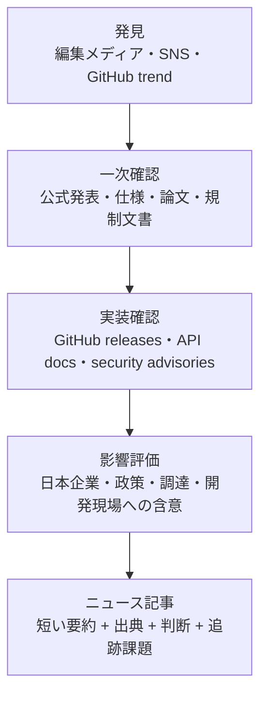
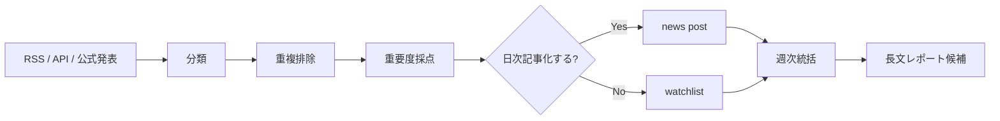

作成日: 2026-05-20
調査方式: 情報源マッピング / 日次ニュース運用設計
対象: 世界・日本の技術トレンド、AI、開発者ツール、サイバーセキュリティ、半導体、クラウド、政策・規制

## 1. 目的

このニュースカテゴリでは、通常の長文レポートとは別に、世界・日本で動いている技術トレンドを日次で拾い、週次・月次で統括判断へつなげる。狙いは「話題になっていること」をそのまま転載することではない。公式発表、論文、実装、脆弱性、政策、資金・市場シグナルを分けて読み、意思決定に使える粒度へ圧縮することである。

出典メモ: Digital Agency は新着・更新の RSS を公開しており、METI も latest information と statistics latest information の RSS を提供している。政府・公的機関の更新は、ニュース媒体より遅い場合があるが、政策・制度・予算の確認点として信頼度が高い。[デジタル庁 RSS](https://www.digital.go.jp/rss)、[METI RSS](https://www.meti.go.jp/english/rss/index.html) を参照。

## 2. 情報源の層

日次調査では、情報源を同じ重みで扱わない。発見、確認、解釈、実務影響の4層に分ける。

| 層                 | 主な役割                           | 代表ソース                                                                         | 採用基準               |
| ------------------ | ---------------------------------- | ---------------------------------------------------------------------------------- | ---------------------- |
| 一次情報           | 事実確認、仕様、日付、当事者の主張 | 企業公式ブログ、政府・標準化機関、論文、GitHub release                             | 本文で最優先引用する   |
| 研究・実装シグナル | 技術の成熟度、再現性、開発者採用   | arXiv、Papers with Code、GitHub Changelog、主要OSS release                         | 変化の方向を見る       |
| リスク・規制       | 導入可否、脆弱性、コンプライアンス | NIST、JPCERT/CC、JVN、IPA、e-Gov、NVD、GitHub Advisory                             | 実務判断で必ず確認する |
| 編集メディア       | 発見、論点整理、市場文脈           | The Verge、Wired、MIT Technology Review、日経クロステック、ITmedia、Publickey など | 単独根拠にしない       |

出典メモ: JPCERT/CC は注意喚起、Weekly Report、JVN の新着を含む RSS を公開している。GitHub Advisory Database は CVE と GitHub-originated advisories を含む OSS 脆弱性データベースとして提供されている。[JPCERT/CC RSS](https://www.jpcert.or.jp/rss/index.html)、[GitHub Advisory Database](https://github.com/advisories) を参照。

## 3. 世界向けの主要情報源

### AI・基盤モデル

- [OpenAI News](https://openai.com/news/) / Research / Docs: モデル、API、価格、推論・エージェント機能、利用規約の変化を確認する。
- [Anthropic News](https://www.anthropic.com/news) / Research: Claude、MCP、AI safety、enterprise 機能、security report を確認する。
- [Google DeepMind Blog](https://deepmind.google/blog/) / [Google Research Blog](https://research.google/blog/): Gemini、AI for science、ロボティクス、研究成果を追う。
- [Meta AI Blog](https://ai.meta.com/blog/)、Microsoft Research、[AWS Machine Learning Blog](https://aws.amazon.com/blogs/machine-learning/)、[NVIDIA Technical Blog](https://developer.nvidia.com/blog/): オープンモデル、クラウドAI、GPU/推論基盤、開発者エコシステムを確認する。
- arXiv `cs.AI`、`cs.LG`、`cs.CL`、`cs.CV`: 研究トレンドの早期検知に使う。論文は査読前も多いため、単独では実務採用根拠にしない。

出典メモ: OpenAI News は Company、Research、Product、Safety、Engineering、Security などの区分を持つ。Anthropic News は日付、カテゴリ、タイトルでニュースを掲載している。Google Research Blog は研究分野ラベル付きで最新記事を公開し、Google DeepMind は AI breakthroughs、projects、updates を News として公開している。arXiv は Atom API で `submittedDate` やカテゴリ指定検索が可能である。[OpenAI News](https://openai.com/news/)、[Anthropic News](https://www.anthropic.com/news)、[Google Research Blog](https://research.google/blog/)、[Google DeepMind News](https://deepmind.google/blog/)、[arXiv API](https://export.arxiv.org/api/query) を参照。

### 開発者ツール・クラウド・OSS

- GitHub Changelog: Copilot、Actions、CodeQL、security advisories、enterprise governance の変化を追う。
- GitHub Releases / repository tags: 実際にリリースされた OSS の変更確認に使う。
- Cloudflare Blog、AWS News Blog、Google Cloud Blog、Azure Updates: インフラ、AI platform、edge、security、database の実装可能性を見る。
- CNCF Blog / Kubernetes Blog / OpenSSF: クラウドネイティブとサプライチェーンの標準化・実務リスクを追う。
- Hacker News、Lobsters、Reddit の専門サブレディット: 早期発見用。本文の根拠ではなく、一次情報へ戻るための入口に限定する。

出典メモ: GitHub Changelog は Copilot、Actions、application security、supply chain security などの変更を日付付きで掲載している。[GitHub Changelog](https://github.blog/changelog/) を参照。

### サイバーセキュリティ・脆弱性

- CISA Known Exploited Vulnerabilities Catalog: 悪用確認済み脆弱性の優先度判断に使う。
- NIST NVD / NIST Cybersecurity Insights / CAISI Research Blog: CVE、AI標準、セキュリティフレームワークの確認に使う。
- GitHub Advisory Database / OpenSSF / vendor security advisories: OSS・依存関係リスクを追う。
- Google Threat Intelligence、Microsoft Security Blog、Mandiant、Palo Alto Unit 42、Cloudflare Radar: 攻撃キャンペーン、DDoS、脅威動向の文脈に使う。

出典メモ: NIST Blogs は CAISI Research Blog と Cybersecurity Insights の RSS を提供しており、AI標準・サイバーセキュリティの公的視点を追いやすい。[NIST Blogs](https://www.nist.gov/blogs) を参照。

### 半導体・ハードウェア・市場

- NVIDIA、AMD、Intel、TSMC、Samsung、Kioxia、Micron の公式発表: 製品、製造、投資、供給制約を確認する。
- SEMI、JEITA、TrendForce、Gartner、IDC: 市場数量や出荷動向の補助情報として使う。
- 米国 Commerce、BIS、CHIPS Program Office、EU Chips Act 関連ページ: 輸出規制・補助金・産業政策の確認に使う。

この領域は企業発表が販売促進を含みやすい。ニュース記事では「性能主張」「量産時期」「顧客採用」「規制・補助金」を分ける。

## 4. 日本向けの主要情報源

### 政策・行政・規制

- デジタル庁: マイナンバー、行政DX、ガバメントクラウド、AI政策、データ連携の更新。
- 経済産業省: 半導体、AI、情報産業、スタートアップ、サイバーセキュリティ、産業政策。
- 総務省: 通信、放送、AIネットワーク、情報通信白書、電波政策。
- e-Gov: 法令・パブリックコメント・行政文書更新。
- 内閣府、NISC、個人情報保護委員会: AI、サイバー、個人情報、重要インフラ関連。

出典メモ: e-Gov は更新を知らせる RSS を提供しており、法令・行政手続き系の変化を追う基盤として使える。[e-Gov RSSフィード](https://www.e-gov.go.jp/service-policy/rssfeed.html) を参照。

### 日本のセキュリティ・脆弱性

- JPCERT/CC: 注意喚起、Weekly Report、JVN 新着、国内インシデント文脈。
- IPA: 情報セキュリティ10大脅威、脆弱性対策、DX白書、IT人材白書。
- 警察庁 / NISC: サイバー犯罪、重要インフラ、政府横断の注意喚起。

日本語で実務影響を書く場合、海外の CVE 情報だけでなく、国内ベンダー・国内利用者への影響と日本語の注意喚起有無を確認する。

### 日本の技術・産業ニュース

- 日経クロステック、ITmedia、Impress Watch、Publickey、CodeZine、Think IT、ASCII.jp TECH: 日本企業・開発現場への波及確認。
- J-Startup、NEDO、産総研、理研、大学発表: 研究開発・スタートアップ・公的支援の把握。
- 東証適時開示、企業IR、決算資料: 技術投資が業績・設備投資・採用に出ているかを見る。

編集メディアは発見と文脈整理に有用だが、数値、仕様、契約、規制は一次情報で再確認する。

## 5. 日次統括ワークフロー

1. 収集: RSS/API/公式ブログを前日以降で取得し、AI、security、developer-tools、data-infrastructure、semiconductor、policy-japan に分類する。
2. 重複排除: 同じ発表を公式発表、メディア記事、SNS反応に分け、公式発表を canonical source にする。
3. 重要度採点: `実務影響`、`新規性`、`信頼度`、`日本への波及`、`追跡必要性` を各 1-5 点で付ける。
4. 一次確認: 高スコア項目は公式発表、論文、仕様、GitHub release、政府文書、脆弱性DBで裏取りする。
5. ニュース化: 日次ニュースは短く、背景・何が変わったか・実務含意・未確認点・出典を明記する。
6. 統括: 週次で「単発ニュース」ではなく、同じ方向に動く複数シグナルを束ねてテーマ化する。

## 6. ニュース記事の標準フォーマット

ニュースカテゴリの記事は、長文レポートより軽く、判断に必要な情報だけを残す。

| セクション   | 書く内容                                   |
| ------------ | ------------------------------------------ |
| 今日の要点   | 3-5行で何が重要か                          |
| 何が起きたか | 公式発表・論文・脆弱性・政策文書の事実     |
| なぜ重要か   | 開発、事業、セキュリティ、政策への影響     |
| 日本への波及 | 日本企業、行政、ユーザー、開発者への関係   |
| 追跡すべき点 | 未確定のロードマップ、価格、仕様、導入障壁 |
| 出典メモ     | 公式情報を優先し、編集記事は補助と明記     |

## 7. 初期ウォッチリスト

最初に常時監視するべきテーマは次の通り。

- AI agents / tool use / MCP / browser and computer use
- Frontier model release、価格、context length、enterprise controls
- AI coding tools、GitHub Copilot、Cursor、Codex、Claude Code、Gemini CLI
- AI security、model abuse、prompt injection、agentic browsing risk
- OSS supply chain、GitHub Actions、CodeQL、SBOM、OpenSSF
- database / vector / knowledge graph / memory systems
- edge AI、on-device AI、GPU/ASIC、半導体供給網
- 日本のAI政策、ガバメントクラウド、個人情報、サイバーセキュリティ

## 8. 運用上の注意

このニュース運用は速報性より再利用性を優先する。SNSで広がっているだけの話題は watchlist に置き、公式発表や実装変更が確認できた時点で記事化する。価格、ロードマップ、仕様、規制、脆弱性は変化が速いため、記事本文では確認日を明示し、必要に応じて後続ニュースで更新する。

公表情報からの推定を使う場合は、その推定が公式ロードマップではないことを明記する。特に AI 製品、半導体、規制、セキュリティ脆弱性は、断定のコストが高い。

## 参考情報

- [デジタル庁 RSS](https://www.digital.go.jp/rss)
- [METI RSS](https://www.meti.go.jp/english/rss/index.html)
- [e-Gov RSSフィード](https://www.e-gov.go.jp/service-policy/rssfeed.html)
- [JPCERT/CC RSS](https://www.jpcert.or.jp/rss/index.html)
- [NIST Blogs](https://www.nist.gov/blogs)
- [GitHub Changelog](https://github.blog/changelog/)
- [GitHub Advisory Database](https://github.com/advisories)
- [Google Research Blog](https://research.google/blog/)
- [Google DeepMind News](https://deepmind.google/blog/)
- [arXiv API](https://export.arxiv.org/api/query)
